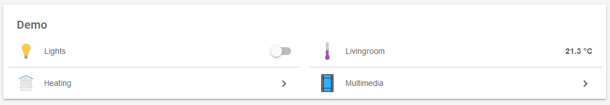
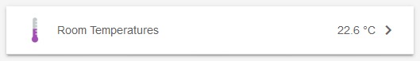
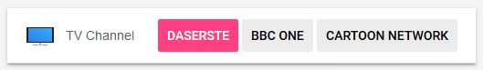
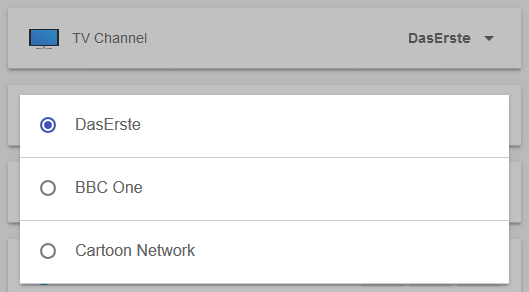
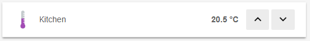
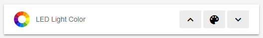
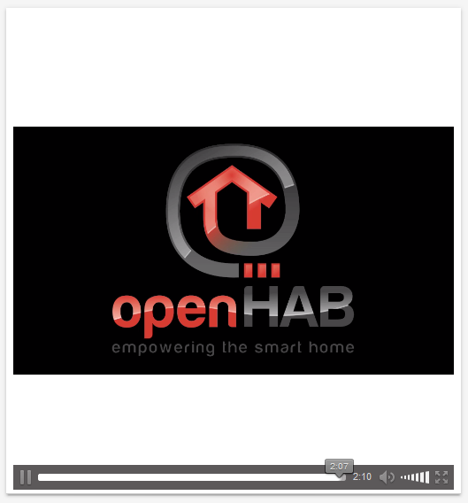

# Configuration

openHAB is the center of your home automation.
Properties and capabilities of all your devices are available through openHAB to the user frontend, the rule engine and other parts and connected systems.

openHAB is a system installed and executed by you, **running independently** from any online services or proprietary technologies.
You as the end-user have the **full control** over every aspect of your smart home.

Every device connected to openHAB is functionally and logically different.
In order to represent all of these, openHAB defines the following few base components:

- [Bindings]({{base}}/addons/bindings.html) - The numerous Add-ons to communicate with your devices
- [Things](things.html) - Your devices represented in openHAB
- [Items](items.html) - properties and capabilities of your Things
- [Groups](items.html#groups) - collections or categories containing Items
- [Sitemaps](sitemaps.html) - User-defined frontend interfaces to arrange Groups, Items and more
- [Transformations](transform.html) - Helper functions to transform your data
- [Persistence](persistence.html) - Services to store data over time
- [Rules](rules-dsl.html) - Automation logic, the "smart" in your Smart Home!
- [JSR223 Scripting](jsr223.html) - Define rules and other runtime objects using [Javascript](http://openjdk.java.net/projects/nashorn/), [Jython](http://www.jython.org) or [Groovy](http://www.groovy-lang.org/).

The individual articles hold all details needed to understand the concepts behind these building bricks for your Smart Home.
For more details on the base concept behind openHAB, please visit the [Concepts Overview page]({{base}}/concepts/index.html).

### Versatility

openHAB provides different user interfaces to modify settings, manage your things and items, build rules and access the sitemap results.
Every interface has it's own strong points.

<table class="centered highlight">
  <thead>
    <tr>
      <th data-field="task">Task</th>
      <th data-field="files">Textual Configuration</th>
      <th data-field="paperui">Paper UI</th>
      <th data-field="habmin">HABmin</th>
      <th data-field="karaf">Console</th>
    </tr>
  </thead>

  <tbody>
    <tr>
      <td>Auto-Discover Things and Items</td>
      <td>❌</td>
      <td>✔️</td>
      <td>✔️</td>
      <td>✔️</td>
    </tr>
    <tr>
      <td>Define Things</td>
      <td>✔️</td>
      <td>✔️</td>
      <td>✔️</td>
      <td>✔️</td>
    </tr>
    <tr>
      <td>Define Items</td>
      <td>✔️</td>
      <td>✔️</td>
      <td>✔️</td>
      <td>✔️</td>
    </tr>
    <tr>
      <td>Define Groups</td>
      <td>✔️</td>
      <td>✔️</td>
      <td>✔️</td>
      <td>✔️</td>
    </tr>
    <tr>
      <td>Define Sitemaps</td>
      <td>✔️</td>
      <td>❌</td>
      <td>❌</td>
      <td>❌</td>
    </tr>
    <tr>
      <td>Define Transformations</td>
      <td>✔️</td>
      <td>❌</td>
      <td>❌</td>
      <td>❌</td>
    </tr>
    <tr>
      <td>Define Persistence</td>
      <td>✔️</td>
      <td>❌</td>
      <td>❌</td>
      <td>❌</td>
    </tr>
    <tr>
      <td>Define Rules</td>
      <td>✔️</td>
      <td>✔️<br />(Experimental)</td>
      <td>✔️<br />(Graphical)</td>
      <td>❌</td>
    </tr>
    <tr>
      <td>Manage Z-Wave Devices</td>
      <td>✔️<br />(Not&nbsp;Recommended)</td>
      <td>✔️<br />(Limited)</td>
      <td>✔️</td>
      <td>❌</td>
    </tr>
    <tr>
      <td>Modify openHAB Settings</td>
      <td>✔️</td>
      <td>✔️</td>
      <td>✔️</td>
      <td>✔️</td>
    </tr>
    <tr>
      <td>Install Add-ons</td>
      <td>✔️</td>
      <td>✔️</td>
      <td>❌</td>
      <td>✔️</td>
    </tr>
  </tbody>
</table>

{: #text-vs-ui}
### Textual vs. Graphical Configuration

With openHAB 1.x the smart home configuration was done via configuration files only.
One of the most visible additions to openHAB 2 is the administrative web interface Paper UI.

Things and Items can either be defined and managed in configuration files or handled by Paper UI in a [system-side database]({{base}}/administration/jsondb.html).

Both methods can be used **side-by-side or even mixed**, e.g. a Thing is discovered by Paper UI and linked Items are defined in a `.items` configuration file.

Configuration done in files will be synced to the database but configuration done in the database will not be written to files.

## Things

[Things]({{base}}/concepts/things.html) represent the physical layer of an openHAB system.
From a configuration standpoint, Things tell openHAB which **physical entities** (devices, web services, information sources, etc.) are to be managed by the system.

Things are connected to openHAB through [bindings]({{base}}/addons/bindings.html).
In order to add a Thing to the system, you must first identify the appropriate binding which will provide the type of Thing you wish to add.
For example, before adding a Thing for a Z-Wave device, the Z-Wave binding must first be installed.

Each Thing provides one or more **Channels** to access its functionality.
These Channels can be linked to [items]({{base}}/concepts/items.html).
Items are used to control Things and consume their information.
Ultimately, when Items are linked to Channels on a Thing, they become available to the various user interfaces and to the rules engine.

*Note:* Things are a new concept in openHAB 2, Things definitions are not needed for 1.x bindings.

### Defining Things

Things are the starting point for configuring physical entities in openHAB.
When you wish to add a new one to the system, you always start by defining a Thing.
Once a Thing has been defined and configured, you are done setting up the connection to the physical layer.
From then on, everything else is configured at the application layer for that entity.

From start to finish, the process for fully configuring a physical entity represented by a Thing looks like this:

1. Identify the binding required for the Thing
2. Install the binding if it has not already been installed
3. Define and configure the Thing
4. Identify the Channels provided by the Thing
5. [Add Items]({{base}}/configuration/items.html) and link them to the Thing's Channels
6. At this point Items can be used to control the Thing or consume its information in e.g. [Sitemaps]({{base}}/configuration/sitemaps.html) or [Rules]({{base}}/configuration/rules-dsl.html)

There are two methods for defining Things provided by the various bindings:
through [discovery]({{base}}/concepts/discovery.html) or by manual definition in configuration text files.

*Note:* Some bindings do not fully support auto-discovery, others are hard to manually cover by the file based approach.
Please consult the documentation for each binding to determine the best way to add that binding's Things and Items to openHAB.
For some bindings (such as the [YahooWeater]({{base}}/addons/bindings/yahooweather/readme.html) binding), manual Thing definitions are required.
Other bindings (such as the [ZWave]({{base}}/addons/bindings/zwave/readme.html) binding) currently prefer or require the discovery method.

#### Defining Things Using Discovery

Things can be added to the system using [discovery]({{base}}/concepts/discovery.html), which allows Things to be discovered automatically if the appropriate binding has been installed and configured.
When a Thing has been discovered, it appears in the discovery inbox.
Newly discovered Things can be added to the system from the inbox using the [Paper UI]({{base}}/configuration/paperui.html).

Things that are added to openHAB from the inbox are maintained in an internal database as opposed to a manually defined `.things` file (see below).
Unlike manually defined Things, if a Thing has configurable properties, these properties can be set through a user interface.

**Attention:** It has to be noted, that Things and Items added through Paper UI / discovery to the internal database will **not** be written to configuration files.
Things and Items definitions can be distributed and mixed among the internal database and manually defined text files.

See the [configuration tutorial]({{base}}/tutorials/beginner/configuration.html) for a step-by-step guide on how to configure Things using discovery.

#### Defining Things Using Files

Things can also be defined manually by creating `.things` configuration text files.
These files are stored in the `things` folder under the openHAB configuration path, e.g. `/etc/openhab2/things/` or `openhab2/conf/things`.

Benefits of defining Things, Items and other aspects of openHAB in configuration text files are, that they are statically defined, unambiguous, flexible and easy to backup and restore.
The main downsides of configuration files are the effort needed to compose them and the probability for typing errors.

The syntax for `.things` files is defined as follows (parts in `<..>` are required):

```xtend
Thing <binding_id>:<type_id>:<thing_id> "Label" @ "Location" [ <parameters> ]
```

**Examples:**

```xtend
Thing network:device:webcam "Webcam" @ "Living Room" [ hostname="192.168.0.2", timeout="5000", ... ]
Thing astro:moon:home [ geolocation="50.12345,10.98765", interval=300 ]
Thing ntp:ntp:local [ hostname="de.pool.ntp.org" ]
```

Looking at the first example:

- the binding ID is "network" (using the [Network Binding]({{base}}/addons/bindings/network/readme.html))
- the type ID is "device", indicating the Thing is a device
- the Thing ID is "webcam", which is an ID to uniquely identify the Thing
- the label is "Webcam", this is how the Thing will be named in the various user interfaces
- the physical location of the Thing is "Living Room"
- the values inside the `[]` brackets are the Thing's configuration parameters, these are partly mandatory and optional

Please check each individual binding's [documentation]({{base}}/addons/bindings.html) for details on what and how to define Things using the `*.things` configuration text files.

#### Linking Items

Items can be linked to Channels of discovered or manually defined Things inside Paper UI or inside configuration files.
For more details about Item definition and usage, please refer to the [Items configuration article]({{base}}/configuration/items.html).

It is important to note, that Channels of discovered Things can also be linked to Items defined in `.items` files.
In order to link a Thing to an Item in an `.items` file, open the Thing in Paper UI under *Configuration → Things*.
In the list of Thing Channels, look for the Channel you wish to link to an Item and copy the Channel's ID.
For instance, a Z-Wave switch might have a Switch Channel that has an ID like this:

```xtend
zwave:device:1a2b3c4d:node2:switch_binary
```

To bind that Channel to an Item in an `.items` file, you can define an Item in the file like so:

```xtend
Switch Kitchen_Light_Switch "Kitchen Light" (Indoor_Lights) { channel="zwave:device:1a2b3c4d:node2:switch_binary" }
```

## Items

In openHAB Items represent all properties and capabilities of the user’s home automation.

While a device or service might be quite specific, Items are unified substitutions inside the openHAB world.
Items can be Strings, Numbers, Switches or one of a few other basic [Item types](#type).
A programmer can compare Item types with base variable data types of a programming language.

A unique feature of openHAB Items is the ability to connect them to the outside world via [Bindings](#binding).
An Item does not simply store information that is set by software (e.g., `OFF`, 3.141 or "No Error"); the information stored by an Item may also be set by actions that take place in your home.

But let's not get ahead of ourselves.
The rest of this page contains details regarding Items and is structured as follows:

{::options toc_levels="2..4"/}

- TOC
{:toc}

### Introduction

Items are basic data types and have a state which can be read from, or written to.
Items can be linked to a [Binding](#binding) channel for interaction with the outside world.
For example, an Item bound to a sensor receives updated sensor readings and an Item linked to a light's dimmer channel can set the brightness of the light bulb.

There are two methods for defining Items:

1.  Through [Paper UI]({{base}}/addons/uis/paper/readme.html).
    Generally all 2.x version Bindings can be configured through Paper UI.
    (Note that 1.x and legacy Bindings do not offer this option)

2.  Through text `.items` files located in the `$OPENHAB_CONF/items` folder.
    Files here must have the extension `.items`; you may create as many `.items` files as needed.
    However, each Item must be unique across all `.items` files.
    Refer to the [installation docs]({{base}}/installation/index.html) to determine your specific installation's folder structure.

Generally 1.x version Bindings can only be bound to Items through `.items` files.
2.x Bindings may be configured using either method described above.

**Assumptions for Paper UI:**
The examples below assume that the user is using a text editor to create a `.items` file.
While the way of defining an Item using the graphical, interactive Paper UI is different, the elements and the nature of an Item definition are identical using either method.

**Editor Recommendation:**
It's recommended to edit `.items` files using one of the [openHAB supporting editors]({{base}}/configuration/editors.html).
Doing so will provide you with full IDE support including features such as syntax checking, and context assistance.

{: #syntax}
### Item Definition and Syntax

Items are defined using the following syntax:

```java
itemtype itemname "labeltext [stateformat]" <iconname> (group1, group2, ...) ["tag1", "tag2", ...] {bindingconfig}
```

- Fields must be entered in the order shown
- `itemtype` and `itemname` are manadatory
- All other fields are optional
- Fields may be separated by one or more spaces, or tabs
- An Item definition may span multiple lines

**Examples:**

```java
Switch Kitchen_Light "Kitchen Light" {mqtt="<[...], >[...]" }
String Bedroom_Sonos_CurrentTitle "Title [%s]" (gBedRoom) {channel="sonos:..."}
Number Bathroom_WaschingMachine_Power "Power [%.0f W]" <energy> (gPower) {channel="homematic:..."}

Number Livingroom_Temperature "Temperature [%.1f °C]" <temperature> (gTemperature, gLivingroom) ["TargetTemperature"] {knx="1/0/15+0/0/15"}
```

The last example above defines an Item with the following fields:

- Item [type](#type) `Number`
- Item [name](#name) `Livingroom_Temperature`
- Item [label](#label) "Temperature"
- Item [state formatted](#state-presentation) to display temperature in Celsius to one-tenth of a degree -  for example, "21.5 °C"
- Item [icon](#icons) with the name `temperature`
- Item belongs to [groups](#groups) `gTemperature` and `gLivingroom` (definition not shown in the example)
- Item is [tagged](#tags) as a thermostat with the ability to set a target temperature ("TargetTemperature")
- Item is [bound to](#binding) the openHAB Binding `knx` with binding specific settings ("1/0/15+0/0/15")

The remainder of this article provides additional information regarding Item definition fields.

{: #type}
#### Type

The Item type defines what kind of state can be stored in that Item and which commands the Item will accept.
Item types are comparable to basic variable data types in programming languages.
Each Item type has been optimized for a particular kind of component in your smart home.
This optimization is reflected in the data and command types.

Available Item types are:

| Item Name      | Description | Command Types |
|----------------|-------------|---------------|
| Color          | Color information (RGB) | OnOff, IncreaseDecrease, Percent, HSB |
| Contact        | Status of contacts, e.g. door/window contacts | OpenClose |
| DateTime       | Stores date and time | - |
| Dimmer         | Percentage value for dimmers | OnOff, IncreaseDecrease, Percent |
| Group          | Item to nest other items / collect them in groups | - |
| Image          | Binary data of an image | - |
| Location       | GPS coordinates | Point |
| Number         | Values in number format | Decimal |
| Player         | Allows control of players (e.g. audio players) | PlayPause, NextPrevious, RewindFastforward |
| Rollershutter  | Roller shutter Item, typically used for blinds | UpDown, StopMove, Percent |
| String         | Stores texts | String |
| Switch         | Switch Item, typically used for lights (on/off) | OnOff |

More details about all of the available Item types and their commands are available under Concepts, see:
[Item Types Overview]({{base}}/concepts/items.html)

To learn about the technical internals of the individual Item types, please refer to:
[Javadoc on Generic Item and its subclasses](https://eclipse.org/smarthome/documentation/javadoc/org/eclipse/smarthome/core/items/GenericItem.html)

<!-- TODO: Random content. Doesn't make sense here. Might be changed to be a more general example for diverse Items

Example:

**Dimmer vs. Switch:**
While a Dimmer Item can accept either On/Off, Increase/Decrease, or Percent updates or command, a Dimmer Item stores its state as a Percent value.
See the following example:

```java
//demo.items
Dimmer Office_Light "Dimmer [%d %%]" {milight="bridge01;3;brightness"}
```

```javascript
//demo.sitemap
Switch item=Office_Light
Slider item=Office_Light
```

When the Switch widget is used, it sends ON or OFF commands to the Item which are mapped to 100% and 0%, respectively.
When the Slider widget is used, it sends Percent commands (values between 0 and 100) to the Item, which are used as the Item's state.
In the example above, if you move the Slider widget to 60%, move the Switch to OFF, and finally move the switch to ON, the Item's state will be 100%.

-->

{: #name}
#### Name

The Item name is used to uniquely identify an Item.
The name must be unique across all `.items` files in your openHAB configuration.
The only characters permitted in an Item name are letters, numbers and the underscore character.
Names must not begin with numbers.
Spaces and special characters are not permitted.

A good Item name is self-explanatory and hints at its Item type and interaction options.
A good hierarchical arrangement allows you to create common-sense groupings of Items.
Names may be organized by function, and/or location.

Users are advised to establish and follow a consistent naming scheme for Items.
You may wish to think of a logical naming hierarchy that makes sense to you and apply that consistently in your openHAB installation.
Having a well thought out naming scheme can be especially important as your installation grows.
An Item naming scheme with a physical or logical top-down will ensure you can easily identify the function or purpose of the Item, especially over time.

The following naming style guide is recommended:

-   Words build a physical or logical hierarchy

-   Every word of the Item name starts with an uppercase letter

-   Words should be separated by an underscore character, except for words that logically belong together

-   Names that reoccur frequently, such as the names of rooms or appliances, may be abbreviated to reduce overall name length.
(Example: Bathroom = BR)

Examples:

| Item Name                         | Interpretation (assumed Item type, example value) |
|-----------------------------------|---------------------------------------------------|
| "`Livingroom_CeilingLight`"       | Living room light (Switch, e.g. ON) |
| "`Livingroom_CeilingLight_Color`" | Living room light color (Color, e.g. warm white) |
| "`GF_BR_WaschingMachine_Power`"   | Electric power consumed by the washing machine located in the ground floor bathroom (Number, e.g. 100W) |
| "`Lighting_Scene`"                | Overall lighting scene of the house (String, e.g. Party) |
| "`Presence_John_Smartphone`"      | An Item indicating if John is home or not, based on smartphone detection (Switch, e.g. Offline) |

[Group](#groups) is a special Item type that may be used to nest or combine Items.
Users are encouraged to apply the style guide above to group names as well as Item names.
Two naming schemes are established in the community for Group names:

1.  Use a plural word form (e.g. Batteries) where possible.
    Otherwise the word "Group" may be appended for clarity.
2.  Prepend a lowercase "g" to the name (e.g. gBattery)

| Group Name                                | Interpretation |
|-------------------------------------------|----------------|
| "`Batteries`" or "`gBattery`"             | Group combining the states of all battery Items |
| "`Maintenance_Group`" or "`gMaintenance`" | Group containing all maintenance-related Items |
| "`Livingroom_Lights`" or "`gLR_Light`"    | Group containing all light Items belonging to the living room |
| "`Livingroom`" or "`gLR`"                 | Group for *all* Items (including lights) belonging to the living room |

{: #label}
#### Label

Label text is used to describe an Item in a human-readable way.
Graphical UIs will display the label text when the Item is included, e.g. in [Basic UI]({{base}}/addons/uis/basic/readme.html) in a [Sitemap]({{base}}/configuration/sitemaps.html) definition.
Some I/O services (e.g. the Amazon Alexa skill) also use the label to match an external voice command to an Item.

In textual configurations the label, in quotation marks, appears next to the optional state presentation field in square brackets (see below).
The label for the Item in the following example is "Temperature":

```java
Number Livingroom_Temperature "Temperature [%.1f °C]"
```

{: #state}
#### State

The state of an Item depends on the Item type, the Channel bound to the Item, and internal or external events.
A analogy can be drawn between the state of an Item and the value of a variable in a computer program.

{: #item-state}
##### Item State

This section provides information about what a user can expect regarding the behavior of the state of an Item.

-   Items are created with a state of `NULL`

-   Operations in openHAB such as a user interacting with the Item using the Basic UI, or a Binding updating the state of an Item will change the state of the Item

-   An Item's state may also be set through a Binding which may be reacting to changes in the real world

-   A Binding may set the state of an Item to `UNDEF` if it looses communications with a Thing (for example, a Z-wave doorbell with a dead battery).
The Binding may also set the state to `UNDEF` if an error exists in the binding configuration, or under other conditions

*N.B.*  Many openHAB users find that it can be very useful to use [Persistence]({{base}}/addons/persistence.html) and [System started]({{base}}/configuration/rules-dsl.html#system-based-triggers) rules so that their systems behaves in a predictable way after an openHAB restart.

{: #command-vs-status}
##### Command vs. Status

Users should bear in mind the difference between an Item used to send a command to a Thing, and an Item that reflects the status of a real-world Thing in the UI.
This distinction may seem obvious, but it can be a little confusing when an Item appears not to reflect the correct status of a Thing.

For example, let's say you have a Switch Item that is used to turn on a light.
You insert this Item into a [sitemap]({{base}}/configuration/sitemaps).
You call up the sitemap and switch on the light using the UI.
The switch icon changes from red to green, but you notice that the light does not turn on.
What happened?
Perhaps the Switch physical device is faulty or perhaps the device lost communications with your network.
In any case, the UI performed correctly - it reflected the fact that you sent a command to the Switch Item.
What the UI did not do is convey the status of the device being switched.
Of course, this is the correct.
As of this point, you do not have any Item in your sitemap that would do this.
If it is critical that you know that the light came on, you could install a sensor that monitors light level.
You could then, through the appropriate Binding, reflect light level changes through a Thing to an Item.
Then you add the light-level Item to your UI.
Now when you send the Switch Item command, and you see a corresponding increase in light level in the room, you know for sure that your command has been received and acted upon, because you have a return status Item in your UI.

{: #state-presentation}
##### State Presentation

The Item definition determines the Item's textual state presentation, e.g., regarding formatting, decimal places, unit display and more.
The state presentation is part of the Item label definition and contained inside square brackets.
The state presentation for the Item in the following example is "`%.1f °C`":

```java
Number Livingroom_Temperature "Temperature [%.1f °C]"
```

If no state presentation and no square brackets are given, the Item will not provide a textual presentation of it's internal state (i.e. in UIs no state is shown).
This is often meaningful when an Item is presented by a non-textual UI elements like a switch or a diagram.

Formatting of the presentation is done applying [Java formatter class syntax](http://docs.oracle.com/javase/7/docs/api/java/util/Formatter.html#syntax).

If square brackets are given, the leading `%` and the trailing formatter conversion are mandatory.
Free text, like a unit, can be added before or after the formatter string.
A few examples are given below:

```java
Number    Livingroom_Temperature   "Temperature [%.1f °C]"     // e.g. "23.5 °C"
String    Livingroom_TV_Channel    "Now Playing [%s]"          // e.g. "Lorem ipsum"
DateTime  Livingroom_TV_LastUpdate "Last Update [%1$ta %1$tR]" // e.g. "Sun 15:26"
Number    Livingroom_Clock_Battery "Battery Charge [%d %%]"    // e.g. "50 %"
```

{: #state-transformation}
##### State Transformation

Transformations can be used in the state part of an Item, to translate the raw state of an Item into another language, or to convert technical values into human readable information.

In the example below, the entry `MAP(window_esp.map)` causes the output of the `Contact` Item to be translated from "CLOSED", to the Spanish "cerrado":

```java
Contact Livingroom_Window "Ventana del salón [MAP(window_esp.map):%s]"
```

Please refer to the article on [Transformations](transform.html) for more usage details and a list of available transformation services.

{: #icons}
#### Icons

The icon name is used by openHAB to select the image to display next to an Item name when using one of openHAB's UIs, e.g. Basic UI.
The icon name appears between angle brackets "&lt;&gt;".
In the example below, the "switch" icon has been selected:

```java
Switch Livingroom_Light "Livingroom Ceiling Light" <switch>
```

openHAB provides a set of [classic icons]({{base}}/addons/iconsets/classic/readme.html) by default.
Users may add their own icons in either `png` or `svg` format in the openHAB icons configuration folder, `$OPENHAB_CONF/icons/classic/`.

The following guidelines apply to user-added icon files:

- Only `png` or `svg` file formats may be used
- Icon filenames may include lowercase letters, numbers and underscores (`_`)
- Uppercase letters and special characters are prohibited
- Hyphens (`-`) are reserved for [Dynamic Icons](#dynamic-icons) (see below)
- Example filenames:
  - Good: `myswitch.svg`, `power_meter.png`, `error23.svg`
  - Bad: `PC_Display.svg`, `power-meter.png`, `tür⇔.svg`

**Bitmaps or Vector Graphics:**
openHAB can work with either Bitmap (`png`) or Vector (`svg`) icon files.
The format should match the display capabilities of the user interfaces in use (e.g. Basic UI).
It is thereby important to decide on one format beforehand; vector graphics are recommended.
The setting can be changed via Paper UI for most user interfaces.
Please check the user interface documentation if in doubt.
Note that image files with the wrong file ending will be ignored.

Users may substitute their own icon for an icon from the default icon set by placing a file in the `$OPENHAB_CONF/icons/classic/` folder with the same filename as the name of the icon being substituted.

{: #icons-dynamic}
##### Dynamic Icons

Some icons are dynamically selected by openHAB depending on the Item's state.
For example, a "switch" icon may appear to be green when the Item is "ON" and red when the item is "OFF.
Behind the scenes, openHAB is actually selecting two different icon files depending upon the Item state - `switch-on` or `switch-off`.
A third default icon file, `switch`, is required as well.
This icon file matches when none of the other icon files match the Item state (e.g. when the Item is in an undefined state).

Dynamic icon filenames follow the pattern below:

```perl
<name>-<state>.<extension>
```

- `<name>` - the name of the icon set
- `-<state>` - the Item state the icon maps to (e.g. "ON" or "OFF", "OPEN" or "CLOSED")
- `<extension>` - bitmap (`png`) or vector graphic (`svg`) icon file extension ([see above](#icons))

Dynamic icon sets may consist of as many state-specific icon files as needed.
Each set must meet the following criteria:

-   A default icon is mandatory.
    The default icon filename is the name of the icon without a hyphen or state (e.g. `switch.svg`)

-   Icon filenames must follow the naming restrictions given for [icons](#icons) above

-   The state name must reflect the Item's raw state.
    [Transformations](#state-transformation) applied in the state presentation definition of the Item have no influence on icon selection.

-   The state portion of the icon name must be in lowercase letters

**Example:**

The user defines the "Livingroom_Light" and "Livingroom_Light_Connection" Items:

```java
Switch Livingroom_Light "Livingroom Ceiling Light" <myswitch>
String Livingroom_Light_Connection "Livingroom Ceiling Light [MAP(error.map):%s]" <myerror>
```

On the filesystem, the following icon files are provided by the user:

| File name              | Description                                                        |
|------------------------|--------------------------------------------------------------------|
| `myswitch-off.svg`     | Matches `OFF` or "off" state                                       |
| `myswitch-on.svg`      | Matches `ON` or "on" state                                         |
| `myswitch.svg`         | Default icon, used when no matching icon is found (e.g. `UNDEF`)   |

| File name              | Description                                                        |
|------------------------|--------------------------------------------------------------------|
| `myerror-no_fault.svg` | Matches `NO_FAULT` state                                           |
| `myerror.svg`          | Default icon, used when Item in other state (e.g. `CONNECT_ERROR`) |

Take note, that the Transformation used in the `Livingroom_Light_Connection` Item doesn't effect the needed state specific icons - the icon selection considers "myerror", not the contents of the `error.map` file.

**Number State Matching Rule:**
For Number Items the equal or next lowest state icon that can be found will be used.
For a dimmable light (0-100%), you might provide icons as in the example:

| File name          | Description                                          |
|--------------------|------------------------------------------------------|
| `mydimmer.svg`     | Default icon (used in undefined states)              |
| `mydimmer-0.svg`   | Matches the turned off light (0%)                    |
| `mydimmer-1.svg`   | Matches any dimmed light between 1% up to 74%        |
| `mydimmer-75.svg`  | Matches the bright light state from 75% to full 100% |

Just as with regular icons, user-defined dynamic icon sets may be configured via the custom icons folder `$OPENHAB_CONF/icons/classic/`.

{: #groups}
#### Groups

The Group is a special Item type that can be used to define a category or collection into which you can combine other Items or Groups.
An Item may be put into one or more groups, and groups may be nested inside other groups.
The general syntax for Group Items is as follows:

```java
Group groupname ["labeltext"] [<iconname>] [(group1, group2, ...)]
```

The Group item is commonly used to define hierarchies of Items from different perspectives.
For example:

-   Location-oriented or physical perspective:
    - Floors in your house → Rooms on that floor → An appliance in that room...

-   Functional or logical perspective:
    - Maintenance Group → All battery states → Individual battery states in percentage
    - Further examples: all lights, all room temperatures, combined power consumption

These relationships can be exploited in [Sitemaps]({{base}}/configuration/sitemaps.html) or in [automation rules]({{base}}/configuration/rules-dsl.html) to navigate through the hierarchically organized Items or to perform computations and updates on subsets of similar Items.

**Example:**

```java
// Overarching group
Group House
// Location perspective
Group GroundFloor  (House)
Group Livingroom   (GroundFloor)
// Functional perspective
Group Sensors      (House)
Group Temperatures (Sensors)

// Example Item
Number Livingroom_Temperature "Temperature [%.1f °C]" (Livingroom, Temperatures)
```

The example shows an Item which stores the temperature of the living room called `Livingroom_Temperature`.

From a **location perspective**, you may have a group called `Livingroom`.
When you add `Livingroom_Temperature` to the `Livingroom` group, `Livingroom_Temperature` is automatically part of the `GroundFloor` and `House` groups.
This is because `Livingroom` is a member of the `GroundFloor` group, and `GroundFloor` is a member of the `House` group.

From a **functional perspective**, the Living room temperature can also be seen as one of many temperatures in the automation setup.
Therefore the addition of `Livingroom_Temperature` to a functional group called `Temperatures`, which itself belongs to the `Sensors` group, seems reasonable.

Using nested group hierarchies such as these allows a rule to iterate through all sensors on the ground floor for maintenance actions, for example.
Because of the hierarchical structure of your group items, the rule will be clean and short.
Additionally, the rule will not need to be modified when a new Item is added to the `Temperatures` group.

{: #group-type}
##### Group Type and State

As you are now aware, an Item can have a state (e.g. "ON", "OFF").
A Group Item can also have a state.
The Group's state is determined by the state of all its Items, and the aggregation function specified in the group definition.

The general syntax for groups with a specific item type and aggregation function is:

```java
Group[:itemtype[:function]] groupname ["labeltext"] [<iconname>] [(group1, group2, ...)]
```

- If the aggregation function is omitted, the function `EQUAL` will be used
- If the aggregation function and `itemtype` are omitted, no group state will be aggregated from member Items

Group state aggregation functions can be any of the following:

| Function               | Description |
|------------------------|-------------|
| `EQUAL`                | Default if no function is specified. If ALL members have state X the group state will be X, otherwise the group state will be `UNDEF`. |
| `AND(value1,value2)`  | [Boolean](https://en.wikipedia.org/wiki/Boolean_algebra) AND operation. If all item states are 'value1', 'value1' is returned, otherwise 'value2' is returned. |
| `OR(value1,value2)`   | [Boolean](https://en.wikipedia.org/wiki/Boolean_algebra) OR operation. If at least one item state is of 'value1', 'value1' is returned, otherwise 'value2' is returned. |
| `NAND(value1,value2)` | [Boolean](https://en.wikipedia.org/wiki/Boolean_algebra) NAND (not AND) operation. Returns the opposite of the AND operation. |
| `NOR(value1,value2)`  | [Boolean](https://en.wikipedia.org/wiki/Boolean_algebra) NOR (not OR) operation. Returns the opposite of the OR operation. |
| `AVG`                  | Calculates the numeric average over all Item states of decimal type. |
| `MAX`                  | Calculates the maximum value of all Item states of decimal type. |
| `MIN`                  | Calculates the minimum value of all Item states of decimal type. |
| `SUM`                  | Calculates the sum of all Item states in the Group. |

Boolean group state functions additionally return a number representing the count of member Items of value 'value1' (see example below).

Because the group state is an aggregation of multiple Item states, not every Item state change results in a change of the group state.

Note that aggregation functions can only be used on compatible Item types.
Incompatible Item types within a Group may result in the invalid aggregation result `UNDEF`.

**Examples:**

```java
Group:Number             Lights       "Active Lights [%d]"              // e.g. "2"
Group:Switch:OR(ON, OFF) Lights       "Active Lights [%d]"              // e.g. ON and "2"
Group:Number:AVG         Temperatures "All Room Temperatures [%.1f °C]" //e.g. "21.3 °C"
```

The first two examples above compute the number of active lights and store them as group state.
However, the second group is of type switch and has an aggregation function of OR.
This means that the state of the group will be `ON` as soon as any of the member lights are turned on.

Groups do not only aggregate information from individual member Items, they can also accept commands.
Sending a command to a Group causes the command to be sent to all Group members.
An example of this is shown by the second group above; sending a single `ON` or `OFF` command to that group turns all lights in the group on or off.

The third example computes the average temperature of all room temperature Items in the group.

{: #tags}
#### Tags

Tags added to an Item definition allow a user to characterize the specific nature of the Item beyond it's basic Item type.
Tags can then be used by add-ons to interact with Items in context-sensitive ways.

Example:
A Light in a typical home setup can be represented by a Switch, a Dimmer or a Color Item.
To be able to interact with the light device via a natural voice command, for example, the fact that the Item is a light can be established by adding the "Lighting" tag as shown below.

```java
Switch Livingroom_Light "Livingroom Ceiling Light" ["Lighting"]
```

Tagging is a new feature and only a few I/O add-ons have implemented it.
The easiest way to determine if tags have been implemented in a specific add-on is to see if the add-on documentation explicitly discusses their usage.
Tags will be ignored if no Items in the openHAB installation support it.

See the [Hue Emulation]({{base}}/addons/ios/hueemulation/readme.html) or [HomeKit Add-on]({{base}}/addons/ios/homekit/readme.html) documentation for more details.

{: #binding}
#### Binding Configuration

One of the greatest strengths of an openHAB automation system is the sheer number of devices you can interact with.
See "[currently available Bindings]({{base}}/addons/bindings.html)" for a list of available Bindings.
This capability of interacting with real-world things is enabled through the association of Bindings with Items.

Once an Item is associated with a Binding, the state of one aspect of a device is reflected in openHAB (e.g., you can see if a light is on or off in one of the user interfaces).
Additionally, you have the opportunity to interact with a device through its Items, if interaction is supported for that aspect of the device (e.g., you can command the light to turn ON or turn OFF).

The Binding of an Item is given in the last part of the Item definition between curly brackets e.g. `{channel="..."}` in the example below:

```java
Number Livingroom_Temperature "Temperature [%.1f °C]" {channel="..."}
```

Users should note that there are significant differences between how Items are associated with devices between 1.x Binding configuration and 2.x Channel linking.
These are described below.

<!-- TODO: Everything below was not yet revised -->

##### 1.x Binding Configuration

To bind an Item to a Binding, you add a Binding definition in curly brackets at the end of the Item definition:

```java
Switch Phone_Mobile {ns="192.168.1.123:80"}
```

Where "ns" is the namespace for a certain Binding like "network", "netatmo", "zwave" etc.
Every Binding defines what values must be given in the Binding configuration string.
That can be the id of a sensor, an ip or mac address or anything else.
The information required for each binding is specified in the configuration information provided for each of the available [Bindings]({{base}}/addons/bindings.html).

Examples:

```java
Switch Phone_Mobile        "My Mobile Phone"                 {ns="192.168.1.123:80"}
Number Netatmo_Indoor_CO2  "CO2 [%d]"                        {netatmo="00:00:00:00:00:00#Co2"}
Number Azimuth             "Azimuth [%d]"                    {astro="planet=sun, type=position, property=azimuth"}
Contact Garage_Door        "Garage door is [MAP(en.map):%s]" {zwave="21:command=sensor_binary,respond_to_basic=true"}
```

In some cases, you will need to use legacy openHAB 1.x bindings with your openHAB 2.0 installation.
In this case, you will need to enable this feature through the Paper UI menu by turning on "Include Legacy 1.x Bindings" found at `/configuration/services/configure extension management/`.
You can then download the legacy .jar file and placed it in the `$OPENHAB_CFG/addons/` folder.
If further configuration is required then you will need to create an `openhab.cfg` file in `$OPENHAB_CONF/services/` and paste the appropriate Binding configuration into this file.
For all other native openHAB2 Bindings, configuration is done through a `bindingname.cfg` file in the `OPENHAB_CFG/services/` directory (substitute the name of your binding for `bindingname` above).

Some bindings will automatically create a `.cfg` file in `$OPENHAB_CONF/services/`.
Inside these files are predefined variables which are required for the Binding to operate.
In many cases you will need to view and edit these to suit your system.
These variables can hold IP addresses, API keys, user names, passwords etc.
These are all in plain text, so be careful who you share these with if some data is sensitive.

##### 2.x Binding Configuration

openHAB2 introduces the concept of [Things and Channels]({{base}}/concepts/things.html).
Unlike 1.x version Bindings which each define their own format for the Binding config that is defined on the Item itself, 2.x Bindings define those parameters in a Thing.
Each Thing has one or more Channels, and Items are linked to one or more Channels.

Some Bindings support automatic discovery of Things, in which case discovered Things will appear in the Inbox in the Paper UI.
Once accepted, the new Thing will appear under Configuration > Things.

Other Bindings support defining Things in a `.things` file located in the `OPENHAB_CFG/things/` folder.

See the [Bindings]({{base}}/addons/bindings.html) configuration section for more information on how to discover or manually define Things for a given Binding.

###### Paper UI Linking

As described above, you can link an Item with a Channel using the Paper UI.

1. First create the Item in Paper UI under Configuration Items.
2. Next navigate to the Thing that has the Channel to link to the Item.
3. Click on the expand icon to the right of the Channel to link to the Item and press the `+` next to "Linked Items."
4. Select the Item from the list and press "Link".

###### Text File Linking

You may also link an Item with a Channel using the `.items` file located in the `OPENHAB_CFBG/items/` folder.
Information about available Channels and options can be found in the Binding readme or discovered via Paper UI.

In Paper UI select a Thing to learn about Channels it supports.

Linking an Item to a Channel is of the form `{channel="channel id"}`.

Examples:

```java
Switch  Phone_Mobile       "My Mobile Phone"               {channel="network:device:devicename:online"}
Number  Netatmo_Indoor_CO2 "CO2"                           {channel="netatmo:NAMain:home:inside:Co2"}
Number  Azimuth            "Azimuth"                       {channel="astro:sun:home:position#azimuth"}
Contact Garage             "Garage is [MAP(en.map):%s]"    {channel="zwave:21:command=sensor_binary,respond_to_basic=true"}
```

##### Multi Binding/Channel Linkage

An Item may be linked to multiple Bindings and/or Channels.
Commands and Updates from and to these Items will be combined, and can be used in interesting ways.

Example:

```java
Switch Office_PC {nh="192.168.3.203", wol="192.168.0.2"}
Number Temperature {mysensors="24;1;V_TEMP", expire="5m,-999"}
```

The first example shows a symbiosis of the network health Binding and the Wake-on-LAN Binding to interact with a PC.
The second example shows a common use case for the [expire Binding]({{base}}/addons/bindings/expire1/readme.html)
where the mysensors Binding will update temperature readings regularly but the expire Binding will also listen and eventually modify the Item state.

###### Exception `autoupdate`

`autoupdate="false"` is a special instruction which keeps the current state of the item, even if a *command* has been received.
This way, the Item is unchanged unless you explicitly post an *update* to the item.

Example:

```java
Switch Garage_Gate {binding="xxx", autoupdate="false"}
```

## Sitemaps

In openHAB a collection of [Things]({{base}}/concepts/things.html) and [Items]({{base}}/concepts/items.html) represent physical or logical objects in the user's home automation setup.
Sitemaps are used to select and prepare these elements in order to compose a user-oriented presentation of this setup for various User Interfaces (UIs),
including [BasicUI]({{base}}/addons/uis/basic/readme.html),
the [Android openHAB app](https://play.google.com/store/apps/details?id=org.openhab.habdroid) and others.

This page is structured as follows:

{::options toc_levels="2..4"/}

- TOC
{:toc}

Sitemaps are text files with the `.sitemap` extension, and are stored in the `$OPENHAB_CONF/sitemaps` directory.
Sitemaps follow the syntax described in this article.

For easy editing of sitemap definition files, we suggest to use on of the [openHAB supporting editors]({{base}}/configuration/editors.html).
These provide full IDE support for sitemap files, including syntax checking and auto-completion.

The openHAB runtime distribution comes with a demo configuration package containing a sitemap file named [`demo.sitemap`](https://github.com/openhab/openhab-distro/blob/master/features/distro-resources/src/main/resources/sitemaps/demo.sitemap).
You may find it useful to use this file as a starting point in creating a sitemap that fits your personal home setup.

The following example illustrates what a typical Sitemap definition might look like:

```perl
sitemap demo label="My home automation" {
    Frame label="Date" {
        Text item=Date
    }
    Frame label="Demo" {
        Switch item=Lights icon="light"
        Text item=LR_Temperature label="Livingroom [%.1f °C]"
        Group item=Heating
        Text item=LR_Multimedia_Summary label="Multimedia [%s]" icon="video" {
            Selection item=LR_TV_Channel mappings=[0="off", 1="DasErste", 2="BBC One", 3="Cartoon Network"]
            Slider item=LR_TV_Volume
        }
    }
}
```

<!-- Note to author: If you update this example, remember to copy it to the end of the article as well! -->

This textual UI configuration will produce a user interface similar to this:


<!-- Note to author: The files to create all screenshots can be found at the end of the article! -->

A full explanation for this example can be found [at the end of this article](#full-example).

### Concepts

**Elements:**
Sitemaps are composed by arranging various user interface elements.
A set of different element types supports a user-friendly and clear presentation.
The example above contains `Frame`, `Text` and `Switch` elements among others.
Elements present information, allow interaction and are highly configurable based on the system state.
One line of Sitemap element definition produces one corresponding UI element.
As shown in the example, each element generates a descriptive text next to an icon on the left side and a status and/or interaction elements on the right.

**Parameters:**
A certain set of parameters can be configured to customize the presentation of an element.
In the shown example `item`, `label` and `valuecolor` are parameters.
Almost all parameters are optional, some are however needed to result in a meaningful user interface.
To avoid very long or unstructured lines of element definition, parameters can be broken down to multiple code lines.

**Blocks:**
By encapsulating elements with curly brackets, multiple elements can be nested inside or behind others.
The `Frame` element type is often used in combination with element blocks.
Frames are used to visually distinguish multiple elements of the same topic on one interface page.
When using code blocks behind other element types such as `Text`, `Group` or `Switch`, these UI elements will, in addition to their normal function, be links to a new view, presenting the nested elements.
In the above example, multiple Frames are defined and some elements are not visible on the main view but are accessible behind their parent element.
These are indicated by the ">" control icon on the right of an element.

**Dependencies:**
A typical sitemap contains dozens of individual elements.
A system state and possible interactions are however often closely dependent.
openHAB supports these dependencies by providing parameters for dynamic behavior.
Be sure to check out the [Dynamic Sitemaps](#dynamic-sitemaps) chapter.

For the technically interested: The Sitemap definition language is an
Xtext Domain Specific Language and the sitemap file model can be found [here](https://github.com/eclipse/smarthome/blob/master/bundles/model/org.eclipse.smarthome.model.sitemap/src/org/eclipse/smarthome/model/Sitemap.xtext).

#### Special Element 'sitemap'

The `sitemap` element is **mandatory** in a Sitemap definition.
This element shall be the first line in the sitemap file, and the following code block comprises the entire Sitemap definition.

```perl
sitemap <sitemapname> label="<title of the main screen>" {
    [all sitemap elements]
}
```

- `sitemapname` shall always be equal to the Sitemaps file name, e.g. the `sitemapname` in a sitemap file named `demo.sitemap` must be "demo"
- `label` is free text and will be shown as the title of the main screen.

(Note that the element `sitemap` is written with a lower case "s".)

### Element Types

The following element types may be used in a Sitemap definition file.

| Element                                   | Description                                               |
|-------------------------------------------|-----------------------------------------------------------|
| [Chart](#element-type-chart)              | Adds a time-series chart object for [persisted](persistence.html) data. |
| [Colorpicker](#element-type-colorpicker)  | Allows the user to choose a color from a color wheel. |
| [Default](#element-type-default)          | Renders an Item in the default UI representation specified by the type of the given Item. |
| [Frame](#element-type-frame)              | Establishes an area containing various other Sitemap elements. |
| [Group](#element-type-group)              | Concentrates all elements of a given group in a nested block. |
| [Image](#element-type-image)              | Renders an image given by an URL. |
| [Mapview](#element-type-mapview)          | Displays an OSM map based on a given Location Item. |
| [Selection](#element-type-selection)      | Provides a dropdown or modal popup presenting values to choose from for an Item. |
| [Setpoint](#element-type-setpoint)        | Renders a value between an increase and a decrease buttons. |
| [Slider](#element-type-slider)            | Presents a value in a progress-bar-like slider. |
| [Switch](#element-type-switch)            | Renders an Item as an ON/OFF or multi-button switch. |
| [Text](#element-type-text)                | Renders an Item as text. |
| [Video](#element-type-video)              | Displays a video stream, given a direct URL. |
| [Webview](#element-type-webview)          | Displays the content of a webpage. |

<!-- TODO: check for new element types -->

**Choosing the right element type:**
Data presented by Sitemap elements will almost always originate from a referenced [Item}({{base}}/configuration/items.md).
Each Item is of a certain Item type, for example `Switch`, `Number` or `String`.

While not all combinations are meaningful, Items of one datatype may be linked to different Sitemap element types.
This provides the flexibility to present Items in the way desired in your home automation user interface.

<!-- TODO: an example of the above would be useful here -->

**General remarks on parameters:**

-   In the following definitions, parameters in `[square brackets]` are optional.

-   Parameters must be supplied in the order shown.

-   Common parameters, also known from [items definition](items.html#item-syntax):
    - `item` defines the name of the Item you want to present (e.g. `Temperature`), [more details](items.html#item-name).
    - `label` sets the textual description displayed next to the preprocessed Item data (e.g. "`Now [%s °C]`"), [more details](items.html#item-label).
    - `icon` chooses the name of the icon file to show next to the element, [more details](items.html#icons).

-   When an [Item]({{base}}/configuration/items.html) is defined, you have the opportunity to assign a label and/or an icon at that point.
If no label or icon are specified in the Sitemap, then the label and/or icon you assigned to the Item will be displayed.
Setting a value for `label` or `icon` of a Sitemap element will override the values defined for the linked Item.

-   Additional parameters such as `mappings` and `valuecolor` are described below.

#### Element Type 'Frame'

```perl
Frame [label="<labelname>"] [icon="<icon>"] {
    [additional sitemap elements]
}
```

Frames are used to visually separate areas of items when the items are viewed in a UI.

**Example:**

```perl
Frame label="Demo" {
    Switch item=Lights icon="light"
    //# and so on...
}
```



#### Element Type 'Default'

```perl
Default item=<itemname> [label="<labelname>"] [icon="<iconname>"]
```

Presents an Item using the default UI representation specified by the type of the given Item.
E.g., a `Dimmer` Item will be represented as a [Slider](#element-type-slider) element while a `Player` Item will be rendered with player button controls (Previous/Pause/Play/Next).

<!-- TODO: specify what the default representation for each Item type is -->

#### Element Type 'Text'

```perl
Text [item=<itemname>] [label="<labelname>"] [icon="<iconname>"]
```

Presents data as normal text.
Most Item types can be used; the values can be prepared and reformatted by using string formatters and transformations.
Please refer to the documentation on [item labels](items.html#item-label) for details.

**Example:**

```perl
Text item=Temperature label="Livingroom [%.1f °C]" icon="temperature"
```


#### Element Type 'Group'

```perl
Group item=<itemname> [label="<labelname>"] [icon="<iconname>"]
```

Clicking on a Group element will reveal a new view showing all group items using the [Default](#element-type-default) element type.
In addition, Item groups may be configured to hold a value, just as with normal items.
Please refer to the documentation on [Item groups](items.html#groups) for details.

- `item` refers to the name of the Item group to be presented.

**Attention:**
There is no way to override the parameters, change the default element type, change the order, use dynamic tags, or insert other elements (e.g. Chart, Image, Webview, etc) in the subframe generated by the Group element.
Please see the Blocks section above for information on how to create a custom subframe with full control over its contents and appearance.

**Example:**

```perl
Group item=gTemperature label="Room Temperatures [%.1f °C]"
```



#### Element Type 'Switch'

```perl
Switch item=<itemname> [label="<labelname>"] [icon="<iconname>"] [mappings="<mapping definition>"]
```

Switches are one of the more common elements of a typical Sitemap.
A Switch will present a discrete state Item and allow changing of it's value.
Note that Switch elements can be rendered differently on the user interface, based on the Item type and the `mappings` parameter.

- `mappings` comes as an array of value-to-string translations, [documented further down](#mappings).
  Without the mappings parameter, user interfaces will present an On/Off Switch, if mappings are given, several labeled buttons will be rendered.

**Examples:**

```perl
Switch item=LR_CeilingLight label="Ceiling Light" icon="light"
Switch item=LR_TV_Channel label="TV Channel" mappings=[0="DasErste", 1="BBC One", 2="Cartoon Network"]
```




#### Element Type 'Selection'

```perl
Selection item=<itemname> [label="<labelname>"] [icon="<iconname>"] [mappings="<mapping definition>"]
```

The Selection element type renders the options as a dropdown menu or as a modal dialog prompt, depending on the user interface.
The element type is, in its use cases, similar to a Switch with multiple states but has the advantage that the main UI stays clean, and more options can be offered.

- `mappings` comes as an array of value-to-string translations, [documented further down](#mappings).

**Example:**

```perl
Selection item=LR_TV_Channel label="TV Channel" mappings=[0="DasErste", 1="BBC One", 2="Cartoon Network"]
```



#### Element Type 'Setpoint'

```perl
Setpoint item=<itemname> [label="<labelname>"] [icon="<iconname>"] minValue=<min value> maxValue=<max value> step=<step value>
```

- `minValue` and `maxValue` limit the possible range of the value (both included in the range).
- `step` defines how much the value will change when the button is pressed one time.

**Example:**

```perl
Setpoint item=KI_Temperature label="Kitchen [%.1f °C]" minValue=4.5 maxValue=30 step=0.5
```



#### Element Type 'Slider'

```perl
Slider item=<itemname> [label="<labelname>"] [icon="<iconname>"] [sendFrequency="frequency"] [switchSupport]
```

This type presents a value as a user-adjustable control which slides from left (0) to right (100).

-   `sendFrequency` is used to distinguish between long and short button presses in the classic (web) frontend.
    This parameter defines the interval in milliseconds for sending increase/decrease requests.

-   `switchSupport` is a parameter without an assignment (Classic UI only!).
    If specified, a short press on the "up" or "down" button switches the item "on" or "off" (0 or 100) respectively.

**Example:**

```perl
Slider item=KI_Temperature label="Kitchen"
```


#### Element Type 'Colorpicker'

```perl
Colorpicker item=<itemname> [label="<labelname>"] [icon="<iconname>"] [sendFrequency=""]
```

This element provides the ability to select a color.
When the user clicks on the middle button, a color wheel will appear.

- `sendFrequency` is used to distinguish between long and short button presses in the classic (web) frontend.
  This parameter defines the interval in milliseconds for sending increase/decrease requests.

<!-- TODO: This paragraph needs an update. What are the left and the right buttons for? -->

**Example:**

```perl
Colorpicker item=LR_LEDLight_Color label="LED Light Color" icon="colorwheel"
```



#### Element Type 'Webview'

```perl
Webview item=<itemname> [label="<labelname>"] [icon="<iconname>"] url="<url>" [height=<heightvalue>]
```

The content of a webpage will be presented live on your user interface next to other Sitemap elements.
Please be aware that Webview elements are not usable by all user interface options.

- `height` is the number of element rows to fill.

**Example:**

```perl
Webview url="http://www.openhab.org" height=5
```


#### Element Type 'Mapview'

```perl
Mapview [item=<itemname>] [label="<labelname>"] [icon="<iconname>"] [height=<heightvalue>]
```

Displays an [OSM](https://www.openstreetmap.org) map based on a given Location Item.

- `height` is the number of element rows to fill.

**Example:**

```perl
Mapview item=Demo_Location height=5
```


#### Element Type 'Image'

```perl
Image [item=<itemname>] [icon="<iconname>"] url="<url of image>" [label="<labelname>"] [refresh=xxxx]
```

This element type is able to present an image.
The image must be available on a reachable website or webserver without password or access token.
Alternatively, the image file (e.g. YourImageFile.png) may be stored locally in the $OPENHAB_CONF/html folder, and will be accessible through the static route, http://<my.openHAB.device>:8080/static/YourImageFile.png.

- `item` can refer to either an Image Item whose state is the raw data of the image, or a String Item whose state is an URL that points to an image. Some clients may not (yet) consider `item`.
- `url` is the default URL from which to retrieve the image, if there is no associated Item or if the associated item's state is not a URL.
- `refresh` is the refresh period of the image in milliseconds ("60000" for minutely updates).

**Example:**

```perl
Image url="https://raw.githubusercontent.com/wiki/openhab/openhab/./images/configuration//features.png"
```


#### Element Type 'Video'

```perl
Video [item=<itemname>] [icon="<iconname>"] url="<url of video to embed>" [encoding="<video encoding>"]
```

Allows you to display a video as part of your Sitemap.
Note: not all video encodings (formats) are supported; you may need to transcode your video.
The video must be reachable directly via URL.
An embedded and/or protected video are not supported.

- `item` can refer to a String Item whose state is a URL to a video. Some clients may not (yet) consider `item`.
- `url` is the default URL from which to retrieve the video if there is no associated Item or if the associated item's state is not a URL.
- `encoding` should be set to "mjpeg" for an MJPEG video, or "HLS" for an HTTP Live Streaming playlist (file with .m3u8 extension).  If you omit the `encoding` parameter, openHAB will attempt to automatically select the correct format.

**Example:**

```perl
Video url="http://demo.openhab.org/Hue.m4v"
```



#### Element Type 'Chart'

```perl
Chart [item=<itemname>] [icon="<iconname>"] [label="<labelname>"] [refresh=xxxx]
[period=xxxx] [service="<service>"] [begin=yyyyMMddHHmm] [end=yyyyMMddHHmm] [legend=true/false]
```

Adds a time-series chart object for the display of logged data.

-   `refresh` defines the refresh period of the Image (in milliseconds).

-   `service` sets the persistence service to use.
If no service is specified, openHAB will use the first queryable persistence service it finds.
Therefore, for an installation with only a single persistence service, this is not required.

<!-- TODO: Is this statement correct?  Isn't there a default persistence setting in paperUI? -->

-   `period` is the scale of the time axis. Valid values are `h, 4h, 8h, 12h, D, 2D, 3D, W, 2W, M, 2M, 4M or Y`.

-   `begin` / `end` sets the beginning and end of the time axis.
Valid values are in the format: "yyyyMMddHHmm" (yyyy = year, MM = month, dd = day, HH = hour (0-23), mm = minutes).

-   `legend` is used to show or to hide the chart legend.
    Valid values are `true` (always show the legend) and `false` (never show the legend).
    If this parameter is not set, the legend is hidden if there is only one chart series.

<!-- TODO: This paragraph needs an update -->

Visit [Charts](https://github.com/openhab/openhab/wiki/Charts) in the Wiki for examples.

<!-- TODO

-->

**Other options to look out for:**
The Chart element type is a good way to present time series data quickly.
For more sophisticated diagrams, openHAB supports the integration of outside sources like most logging and graphing solutions (e.g. [Grafana](http://grafana.org)).
See this [Tutorial](https://community.openhab.org/t/13761/1) for more details.

**Technical constraints and details:**

- When using rrd4j persistence, you must use the `everyMinute` (60 seconds) logging strategy.  Otherwise rrd4j thinks that there is no data and will not properly draw the charts.
- The visibility of multiple Chart objects may be toggled to simulate changing the Chart period; non-visible Chart widgets are NOT generated behind the scenes until they become visible.
- When charting a group of item, make sure that every label is unique. If the label contains spaces, the first word of the label must be unique. Identical labels result in an empty chart.

<!-- TODO: This paragraph needs an update -->

<!-- TODO: Element type list is not supported and throws NPE in BasicUI
#### Element Type 'List'

```perl
List item=<itemname> [label="<labelname>"] [icon="<iconname>"] [separator=""]
```
Splits a String Item at each separator into multiple rows.
-->

### Mappings

Mappings is an optional parameter for the [Switch](#element-type-switch) and [Selection](#element-type-selection) element types.

Mapping syntax:

```perl
mappings=[value_1="description_1", value_2="description_2", ...]
```

Examples:

```perl
mappings=[ON="on", OFF="standby"]
mappings=[1="DasErste", 2="BBC One", 3="Cartoon Network"]

mappings=[OFF="All heaters off"]
mappings=[15="Gone", 19="Chilly", 21="Cozy"]
```

As you can see, different Item data types are accepted as mappings values.
The first two lines show very typical use cases.
Imagine your TV is part of your openHAB setup.
Its power state is represented by a binary Switch Item.
Its channel number is a discrete number Item that may only be set to one of three states.
By using a Switch or Selection element with a mappings array, you can replace these meaningless values with user-friendly descriptions for display on the user interface.


This mapping changes the displayed power state of the TV from "ON" and "OFF" to the more accurate terms, "on" and "standby".
Similarly, mapping above changes the numbers "1", "2", and "3" to "DasErste", "BBC One", and "Cartoon Network" respectively.

In the third and forth examples above, only a subset of the possible values of items belonging to a heating system are presented to the user.
This limits the possible input values, which is yet another often occurring use case for mappings.

### Dynamic Sitemaps

All Sitemap elements can be configured to be hidden, color highlighted or to have a [dynamic icon]({{base}}/items.md#icons-dynamic), depending on certain Item states.
A few practical use cases are:

- Show a battery warning if the voltage level of a device is below 30%
- Hide further control elements for the TV if it is turned off
- Highlight a value with a warning color if it is outside accepted limits
- Present a special icon, depending on the state of an item (a [dynamic icon]({{base}}/items.md#icons-dynamic))

#### Visibility

The `visibility` parameter is used to dynamically show or hide an Item.
If the parameter is not provided, the default is to display the Item.

Visibility syntax:

```perl
visibility=[item_name operator value, item_name operator value, ... ]
```

Valid comparison operators are:
- equal to `==`, unequal to `!=`
- less than or equal to `<=`, greater than or equal to`>=`
- less than `<`, greater than `>`
Expressions are evaluated from left to right.

**Examples:**

```perl
visibility=[Battery_Level<30]
visibility=[TV_Power==ON]
visibility=[Day_Time=="Morning", Day_Time=="Afternoon", Temperature>19]
```

If any one of the comparisons is evaluated as `true`, the Item will be visible, otherwise it will be hidden.
It is important to note that visibility may be determined based on only one condition at a time.
If any one of the comparisons is evaluated as `true`, then the Item will be visible.
Otherwise it will be hidden.

In the third example above, a control for a lawn sprinkler will be visible if it is Morning, *OR* if it is Afternoon, *OR* if the temperature is above 19 °C.
Combining multiple conditions, for example Morning *AND* above 19 °C is not supported.
To control visibility based upon combining multiple Items, or on more complex conditions, consider defining and using an additional Item that is set by a Rule.
Rules have a rich set of features that can support more involved scenarios.

#### Label and Value Colors

Colors can be used to emphasize an items label or its value based on conditions.
Colors may be assigned to either the label or the value associated with an Item.

**Label and Value Color Syntax:**

```perl
labelcolor=[item_name operator value = "color", ... ]
valuecolor=[item_name operator value = "color", ... ]
```

Note that `item_name` and `operator` are both optional.
If `item_name` is not provided, the Item name will default to the current Item.
If an operator is not specified, the operator will default to `==`.

The comparison operators for `labelcolor` and `valuecolor` are the same as for the visibility parameter.

**Examples:**

The following three lines are equivalent.

```perl
Text item=Temperature labelcolor=[>0="blue"] valuecolor=[22="green"]
Text item=Temperature labelcolor=[>0="blue"] valuecolor=[==22="green"]
Text item=Temperature labelcolor=[>0="blue"] valuecolor=[Temperature==22="green"]
```

The line below illustrates the importance of operator order:

```perl
Text item=Temperature valuecolor=[Last_Update=="Uninitialized"="gray",
                                  >=25="orange", >=15="green", 0="white", <15="blue"]
```

Note that expressions are evaluated from left to right; the first matching expression determines the color.
If the order of the expressions was reversed, the color assignment would not work properly.
Note also, the effect of omitting `Temperature` and the comparison operator in the expression `0="white"` (as compared to `==0="white"`).

Below is a list of standard colors and their respective RGB color codes.

| Color Name  | Preview and RGB Color Code              |
|-------------|-----------------------------------------|
| maroon      | *`► #800000`*{: style="color: #800000"} |
| red         | *`► #ff0000`*{: style="color: #ff0000"} |
| orange      | *`► #ffa500`*{: style="color: #ffa500"} |
| olive       | *`► #808000`*{: style="color: #808000"} |
| yellow      | *`► #ffff00`*{: style="color: #ffff00"} |
| purple      | *`► #800080`*{: style="color: #800080"} |
| fuchsia     | *`► #ff00ff`*{: style="color: #ff00ff"} |
| white       | *`► #ffffff`*{: style="color: #ffffff"} |
| lime        | *`► #00ff00`*{: style="color: #00ff00"} |
| green       | *`► #008000`*{: style="color: #008000"} |
| navy        | *`► #000080`*{: style="color: #000080"} |
| blue        | *`► #0000ff`*{: style="color: #0000ff"} |
| teal        | *`► #008080`*{: style="color: #008080"} |
| aqua        | *`► #00ffff`*{: style="color: #00ffff"} |
| black       | *`► #000000`*{: style="color: #000000"} |
| silver      | *`► #c0c0c0`*{: style="color: #c0c0c0"} |
| gray        | *`► #808080`*{: style="color: #808080"} |

Please take note that colors other than those listed in the list above may be used.
Generally, you can expected that valid HTML colors will be accepted (e.g. "green", "lightgrey", "#334455"), but note that a UI may only accept internally defined colors, or work with a special theme.
The color names above are agreed on between all openHAB UIs and are therefor your safest choice.

#### Icons

openHAB allows a set of icons to be assigned to the different states of an Item and therefor to be presented in a Sitemap.
Please refer to the documentation on [Item configuration](items.html) for details.


### Full Example


<!-- Note to author: If you update this example, remember to copy it to the beginning of this article as well! -->

```perl
sitemap demo label="My home automation" {
    Frame label="Date" {
        Text item=Date
    }
    Frame label="Demo" {
        Switch item=Lights icon="light"
        Text item=LR_Temperature label="Livingroom [%.1f °C]"
        Group item=Heating
        Text item=LR_Multimedia_Summary label="Multimedia [%s]" icon="video" {
            Selection item=LR_TV_Channel mappings=[0="off", 1="DasErste", 2="BBC One", 3="Cartoon Network"]
            Slider item=LR_TV_Volume
        }
    }
}
```

<!-- Note to author: If you update this example, remember to copy it to the beginning of this article as well! -->

Explanation:

-   The Sitemap "demo" with the shown title "My home automation" is defined.

-   One first Frame with a date stamp is shown.

-   Another Frame with a visual label "Demo" is presented, containing:

    -   A Switch for the Item "Lights"

    -   A Text element showing a temperature in a given format

    -   A Group element. Upon clicking the element, a new view containing all "Heating" Items will be shown.

    -   Another Text element showing a "Multimedia" summary, e.g. "Currently playing".
        The element is additionally the host for a nested block.
        By clicking in the element, a new view with two elements is presented:
        - A Selection presenting four options in a modal dialog prompt
        - A Slider to set the volume (e.g. 0-100%)

<!-- Note to author: If you update this example, remember to copy it to the beginning of this article as well! -->

### Further notes and comparison details

-   String comparisons are case sensitive, so `==ON` is not the same a `==on`.

-   DateTime comparisons are relative to the current time and specified in seconds.
    So the expression `Lights_On_Time > 300` will return true if the DateTime Item is set to a value that's newer than the past 5 minutes (300 seconds).

-   Further examples for defining Sitemaps can be found in our [openHAB-Samples](https://github.com/openhab/openhab/wiki/Samples-Sitemap-Definitions) section.

<!-- Note to author:
- The screenshot were created with chrome mobile developer tools on a page width of 529px
 -The screenshots were created in BasicUI with the following items and Sitemap file content:
Group:Number:AVG Temperatures <heating>
Number Demo_LivingroomTemperature "Livingroom [21.0 °C]" <temperature> (Temperatures)
Number Demo_BedroomTemperature "Bedroom [19.5 °C]" <temperature> (Temperatures)
Number Demo_KitchenTemperature "Kitchen [20.5 °C]" <temperature> (Temperatures)
Location Demo_Location "Location [48.858377,2.294486,66.0]"

Number Demo_TV_Channel
Color Demo_Color


sitemap demo label="My home automation" {
        Frame label="Date" {
                Text item=Date label="Today [Monday, 01. Aug. 2016]"
        }
        Frame label="Demo" {
                Switch item=Lights icon="light" mappings=[OFF="All Off"]
                Text item=Temperature label="Livingroom [21.3 °C]" icon="temperature" valuecolor=[>25="orange",>15="green",<=15="blue"]
                Group item=Heating
                Text item=Multimedia_Summary label="Multimedia" icon="video" {
                        Selection item=TV_Channel mappings=[0="off", 1="DasErste", 2="BBC One", 3="Cartoon Network"]
                        Slider item=Volume
                }
        }

        Text label="The following elements are for screenshots. The screen was at this width:"
        Text label="---------------------------------------------------------------------------------------"
    Frame {
        Text item=Temperature label="Livingroom [21.3 °C]" icon="temperature"
    }
    Frame {
        Switch item=Livingroom_Light_OnOff label="Ceiling Light" icon="light"
    }
    Frame {
        Switch item=Demo_TV_Channel label="TV Channel" icon="television" mappings=[0="DasErste", 1="BBC One", 2="Cartoon Network"]
    }
    Frame {
        Selection item=Demo_TV_Channel label="TV Channel" icon="television" mappings=[0="DasErste", 1="BBC One", 2="Cartoon Network"]
    }
    Frame {
        Setpoint item=Demo_KitchenTemperature
    }
    Frame {
        Slider item=Demo_KitchenTemperature switchSupport
    }
    Frame {
        Colorpicker item=Demo_Color label="LED Light Color" icon="colorwheel"
    }
    //Frame {
    //    Chart item=Demo_KitchenTemperature label="Test" period=h refresh=600
    //}
    Frame {
        Group item=gHeatAct label="Room Temperatures [%.1f °C]"
    }
    Frame {
        Image url="https://raw.githubusercontent.com/wiki/openhab/openhab/./images/configuration//features.png"
    }
    Frame {
        Video url="http://demo.openhab.org/Hue.m4v"
    }
    Frame {
        Webview url="http://www.openhab.org" height=5
    }
    Frame {
        Text item=Temperature label="Livingroom [22.0 °C]" icon="temperature" labelcolor=[!=1="blue"] valuecolor=[!=1="green"]
    }
    Frame {
        Mapview item=Demo_Location height=5
    }
}
-->

## Transformations

Transformations are used to translate data from a cluttered or technical raw value to a processed or human-readable representation.
They are often useful, to **interpret received Item values**, like sensor readings or state variables, and to translate them into a human-readable or better processible format.

Details about the usage of Transformations and the available Transformation services can be found in the [main Transformation services article]({{base}}/addons/transformations.html).

Be aware that a transformation service just as any other openHAB add-on needs to be installed prior to first usage.

The configuration folder `$OPENHAB_CONF/transform` is home for Transformation service files.
Those files contain service specific data or logic and their syntax depends on the Transformation service.
Some but not all Transformation services rely on such additional files.

## Persistence

openHAB can store data over time; this is known as persistence.
The data may be retrieved at a later time, for example to restore your system after startup, or to prepare graphs for display on a UI.

openHAB persists Item states in a database, and most popular databases are supported.
You may have more than one persistence add-on loaded, and each of these may be configured independently.

A complete list of supported persistence add-ons may be found in the [persistence]({{base}}/addons/persistence.html) section of the on-line openHAB documentation.

Please refer to the [available persistence service add-on]({{base}}/addons/persistence.html) documentation for your selected persistence add-on for configuration instructions.

### Default Persistence Service

It is important to select a default persistence service.
You should do this even if you have only one persistence add-on installed.

To select a default persistence service, in paper UI, select Configuration and then System from the side menu.
Scroll down to "Persistence", and select your default service from the drop-down list.
Note that you must first install a persistence add-on before you make this selection.
Be sure to save your choice once you have selected your default service.

### Persistence Configuration

The information below allows you to determine which Item states are persisted, when they are persisted, and where they are stored.

Persistence Strategies are configured in a file named `<persistenceservice>.persist`, stored in `$OPENHAB_CONF/persistence`.
Replace "persistenceservice" with the name of your persistence add-on (e.g. `rrd4j.persist`).

#### Persistence Triggers

The persistence of an Item's state may be triggered when that Item changes state or when the Item is updated (even if its state did not change).
Persistence may also be triggered by a time-related event (see Cron Persistence Triggers below).

#### Strategies

This section allows you to name and define one or more `Strategies` and to select a default strategy.
The syntax is as follows:

```java
Strategies {
  <strategyName1> : "cronexpression1"
  <strategyName2> : "cronexpression2"
  ...
  default = everyChange
  ...
}
```

The `default` parameter assigns a strategy to be used if one is not specified in the `Items` section below.
The `default` parameter may be omitted from the `Strategies` section, but only if a strategy is provided in each line of the `Items` section.
If the `strategy` portion of the `itemlist` is omitted in the `Items` section, the `default` strategy specified in the `Strategies` section will be applied.

##### Predefined Strategies

The following strategies are defined internally and may be used in place of `strategyName` above:

- `everyChange`: persist the Item state whenever its state has changed
- `everyUpdate`: persist the Item state whenever its state has been updated, even if it did not change
- `restoreOnStartup`: load and initialize the last persisted state of the Item on openHAB startup (if the Item state is undefined (`UNDEF`)).

##### Cron Persistence Triggers
openHAB uses [Quartz](http://www.quartz-scheduler.org/documentation/quartz-2.1.x/quick-start.html) for time-related cron events.
See the [Rules article]({{base}}/configuration/rules-dsl.html#time-based-triggers) for more information.

#### Items

This section defines which items should be persisted with which strategy.
The syntax is as follows:

```java
Items {
    <itemlist1> [-> "<alias1>"] : [strategy = <strategy1>, <strategy2>, ...]
    <itemlist2> [-> "<alias2>"] : [strategy = <strategyX>, <strategyY>, ...]
    ...

}
```

where `<itemlist>` is a comma-separated list consisting of one or more of the following options:

- `*` - this line should apply to all items in the system
- `<itemName>` a single Item identified by its name. This Item can be a group Item.  But note that only the group value will be persisted.  The value of the individual group members will not be persisted using this option.
- `<groupName>*` - all members of this group will be persisted, but not the group itself. If no strategies are provided, the default strategies that are declared in the first section are applied.  Optionally, an alias may be provided if the persistence service requires special names (e.g. a table to be used in a database, a feed id for an IoT service, etc.)

The example `Items` section below takes advantage of a `default` entry in the  `Strategies` section.
Assume the `Strategies` section contains the line:

```java
  default = everyChange
```

then the following section,

```java
Items {
    GF_Hall_Light
}
```

will cause the state of `GF_Hall_Light` to be persisted on every change.

Below you will find a complete example persistence configuration file:

```java
// persistence strategies have a name and definition and are referred to in the "Items" section
Strategies {
        everyHour : "0 0 * * * ?"
        everyDay  : "0 0 0 * * ?"

        // if no strategy is specified for an Item entry below, the default list will be used
       default = everyChange
}

/*
 * Each line in this section defines for which Item(s) which strategy(ies) should be applied.
 * You can list single items, use "*" for all items or "groupitem*" for all members of a group
 * Item (excl. the group Item itself).
 */
Items {
        // persist the Item state of Heating_Mode and Notifications_Active on every change and restore them from the db at startup
        Heating_Mode, Notifications_Active: strategy = everyChange, restoreOnStartup

        // additionally, persist all temperature and weather values every hour
        Temperature*, Weather* : strategy = everyHour
}
```

### Restoring Item States on Restart

When restarting your openHAB installation you may find there are times when your logs indicate some Items have the state, `UNDEF`.
This is because, by default, Item states are not persisted when openHAB restarts - even if you have installed a persistence add-on.
In order for items to be persisted across openHAB restarts, you must define a `restoreOnStartup` strategy for all your items.
Then, whatever state they were in before the restart will be restored automatically.
The following example persists all items on every change and restores them at startup:

```java
Strategies {
  default = everyUpdate
}

Items {
  * : strategy = everyChange, restoreOnStartup
}
```

### Persistence Extensions in Scripts and Rules

To make use of persisted states inside scripts and rules, a few useful extensions have been defined on items.
Note that these extensions are only available to be applied to Items.
They are not generally available for use in Scripts or Rules.

Example:

The statement

`Temperature.historicState(now.minusDays(1))`

will return the state of the Item "Temperature" from 24 hours ago.
You can easily imagine that you can implement very powerful rules using this feature.

Here is the full list of available persistence extensions:

| Persistence Extension                   | Description |
|-----------------------------------------|-------------|
| `<item>.persist`                        | Persists the current State of the Item |
| `<item>.lastUpdate`                     | Queries for the last update timestamp of a given Item |
| `<item>.historicState(AbstractInstant)` | Retrieves the State of an Item at a certain point in time |
| `<item>.changedSince(AbstractInstant)`  | Checks if the State of the Item has (ever) changed since a certain point in time |
| `<item>.updatedSince(AbstractInstant)`  | Checks if the state of the Item has been updated since a certain point in time |
| `<item>.maximumSince(AbstractInstant)`  | Gets the maximum value of the State of a persisted Item since a certain point in time |
| `<item>.minimumSince(AbstractInstant)`  | Gets the minimum value of the State of a persisted Item since a certain point in time |
| `<item>.averageSince(AbstractInstant)`  | Gets the average value of the State of a persisted Item since a certain point in time |
| `<item>.deltaSince(AbstractInstant)`    | Gets the difference in value of the State of a given Item since a certain point in time |
| `<item>.previousState()`                | Gets the previous State of a persisted Item (returns HistoricItem) |
| `<item>.previousState(true)`            | Gets the previous State of a persisted Item, skips Items with equal State values and searches the first Item with State not equal the current State (returns HistoricItem) |
| `<item>.sumSince(AbstractInstant)`      | Gets the sum of the previous States of a persisted Item since a certain point in time |

These extensions use the default persistence service.
(Refer to 'Default Persistence Service' above to configure this.)
You may specify a different persistence service by appending a String as an optional additional parameter at the end of the extension.

**Example**
To persist an Item called `Lights` in an rrd4j database, you would enter the following:
`Lights.persist("rrd4j")`

#### Date and Time Extensions

A number of date and time calculations have been made available in openHAB through incorporation of [Jodatime](http://joda-time.sourceforge.net/).
This makes it very easy to perform actions based upon time.
Here are some examples:

```java
Lights.changedSince(now.minusMinutes(2).minusSeconds(30))
Temperature.maximumSince(now.toDateMidnight)
Temperature.minimumSince(parse("2012-01-01"))
PowerMeter.historicState(now.toDateMidnight.withDayOfMonth(1))
```

The "now" variable can be used for relative time expressions, while "parse()" can define absolute dates and times.
See the [Jodatime documentation](http://joda-time.sourceforge.net/api-release/org/joda/time/format/ISODateTimeFormat.html#dateTimeParser()) for information on accepted formats for string parsing.

### Startup Behavior

Persistence services and the Rule engine are started in parallel.
Because of this, it is possible that, during an openHAB startup, Rules will execute before Item states used by those Rules have been restored.
(In this case, those unrestored Items have an "undefined" state when the Rule is executed.)
Therefore, Rules that rely on persisted Item states may not work correctly on a consistent basis.

#### Workaround 1

A workaround which helps in some cases is to create an Item e.g. "delayed_start" that is set to "OFF" at startup and to "ON" some time later (when it can be assumed that persistence has restored all items).
You can then write a Rule that restores Items from your persistence service after the delay has completed.
The time of the delay must be determined by experimentation.
How long you need to wait before changing your "delayed_start" Item from "OFF" to "ON" depends upon the size of your home automation project and the performance of your platform.

<!-- TODO: Need a code example for Workaround 1. -->

#### Workaround 2

Create `$OPENHAB_CONF/rules/refresh.rules` with the following content (This rule runs only once when openHAB starts):

```sh
var boolean reloadOnce = true
rule "Refresh rules after persistence service has started"
  when System started
then
  if(reloadOnce)
    executeCommandLine("$OPENHAB_CONF/rules/rules_refresh.sh")
  else
    println("reloadOnce is false")
  reloadOnce = false
end
```

Create a refresh script `$OPENHAB_CONF/rules_refresh.sh` and make it executable (`chmod +x rules_refresh.sh`):

```sh
##!/bin/bash
##This script is called by openHAB after the persistence service has started
sleep 5
cd [full_path_to_openhab_config_directory]/rules
FileList="$(find *.rules | grep -v refresh.rules)"
for File in $FileList
do
  touch $File
done
```

The script waits for five seconds and then touches all `*.rules` files (except `refresh.rules`).
This causes openHAB to reload all rules (openHAB automatically reloads rules when their creation date/time changes).
Other rules files may be added on new lines.
Note - you will have to experiment to find the appropriate sleep value for your specific system.

## Textual Rules

"Rules" are used for automating processes: Each rule can be triggered, which invokes a script that performs any kinds of tasks, e.g. turn on lights by modifying your items, do mathematical calculations, start timers etcetera.

openHAB has a highly integrated, lightweight but yet powerful rule engine included.
On this page you will learn how to leverage its functionality to do *real* home automation.

{::options toc_levels="2..4"/}

- TOC
{:toc}

### Defining Rules

#### File Location

Rules are placed in the folder `${openhab.home}/conf/rules`.
The [demo setup]({{base}}/tutorials/demo.html) already comes with a demo file called `demo.rules`, which has a couple of examples that can be a good starting point.

A rule file can contain multiple rules.
All rules of a file share a common execution context, i.e. they can access and exchange variables with each other.
It therefore makes sense to have different rule files for different use-cases or categories.

#### IDE Support

The [Eclipse SmartHome Designer]({{base}}/configuration/editors.html#esh-designer) offers support for rules building.
It includes syntax checks and coloring, validation with error markers, content assist (Ctrl+Space) incl. templates etc.
This makes the creation of rules very easy!

> Bugs:
> Please note that there are a couple of [open bugs](https://github.com/eclipse/smarthome/issues?q=is%3Aopen+is%3Aissue+label%3ADesigner+label%3Abug) related to the SmartHome Designer.
> These result in error markers in the Designer, while the rules are executed nicely by the runtime.

#### The Syntax

Note: The rule syntax is based on [Xbase](http://www.eclipse.org/Xtext/#xbase) and as a result it is sharing many details with [Xtend](http://www.eclipse.org/xtend/), which is built on top of Xbase as well.
As a result, we will often point to the Xtend documentation for details.

A rule file is a text file with the following structure:

- Imports
- Variable Declarations
- Rules

The **Imports** section contains import statement just like in Java.
As in Java, they make the imported types available without having to use the fully qualified name for them.
For further details, please see the [Xtend documentation for imports](http://www.eclipse.org/xtend/documentation/202_xtend_classes_members.html#imports).

Example:

```javascript
import java.net.URI
```

A few default imports are already done, so classes from these packages do not need to be explicitly imported:

```java
org.eclipse.smarthome.core.items
org.eclipse.smarthome.core.persistence
org.eclipse.smarthome.core.library.types
org.eclipse.smarthome.core.library.items
org.eclipse.smarthome.model.script.actions
```

The **Variable Declarations** section can be used to declare variables that should be accessible to all rules in this file.
You can declare variables with or without initial values and modifiable or read-only.
For further details, please see the [Xtend documentation for variable declarations](http://www.eclipse.org/xtend/documentation/203_xtend_expressions.html#variable-declaration).

Example:

```java
// a variable with an initial value. Note that the variable type is automatically inferred
var counter = 0

// a read-only value, again the type is automatically inferred
val msg = "This is a message"

// an uninitialized variable where we have to provide the type (as it cannot be inferred from an initial value)
var Number x
```

The **Rules** section contains a list of rules.
Each rule has the following syntax:

```java
rule "<RULE_NAME>"
when
    <TRIGGER_CONDITION> [or <TRIGGER_CONDITION2> [or ...]]
then
    <SCRIPT_BLOCK>
end
```

- `<RULE_NAME>` - Each rule must have a unique name (given within quotes). It is recommended that you choose a name that has meaning when spoken.
- `<TRIGGER_CONDITION>` - The triggering event upon which the rule logic is executed. A rule is executed in reaction to one or more trigger conditions. Multiple conditions are separated by the keyword `or`. Please see below for different possible triggers.
- `<SCRIPT_BLOCK>` - Contains the logic that should be executed when a trigger condition is met, see the [script](#scripts) section for details on its syntax.

{: #rule-triggers}
#### Rule Triggers

Before a rule starts working, it has to be triggered.

There are different categories of rule triggers:

- **Item**(-Event)-based triggers: They react on events on the openHAB event bus, i.e. commands and status updates for items
- **Time**-based triggers: They react at special times, e.g. at midnight, every hour, etc.
- **System**-based triggers: They react on certain system statuses.
- **Thing**-based triggers: They react on thing status, i.e. change from ONLINE to OFFLINE.

Here are the details for each category:

{: #event-based-triggers}
#### Event-based Triggers

You can listen to commands for a specific item, on status updates or on status changes (an update might leave the status unchanged).
You can decide whether you want to catch only a specific command/status or any.
Here is the syntax for all these cases (parts in square brackets are optional):

```java
Item <item> received command [<command>]
Item <item> received update [<state>]
Item <item> changed [from <state>] [to <state>]
```

A simplistic explanation of the differences between `command` and `update` can be found in the article about [openHAB core actions](../addons/actions.html).

{: #time-based-triggers}
#### Time-based Triggers

You can either use some pre-defined expressions for timers or use a [cron expression](http://www.quartz-scheduler.org/documentation/quartz-2.1.x/tutorials/tutorial-lesson-06) instead:

```java
Time is midnight
Time is noon
Time cron "<cron expression>"
```

A cron expression takes the form of six or optionally seven fields:

1. Seconds
2. Minutes
3. Hours
4. Day-of-Month
5. Month
6. Day-of-Week
7. Year (optional field)

for more information see the [Quartz documentation](http://www.quartz-scheduler.org/documentation/quartz-2.1.x/tutorials/tutorial-lesson-06).

You may also use [CronMaker](http://www.cronmaker.com/) or the generator at [FreeFormatter.com](http://www.freeformatter.com/cron-expression-generator-quartz.html) to generate cron expressions.

{: #system-based-triggers}
#### System-based Triggers

Two system-based triggers are provided as described in the table below:

| Trigger           |  Description |
|-------------------|--------------|
| System started    | System started is triggered upon openHAB startup, after the rule file containing the System started trigger is modified, or after item(s) related to that rule file are modified in a .items file. |
| System shuts down | Rules using the 'System shuts down' trigger execute when openHAB shuts down. |

You may wish to use the 'System started' trigger to initialize values at startup if they are not already set.

Example:

```java
rule "Speedtest init"
when
    System started
then
    createTimer(now.plusSeconds(30), [|
        if (Speedtest_Summary.state == NULL || Speedtest_Summary.state == "") Speedtest_Summary.postUpdate("unknown")
    ])
end
```

{: #thing-based-triggers}
#### Thing-based Triggers

Your rules can take actions based upon status updates or status changes generated by Things.
You can decide whether you want to catch only a specific or any status the Thing can get updated too.
Here is the syntax for all these cases (parts in square brackets are optional):

```java
Thing <thingUID> received update [<status>]
Thing <thingUID> changed [from <status>] [to <status>]
```

The status used in the trigger and the script is a string (no quotes).
You can find all the possible values for status from [Thing Status]({{base}}/concepts/things.html).
And refer to [Thing Status Action]({{base}}/addons/actions.html) to find how to get thing status in the script.

The `thingUID` is the identifier assigned to the Thing, manually in your configuration or automatically during auto discovery.
You can find it from PaperUI or from Karaf remote console.
For example, one z-wave device can be "zwave:device:c5155aa4:node14".

> Note: You need to use quotes around `thingUID` if it contains special characters such as ':'.

{: #channel-based-triggers}
#### Channel-based Triggers

Some add-ons provide trigger channels.
Compared with other types of channels, a trigger channel provides information about discrete events, but does not provide continuous state information.

Your rules can take actions based upon trigger events generated by these trigger channels.
You can decide whether you want to catch only a specific or any trigger the channel provides.
Here is the syntax for these cases (parts in square brackets are optional):

> Note: You need to use quotes around `triggerChannel` if it contains special characters such as `:`.

```java
Channel "<triggerChannel>" triggered [<triggerEvent>]
```

`triggerChannel` is the identifier for a specific channel.

When a binding provides such channels, you can find the needed information in the corresponding binding documentation.
There is no generic list of possible values for `triggerEvent`,
The `triggerEvent`(s) available depend upon the specific implementation details of the binding.

Example:

```java
rule "Start wake up light on sunrise"
when
    Channel "astro:sun:home:rise#event" triggered START
then
    ...
end
```

{: #scripts}
### Scripts

The expression language used within scripts is the same that is used in the Xtend language - see the [documentation of expressions](http://www.eclipse.org/xtend/documentation/203_xtend_expressions.html) on the Xtend homepage.

The syntax is very similar to Java, but has many nice features that allows writing concise code.
It is especially powerful in handling collections.
What makes it a good match for openHAB from a technical perspective is the fact that there is no need to compile the scripts as they can be interpreted at runtime.

To be able to do something useful with the scripts, openHAB provides access to

- all defined items, so that you can easily access them by their name
- all enumerated states/commands, e.g. `ON, OFF, DOWN, INCREASE` etc.
- all [standard actions](https://github.com/openhab/openhab/wiki/Actions) to make something happen

Combining these features, you can easily write code like:

```java
if (Temperature.state < 20) {
    Heating.sendCommand(ON)
}
```

{: #manipulating-item-states}
#### Manipulating Item States

Rules are often used to manipulate the state of an Item, for example switching lights on and off under certain conditions.
Two commands can change the value or state of an Item within rules:

- `MyItem.postUpdate(<new_state>)` - Change the status of an Item without causing any implicit actions. Can be used to reflect changes that may be caused by other means.
- `MyItem.sendCommand(<new_state>)` - Change the status of an Item and trigger potential further actions, e.g. send a command to the linked device/binding.

In relation to [event-based rule triggers]({{base}}/configuration/rules-dsl.html#event-based-triggers) the manipulator commands `sendCommand` and `postUpdate` act differently.
The following table summarizes the impact of the two manipulator commands on the rule execution due to the used trigger:

| Command \ Rule Trigger   | `received update` | `received command` | `changed` |
|--------------------------|-------------------|--------------------|-----------|
| postUpdate               | ⚡ rule fires      | ❌                 | (depends) |
| sendCommand              | ❌                | ⚡ rule fires       | (depends) |
| *Change through Binding* | ⚡ rule fires      | ⚡ rule fires       | (depends) |

**Beware:**
Besides the specific manipulator command methods `MyItem.sendCommand(<new_state>)` and `MyItem.postUpdate(<new_state>)`, generic manipulators in the form of `sendCommand(MyItem, <new_state>)` and `postUpdate(MyItem, <new_state>)` are available. The specific versions is normally recommended.

{: #sendcommand-method-vs-action}
##### MyItem.sendCommand("new state") versus sendCommand(MyItem, "new state")

Using the methods `MyItem.sendCommand(<new_state>)` and `MyItem.postUpdate(<new_state>)` is often preferable.
These are methods of Objects that can accept a variety of types.

Contrary, the Actions `sendCommand(MyItem, "<new_state>")` and `postUpdate(MyItem, "<new_state>")` can only accept strings as arguments.

The reasons lie within Java, the object-oriented programming language on which openHAB is built.
Java and the Rules DSL have two basic types, primitives and Objects.
A lower case letter data type after a `var` or a `val` statement, for example `var int`, indicates a primitive type.
An upper case letter data type after a `val` and `var` statement, for example `var Number` indicates an Object.
Objects are more complex than primitives.

Objects have special methods that can perform many necessary type conversions automatically.
Using `Myitem.sendCommand(new_state)` or `Myitem.postUpdate(new_state)` will, in most cases, convert `new_state` into a type that Object `myItem` can apply.

The Action `sendCommand(MyItem, new_state)` does not provide the same flexibilty.
For example, if `new_state` is typed as a primitive (e.g., `var int new_state = 3`) and myItem is of the Object type Dimmer:
* the following command ***will fail***: ~~sendCommand(MyItem, new_state)~~.
* However, the following command **will work**: `MyItem.sendCommand(new_state)`.

Using `MyItem.postUpdate(new_state)` or `MyItem.sendCommand(new_state)` will create the most stable code.
It provides by far the best option for avoiding most problems.
This syntax ensures that any conversion (typing) of the `new_state` is done in a way that is most suitable for `myItem`.

**Exception:**
Actions are useful when the name of the Item is only available as a String.
For example, if the name of the Item to receive an update or command was calculated in the Rule by building up a String:

```java
val index = 5
sendCommand("My_Lamp_" + index, ON)
```

{: #using-state-of-items-in-rules}
#### Using the States of Items in Rules

Often it is desired to calculate other values from Item states or to compare Item states against other values 

In openHAB, every item carries a state.
The state of an Item is an Object itself and can be accessed with `MyItem.state`.
A complete and up-to-date list of item types are currently allowed in OpenHAB and the command types each item can accept is given in the [openHab documentation for items]({{base}}/concepts/items.html). 
To use the state of an Item in rules it is often necessary to know what type of state the Item is carrying and how to convert it into types that can be used in such operations. 
Conversely, to use the result of a calculation to modify the state of an item may require its transformation into a suitable type.

This section differentiates between command type and state type. 
For ease of reading, it is possible to simply add “type” to the end of a command type thereby obtaining the state type. 
For example, a Color Item can receive an OnOffType, IncreaseDecreaseType, PercentType, or HSBType. 
Therefore the following are all valid commands one can send to a Color Item:
- `MyColorItem.sendCommand(ON)`
- `MyColorItem.sendCommand(INCREASE)`
- `MyColorItem.sendCommand(new PercentType(50))`
- `MyColorItem.sendCommand(new HSBType(new DecimalType(123), new PercentType(45), new PercentType(67)))`

An alternative way to command or update the state of an item is through the use of specially formatted strings. 
The section in the [item documentation on formatting]({{base}}/concepts/items.html#state-and-command-type-formatting) details the requirements for the formatting. 

Even though many Items accept commands and updates of various different types, each stores its state internally using only one type. 
The Color Item from the example above will accept various command types, but will only return an HSBType. 

Groups can be declared with any Item type and the internal state of the Group will match that type. 
For example, `Group:Switch` will return an OnOffType for its state.

Each State Type provides a number of convenience methods that will greatly aid in conversion and calculations. 
There are two ways to discover these methods:

- Use the [Eclipse SmartHome Designer]({{base}}/installation/designer.html) and the `<ctrl><space>` key combo to list all the available methods
- Look at the JavaDocs for the given type.
For example, the [JavaDoc for HSBType](http://www.eclipse.org/smarthome/documentation/javadoc/index.html?org/eclipse/smarthome/core/library/types/HSBType.html) shows getRed, getBlue, and getGreen methods.
Thse methods can be called in Rules-DSL without the "get" part in name as in `(MyColorItem.state as HSBType).red)`. 
They retrieve the state of MyColorItem and then casts it as HSBType to be able to use the methods associated with the HSBType.  

{: #conversions}
##### Working with Item States: Conversions

*Reminder: For a complete and up-to-date list of what item types are currently allowed in openHAB and the command types each item can accept refer to the section on [items in the openHAB documentation]({{base}}/concepts/items.html).*

Below a **non-exhaustive** list of some more common conversions. 
The interested reader is encouraged to also visit the [forum](https://community.openhab.org) where many more examples can be found.

###### Conversion of Item.state to String

All Item states can be converted into a string by invoking `MyItem.state.toString`. 

###### Color Item

A Color Item stores an **HSBType**.
The HSB stands for Hue, Saturation, and Brightness. 
Often one has the desired color as an RGB values (Red, Green, Blue). 
The following code can be used to send an RGB value to a Color Item. 

```java
import java.awt.Color

// Create item
val newColor = new Color(red, blue, green) // where red, blue, and green are ints between 0 and 255

//Saving to an Item
MyColorItem.sendCommand(new HSBType(newColor))
```

When individual color values from a HSBType as a PercentType are retrieved, it will be necessary to multiply that PercentType by 255 to obtain a standard 8-bit per color channel RGB. 
Correspondingly, the for 16 or 32 bit representation, the percent type needs to be multiplied the percent type by 16^2 or 32^2, respectively.

```java

//Example for conversion to 8-bit representation
// In rule body
val red = (MyColorItem.state as HSBType).red * 255
val green = (MyColorItem.state as HSBType).green * 255
val blue = (MyColorItem.state as HSBType).blue * 255
```

###### Contact Item

A Contact Item carries a  OpenClosedType.
OpenClosedType is an Enumeration. 
One can convert from Open and Closed to 1 and 0 with code similar to:

```java
val contactNum = if (MyContactItem.state == OPEN) 1 else 0
```

###### DateTime Item

A DateTime Item carries a **DateTimeType**.
DateTimeType presents the biggest challenge when converting and performing calculations. 
The problems stem from the fact that by default the Rules use a Joda DateTime class to represent time, most notably `now`. 
However, DateTimeType is not a Joda DateTime and in fact the two are incompatible, requiring some conversion in order to use the two together.

The lowest common denominator when working with time is to get at the epoch value. 
Epoch is the number of milliseconds that has passed since 1 January 1970 GMT and stored in a `long`. 
With epoch, one can compare two dates together, convert a Joda DateTime to a DateTimeType and visa versa.

```java
// Get epoch from DateTimeType
val Number epoch = (MyDateTimeItem.state as DateTimeType).calendar.timeInMillis

// Get epoch from Joda DateTime
val Number nowEpoch = now.millis

// Convert DateTimeType to Joda DateTime
val joda = new DateTime((MyDateTimeItem.state as DateTimeType).calendar.timeInMillis)

// Convert Joda DateTime to DateTimeType
val calendar = java.util.Calendar::getInstance
calendar.timeInMillis = now.millis
val dtt = new DateTimeType(calendar)
```

In certain cases it is needed to convert an epoch timestamp to a human readable and/or store it in a DateTimeType and a DateTime Item. 
Here an option to do so utilizing SimpleDateFormat:

```java
import java.text.SimpleDateFormat
import java.util.Date

// Convert epoch to a human readable
val SimpleDateFormat sdf = new SimpleDateFormat("yyyy-MM-dd'T'HH:mm:ss.SSSZ")
val String timestampString = sdf.format(new Date(timestampEpoch))

// Convert human readable time stamp to DateTimeType
val DateTimeType timestamp = DateTimeType.valueOf(timestampString)

//convert state from Item of DateTimeType into a string
val String datetime_string  = DateTime_Item.state.format("%1$td.%1$tm.%1$ty %1$tH:%1$tM"))
```

Both Joda DateTime as well as DateTimeType provide a number of useful methods for comparing date times together and/or extracting parts of the date. 
For some examples:

```java
// See if DateTimeType is before Joda DateTime
if(now.isBefore((MyDateTimeItem.state as DateTimeType).calendar.timeInMillis)) ...

// See if DateTimeType is after Joda DateTime
if(now.isAfter((MyDateTimeItem.state as DateTimeType).calendar.timeInMillis))...

// Get the hour in the day from a DateTimeType
val hours = (MyDateTimeItem.state as DateTimeType).calendar.get(Calendar::HOUR_OF_DAY)
// See the Calendar javadocs for the full set of parameters available
```

###### Dimmer Item

A Dimmer Item carries a **PercentType**.
PercentType can be cast to and treated like a java.lang.Number, where Number represents any type of numerical value. 
The Rules language supports doing mathematical and logical operations with Numbers
The Number Object supports methods for getting primitive versions of that Number if needed.

```java
//Loading from an Item
val dimVal = MyDimmerItem.state as Number
//as integer
val int dimAsInt = dimVal.intValue
// as float
val float dimAsFloat = dimVal.floatValue
```

If the conversion from or into hexadecimal values is necessary, the following examples may be useful:

```java
// to convert a hex_code (a number expressed in hexadecimals) to a Number type 
val dimVal =  Integer.parseInt(hex_code, 16) as Number
//for very large_hex_codes use
val dimVal = Long.valueOf(large_hex_code, 16).longValue() as Number

// and here an additional example to convert an integer_value to hex_code string
var String hex = Long.toHexString(integer_value);
```

Additional conversions that might be useful are listed below under NumberItem

###### Location Item

A Location Items carries a **PointType**.
A PointType consist of two or three DecimalType numbers representing latitude and longitude in degrees, and an optional altitude in meters. 
Here are a few examples:

```java
// Creation
val location = new PointType(new DecimalType(50.12345), new DecimalType(10.12345))
// Creation from String; ATTENTION: do not add space after comma
val PointType home = new PointType("12.121212,123.123123")

// Loading from an Item
val PointType location = Device_Coordinates.state as PointType
```

###### Number Item

A Number Items carries a **DecimalType**. 
A DecimalType is also a java.lang.Number so all the conversions listed above under Dimmer Item apply to Number Item as well.

Here some other commonly needed conversions:

```java
//convert integer_number to string containing hex_code
var String hex_code = Long.toHexString(integer_number);

//convert hex_code to Number type
var MyNumber = Integer.parseInt(hex_code, 16) as Number
//use the following for large_hex_code
var MyNumber = Long.parseLong(hex, 16) as Number

// coverting hex_code into DecimalType
var DecimalType parsedResult = DecimalType.valueOf(Long.parseLong(hex_code, 16).toString);
```

Other useful conversions can be found under Dimmer Item.

One warning comes with DecimalType. 
The full explanation is [beyond the scope of this introduction](https://community.openhab.org/t/ambiguous-feature-call-whats-wrong-designer-user-or-bug/9477/4). 
To avoid an error mentioning an "Ambiguous Method Call" always cast the state of a DecimalType to a Number, not DecimalType.

###### Player Item

The Player item allows to control players (e.g. audio players) with commands such as Play, Pause, Next, Previous, Rewind and Fastforward.
The Player Item carries three types with predefined commands 

State Type | Commands
------------------|------------------
**PlayPauseType** | PLAY, PAUSE
**RewindFastforwardType** | REWIND, FASTFORWARD
**NextPreviousType** | NEXT, PREVIOUS

These types can be convert from Open and Closed to 1 and 0 with code similar to the Contact Item (OpenClosedType)

```java
//Loading from an Item
val int Playing = if (MyPlayerItem.state == PLAY) 1 else 0
```

###### PointType

See Location item

###### Rollershutter Item

See Dimmer
In addition to the command types of the item type Dimmer, the Rollershutter item accepts the StopMoveType with the commands STOP and MOVE

###### String Item

To convert the state of an Item that carries a StringType, the method toString can be invoked.

```java
//Loading from an Item
val stateAsString = MyStringItem.state.toString
```

In case an item returns a string containing a value as a hexadecimal number, it can be converted to an integer by using

```
//Loading hexvalue from string
val itemvalue = new java.math.BigDecimal(Integer::parseInt(myHexValue, 16))
```

###### Switch Item

A Switch Item carries a OnOffType.
OnOffType is an Enumeration. 
One can convert from ON and OFF to 1 and 0 with code similar to:

```java
val SwitchNum = if (MySwitchItem.state == ON) 1 else 0
```


##### Deeper Dive

While interacting with Item states, care must be taken to understand the difference between Objects and primitives. 
As all object-oriented computer languages, Java and the Rules DSL have implemented the concept of inheritance. 
However, inheritance only applies to Objects and does **not** apply to primitives; examples for primitives are `integer` and `boolean`.
Inheritance allows to take an existing Object type, called a Class, and adding to it to make it into something different. 
This “something different” becomes a Child of the original Class, the parent. The Child still can do everything the parent could do. 
The top level base Class for all Objects in Java and the Rules DSL is called simply `Object`. 

In addition to other useful things, the class `Object` implements a method called `toString`. 
And since `Object` is the parent of all Objects, ALL Classes also implement a `toString` method. 
_However primitives do not inherit from Object. 
They don't inherit from anything and they don't have any methods at all which includes the lack of a toString Method._

Objects are typically equipped with many more type conversion methods, while primitives do not support any type conversion. 
This distinction is very relevant when trying to use the result of a calculation and apply it to an Item state.
The `sendCommand` is a generic action and needs to be able to work with all Item types. 
Actions only support two String arguments as all Objects will support the conversion `toString`. 
`sendCommand (MyItem, new_state)` will automatically use the `MyItem.toString` method to convert MyItem into a String. 
It will also attempt to do so with the second argument if `new_state` is not already a String. 
However, if the second argument is a primitive, and not an Object, it does not carry a method `toString`. 
Thus, Rules DSL will not be able to cast `new_state` as a String. 
As a consequence, the use of `sendCommand(MyItem, primitive)`, using a primitive as the second argument, will almost always fail. 

The different syntax for the generic and the objective-specific differs and is given in the table below:

| Generic (Action)                 | Specific (Method)               |
|----------------------------------|---------------------------------|
| `postUpdate(MyItem, new_state)`  | `MyItem.postUpdate(new_state)`  |
| `sendCommand(MyItem, new_state)` | `MyItem.sendCommand(new_state)` |

The benefit of using Objects over primitives is apparent through the following type conversions that are automatically invoked by Object as the context requires. 
Using the method `MyTimes.sendCommand()` that is owned by MyItem will use the `sendCommand` method that is suitable to make the necessary type conversions.
For example, the `NumberItem` class would have a `sendCommand(int)`, `sendCommand(long)`, `sendCommand(float)`, `sendCommand(double)`, `sendCommand(Number)`, `sendCommand(DecimalType)`, and `sendCommand(String)` method. 
Each of these separate methods is individually written to handle all of these different types of Objects. 
MyItem will automatically apply the method that corresponds to the argument type.

{: #implicit-variables}
#### Implicit Variables inside the Execution Block

Besides the implicitly available variables for items and commands/states, rules can have additional pre-defined variables, depending on their triggers:

- `receivedCommand` - will be implicitly available in every rule that has at least one command event trigger.
- `previousState` - will be implicitly available in every rule that has at least one status change event trigger.
- `triggeringItem` - will be implicitly available in every rule that has at least one command, status update, or status change event trigger.

{: #return}
#### Early returns

It is possible to return early from a rule, not executing the rest of the statements like this:

```java
if (Temperature.state > 20) {
	return;
}
Heating.sendCommand(ON)
```

Caveat: Please note the semicolon after the return statement which terminates the command without an additional argument.

{: #concurrency-guard}
#### Concurrency Guard

If a rule triggers on UI events it may be necessary to guard against concurrency.

```javascript
import java.util.concurrent.locks.ReentrantLock

val ReentrantLock lock  = new ReentrantLock()

rule ConcurrentCode
when
    Item Dummy received update
then
    lock.lock()
    try {
        // do stuff
    } finally{
        lock.unlock()
    }
end
```

{: #transformations}
#### Transformations

openHAB [Transformation services]({{base}}/addons/transformations.html) may also be used in rules to transform/translate/convert data.
The general syntax is as follows:

```java
transform("<transformation-identifier>", "<transf. expression or transf. file name>", <input-data or variable>)
```

- `<transformation-identifier>` - Shorthand identifier of the transformation service
- `<transf. expression or transf. file name>` - Transformation service specific
- `<input-data or variable>` - The data to transform, MUST be of data type *String*

Examples:

```java
var condition = transform("MAP", "window_esp.map", "CLOSED")
var temperature = transform("JSONPATH", "$.temperature", jsonstring)
var fahrenheit = transform("JS", "convert-C-to-F.js", temperature)
```

For all available Transformation services please refer to the list of [Transformation Add-ons]({{base}}/addons/transformations.html).

{: #logging}
#### Logging

You can emit log messages from your rules to aid debugging.
There are a number of logging methods available from your rules, the java signatures are:

```java
logDebug(String loggerName, String format, Object... args)
logInfo(String loggerName, String format, Object... args)
logWarn(String loggerName, String format, Object... args)
logError(String loggerName, String format, Object... args)
```

In each case, the `loggerName` parameter is combined with the string `org.eclipse.smarthome.model.script.` to create the log4j logger name.
For example, if your rules file contained the following log message:

```java
logDebug("kitchen", "Kitchen light turned on")
```

then the logger you would have to configure to have your messages appearing in the console would be:

```text
log:set DEBUG org.eclipse.smarthome.model.script.kitchen
```

### Rule Examples

Below some examples for common rules:

```java
var Number counter

// setting the counter to some initial value
// we could have done this in the variable declaration already
rule "Startup"
when
    System started
then
    counter = 0
end

// increase the counter at midnight
rule "Increase counter"
when
    Time cron "0 0 0 * * ?"
then
    counter = counter + 1
end

// tell the number of days either at noon or if a button is pressed
rule "Announce number of days up"
when
    Time is noon or
    Item AnnounceButton received command ON
then
    say("The system is up since " + counter + " days")
end

// sets the counter to the value of a received command
rule "Set the counter"
when
    Item SetCounterItem received command
then
    counter = receivedCommand as DecimalType
end
```

### Further Examples

Many more examples can be found in the [Tutorials & Examples](https://community.openhab.org/c/tutorials-examples) category of the community forum.
They are community provided and new ones are added constantly.
