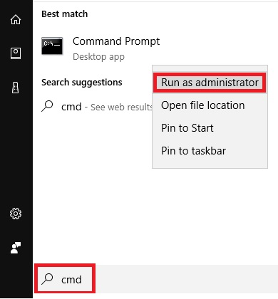
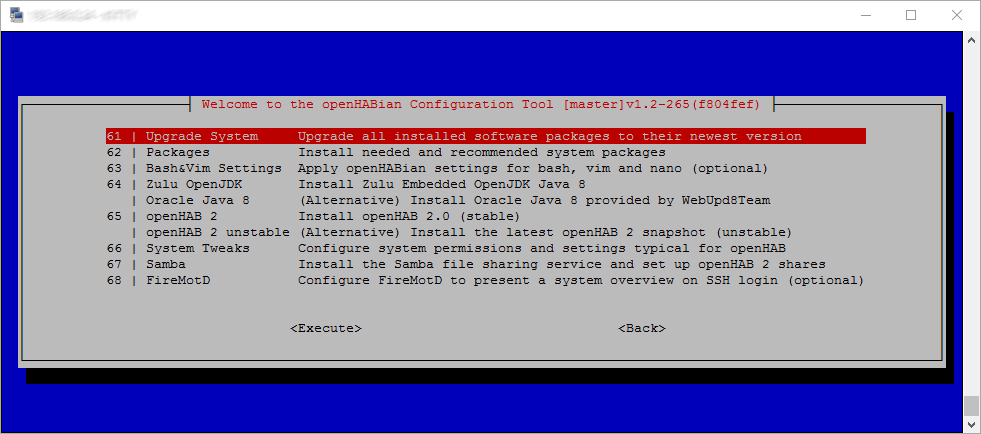
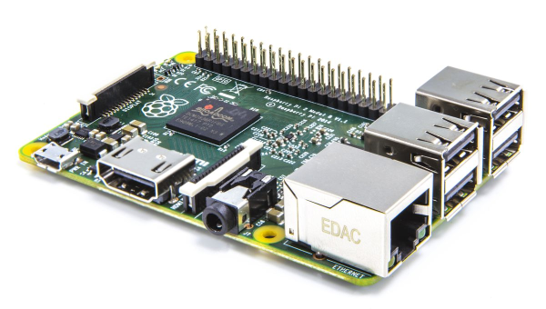

# Installation

openHAB 2 is based on the Eclipse SmartHome framework and is fully written in Java.
As such, it only depends on a Java Virtual Machine, which is available for many platforms.
openHAB can be executed on different versions of **Mac OS X** and **Windows** and many different variants of **Linux** (Ubuntu, Raspbian, ...).

Please be aware of the fact, that openHAB 2 is based on a new core and introduces new concepts.
Therefore, tutorials and help you may find on the internet for openHAB 1 **might** be outdated!

## Overview

### Platform Recommendations

1.  You are **new to openHAB 2** and want to give it a try? You are in luck:
    - Set up openHAB 2 on your local PC or Mac in just a few steps.

2.  You gained some experience and want to use openHAB to seriously control your home?
    Typical hardware and software requirements are:
    - **24/7 availability:** A dedicated system connected by Ethernet and running continuously.
    - **Energy and space efficient:** A device capable of performing the task at hand without being exaggerated
    - **Extendibility:** Your system should be capable of running additional software like an MQTT broker or a persistence and graphing software.
    - **Peripherals:** Depending on your home automation hardware, you will need additional  peripheral devices such as a WiFi interface or a special USB radio module.

Many devices are suited to host a continuous installation of openHAB 2.
Experiences with different devices and environments can be found in the [community forum hardware section](https://community.openhab.org/c/hardware/server).

The [Raspberry Pi](rasppi.html) as a minimal sufficient device is quite popular, especially as we offer a quick setup with [openHABian](openhabian.html).
A popular alternative is [our solution for the Synology DiskStation](synology.html), which many users already own in their homes.
The previously mentioned [openHABian](openhabian.html) can also be used to kickstart your openHAB 2 experience on existing Debian/Ubuntu based Linux systems.

Please check the menu to the left for all available options.

### Prerequisites

Make sure that you have an up to date Java platform installed on your host system.
Zulu is currently the recommended Java platform for openHAB.
[Download](https://zulu.org/download/?show=all) and [installation](http://zulu.org/zuludocs-folder/Content/ZuluInstallationGuide/InstallingZulu/InstallZulu.htm) instructions can be found on Azul Systems' Zulu website.
Oracle Java is also suitable for most configurations but licencing restrictions may apply.
OpenJDK may also be used, but it has some [known limitations](https://community.openhab.org/t/running-openhab-2-on-openjdk/21443/8?u=gatekeeper6838) with openHAB and is not recommended.

| Java Platform | Advantages | Disadvantages |
|---------------|------------|---------------|
| [Zulu](https://www.azul.com/products/zulu/) | Completely open source, fully certified Java SE compliant build of OpenJDK, embedded version optimized for ARM devices [available here](http://www.azul.com/downloads/zulu-embedded/) |  |
| [Oracle Java](https://java.com/en/) | Full openHAB support on all platforms | [Licensing restrictions](https://blog.takipi.com/running-java-on-docker-youre-breaking-the-law/), manual installation required on many Linux systems: [Ubuntu](https://help.ubuntu.com/community/Java), [Mint](https://community.linuxmint.com/tutorial/view/1091), and [Debian](https://wiki.debian.org/Java/Sun) are some examples |
| [OpenJDK](http://openjdk.java.net) | Supported by many Linux distributions, packages [typically available](http://openjdk.java.net/install/index.html) | [Performance issues](https://github.com/openhab/openhab-distro/issues/10#issuecomment-223786506) on ARM platforms, [compatibility issues](https://community.openhab.org/t/openhab-is-offline-message-fixed/17441/8) with certain bindings and certificates |

Please use the **32-bit version** of the JVM for ARM platforms, even on 64-bit operating systems.
Serial connections won't work with a 64-bit JVM, preventing bindings like Z-Wave from functioning.

As for now, a pre-release **Java 9** installation is not recommended and is not yet supported by openHAB 2.

For best compatibility, namely with the openHAB Cloud service [myopenhab.org](http://www.myopenhab.org), the minimum recommended Java 8 revision is "101".
Attention: Most package managers serve an **older revision**.
Check your current Java version by opening a command line console and typing `java -version`:

```text
java version "1.8.0_121"
Java(TM) SE Runtime Environment (build 1.8.0_121-b13)
Java HotSpot(TM) Client VM (build 25.121-b13, mixed mode)
```

### Setup variants

Before you can start, three decisions have to be made:

1.  openHAB 2 is available as a platform independent archive file or through a package repository:
    - **Manual setup:** Download and extract a platform independent zip archive: [Mac OS X](macosx.html), [Windows](windows.html), [Linux](linux.html#manual-installation)
    - **Package setup:** Install though a package repository, including automatic updates.
    This option is only available for Debian or Ubuntu derivatives and the recommended choice: [Linux (apt/deb)](linux.html#package-repository-installation)

2.  Stable release or cutting edge:
    - **Stable:** Use the latest official release ([hosted on Bintray](https://bintray.com/openhab/mvn/openhab-distro)).
    - **Snapshot:** Benefit from the latest changes in the daily created snapshot ([hosted on CloudBees](https://openhab.ci.cloudbees.com/job/openHAB-Distribution)).

### Installation

Please follow the instructions in the installation article matching your platform (see the menu to the left).

### Additional Steps

After you got openHAB 2 set up and running, there are a few additional setup steps you should consider:

-   Configure a network share on your openHAB host device and mount it locally: [Linux Samba Share](linux.html#network-sharing), Windows file sharing, ...

-   Install the [Eclipse SmartHome Designer](designer.html) on your local machine, to manage your (remote) configuration files.
    The designer comes with built-in support for the openHAB syntax and elements.

### Getting started

With the openHAB 2 distribution up and running, you should now continue with
the [Beginner Tutorial]({{base}}/tutorials/beginner)
or by working on your own configuration.

### Help

The very active [openHAB Community Forum](https://community.openhab.org) provides many more details and hints.
If you run into any problems, use the search function or open a new thread with your detailed question.

## Linux

The following instructions will guide you through the process of setting up openHAB 2 and recommended packages for both .DEB (Ubuntu, Debian etc.) and .RPM (RedHat, CentOS, Fedora etc.) Linux systems.

All instructions can be executed in a terminal or remotely via SSH connection.

This page is structured as follows:

{::options toc_levels="2..4"/}

- TOC
{:toc}

If you are unfamiliar with Linux, SSH and the Linux console or if you want to improve your skills, read up on these important topics.
A lot of helpful articles can be found on the internet, for example:

- "Learn the ways of Linux-fu, for free" interactively with exercises at [linuxjourney.com](https://linuxjourney.com).

Linux file permissions is one of the biggest sources of issues, Linux novices run into.
If you find yourself in a situation, where you have **no write access** to the openHAB configuration or system files wrong permissions and/or the incorrect use of `sudo` are often the cause.
Train your understanding of Linux permissions at [linuxjourney.com/lesson/file-permissions](https://linuxjourney.com/lesson/file-permissions).

**Meeting the Requirements:**
As a first step, please verify, that your system meets the [prerequisites](index.html#prerequisites).
You may want to install Zulu, a fully certified Java build [as a package](http://zulu.org/zuludocs-folder/Content/ZuluInstallationGuide/PrepareZuluPlatform/AttachAzulPackageRepositories.htm) or [manually](http://zulu.org/zuludocs-folder/Content/ZuluInstallationGuide/InstallingZulu/InstallLinuxUsingZuluZIPFile.htm).

Alternatively, Zulu Embedded can be installed for small systems either from the same package repository as above or [manually](http://www.azul.com/downloads/zulu-embedded/).
If you're unsure which manual file you should download, using `dpkg --print-architecture` or `rpm -q --qf '%{ARCH}\n' rpm` in your Linux terminal should point you in the right direction (e.g. armhf means ARM Hard Float).

When installing Zulu or Zulu Embedded from a .zip or .tar archive, make sure to [set Zulu as the main Java "alternative"](http://zulu.org/zuludocs-folder/Content/ZuluInstallationGuide/SwitchingBetweenJavaAlternatives/SwitchBetweenJavaAlts.htm).

**Note:** Make sure to download Zulu or Java **8**, as openHAB is not yet compatible with Java 9. 

### Installation

openHAB 2 can be installed though a package repository or manually from file.
The installation through a provided **package repository** (using `apt`, `apt-get`, `yum` or `dnf`) is **recommended** for end users.
The manual installation through a platform independent archive file is suited for users who know what they are doing.

#### Package Repository Installation

Installation through a package repository is the recommended choice. You can select the appropriate installation instructions by expanding from the apt or yum instructions.
Alternatively resort to the [manual installation approach](#manual-installation).




Apt Based Systems



First, add the openHAB 2 Bintray repository key to your package manager and allow Apt to use the HTTPS Protocol:

```shell
wget -qO - 'https://bintray.com/user/downloadSubjectPublicKey?username=openhab' | sudo apt-key add -
sudo apt-get install apt-transport-https
```

Then, you can choose between, *Official (Stable)*, *Beta* or *Snapshot* builds:

-   **Stable Release**

    The stable builds contain the latest official release with tested features.

    Add the **openHAB 2 Stable Repository** to your systems apt sources list:

    ```shell
    echo 'deb https://dl.bintray.com/openhab/apt-repo2 stable main' | sudo tee /etc/apt/sources.list.d/openhab2.list
    ```

-   **Testing Release**

    The beta and release candidate builds come out less frequently, but will contain new features that are currently in the testing phase.

    Add the **openHAB 2 Beta Repository** to your systems apt sources list:

    ```shell
    echo 'deb https://dl.bintray.com/openhab/apt-repo2 testing main' | sudo tee /etc/apt/sources.list.d/openhab2.list
    ```

-   **Snapshot Release**

    The snapshot build is created [almost daily](https://openhab.ci.cloudbees.com/job/openhab-linuxpkg/), and include the latest changes to the openHAB 2 core and add-ons.
    These changes are often unstable, so you should use this branch only for testing or development purposes.

    The snapshot repository is hosted in openHAB's [JFrog Artifactory instance](https://www.jfrog.com/Artifactory).
    To use it, add the **openHAB 2 Unstable Repository** to your systems apt sources list:

    ```shell
    echo 'deb https://openhab.jfrog.io/openhab/openhab-linuxpkg unstable main' | sudo tee /etc/apt/sources.list.d/openhab2.list
    ```

Next, resynchronize the package index:

```shell
sudo apt-get update
```

Now install openHAB with the following command:

```shell
sudo apt-get install openhab2
```

When you choose to install an add-on, openHAB will download it from the internet on request.
If you plan on disconnecting your machine from the internet, then you will want to also install the add-ons package.

```shell
sudo apt-get install openhab2-addons
```




Yum or Dnf Based Systems



The RPM repo information should be defined inside a file, make a new file at `/etc/yum.repos.d/openhab.repo` with the following contents depending on your choice of release.
You may add all three to the same file, but make sure the desired repo is is set to `enabled=1`:

-   **Stable Release**

    The stable builds contain the latest official release with tested features.

    ```text
    [openHAB-Stable]
    name=openHAB 2.x.x Stable
    baseurl=https://dl.bintray.com/openhab/rpm-repo2/stable
    gpgcheck=1
    gpgkey=https://bintray.com/user/downloadSubjectPublicKey?username=openhab
    enabled=1
    ```

-   **Testing Release**

    The beta or release candidate builds come out less frequently, but will contain new features that are currently in the testing phase.

    ```text
    [openHAB-Testing]
    name=openHAB 2.x.x Testing
    baseurl=https://dl.bintray.com/openhab/rpm-repo2/testing
    gpgcheck=1
    gpgkey=https://bintray.com/user/downloadSubjectPublicKey?username=openhab
    enabled=1
    ```

-   **Snapshot Release**

    The snapshot build is created [almost daily](https://openhab.ci.cloudbees.com/job/openhab-linuxpkg/), and include the latest changes to the openHAB 2 core and add-ons.
    These changes are often unstable, so you should use this branch only for testing or development purposes.

    ```text
    [openHAB-Snapshots]
    name=openHAB 2.x.x Snapshots
    baseurl=https://openhab.jfrog.io/openhab/openhab-linuxpkg-rpm/unstable
    gpgcheck=1
    gpgkey=https://openhab.jfrog.io/openhab/api/gpg/key/public
    enabled=1
    ```

Now install openHAB with the following command, please note that for systems that support it `dnf` can be used instead of yum:

```shell
sudo yum install openhab2
```

When you choose to install an add-on, openHAB will download it from the internet on request.
If you plan on disconnecting your machine from the internet, then you will want to also install the add-ons package.

```shell
sudo yum install openhab2-addons
```




Optionally, you may in addition install the legacy add-ons package `openhab2-addons-legacy`.
This package contains 1.x bindings, for which there is already a 2.x version available.
This might be useful if you're [coming from openHAB 1.x]({{base}}/tutorials/migration.html) for example.

If everything went well, you can start openHAB and register it to be automatically executed at system startup.




Systems based on **sysVinit** (e.g. Ubuntu 14.x, Debian Wheezy and older):



```shell
sudo /etc/init.d/openhab2 start
sudo /etc/init.d/openhab2 status

sudo update-rc.d openhab2 defaults
```




Systems based on **systemd** (e.g. Debian 8, Ubuntu 15.x, Raspbian Jessie and newer):



```shell
sudo systemctl start openhab2.service
sudo systemctl status openhab2.service

sudo systemctl daemon-reload
sudo systemctl enable openhab2.service
```




The first start may take **up to 15 minutes**, this is a good time to reward yourself with hot coffee or a freshly brewed tea!

You should be able to reach the openHAB 2 Dashboard at [http://openhab-device:8080]() at this point.
If you're new to openHAB, then you should checkout the [beginner's tutorial]({{base}}/tutorials/beginner/1sttimesetup.html)!


##### Service Control

openHAB will run as a service in the background.
The most important commands to control the openHAB service are given below.




Systems based on **sysVinit** (e.g. Ubuntu 14.x, Debian Wheezy and older):



  ```shell
  # Learn about the current service status
  sudo /etc/init.d/openhab2 status

  # (Re-)Start openHAB (background service)
  sudo /etc/init.d/openhab2 restart

  # Stop the openHAB background service
  sudo /etc/init.d/openhab2 stop

  # Make openHAB automatically start after booting the Linux host
  sudo update-rc.d openhab2 defaults
  ```




Systems based on **systemd** (e.g. Debian 8, Ubuntu 15.x, Raspbian Jessie and newer):



  ```shell
  # Learn about the current service status
  sudo systemctl status openhab2.service

  # (Re-)Start openHAB (background service)
  sudo systemctl restart openhab2.service

  # Stop the openHAB background service
  sudo systemctl stop openhab2.service
  
  # Get the service log since the last boot
  sudo journalctl -u openhab2.service -b

  # Make openHAB automatically start after booting the Linux host
  sudo systemctl daemon-reload
  sudo systemctl enable openhab2.service
  ```




##### Command Line Interface (CLI)

After installing openHAB, a shortcut named `openhab-cli` provides access to the openHAB-specific commands (such as [backup, restore](#backup-and-restore), and [console]({{base}}/administration/console.html)).
To use the shortcuts in a terminal, simply type `openhab-cli` followed by the command.
For example:

```shell
Usage:  openhab-cli command [options]

Possible commands:
  start [--debug]     -- Starts openHAB in the terminal.
  stop                -- Stops any running instance of openHAB.
  status              -- Checks to see if openHAB is running.
  console             -- Opens the openHAB console.
  backup [filename]   -- Stores the current configuration of openHAB.
  restore filename    -- Restores the openHAB configuration from a backup.
  showlogs            -- Displays the log messages of openHAB.
  info                -- Displays distribution information.
```

##### Changing Versions

To stay up to date with new releases, you should do regular upgrades.
This is especially important if you are working with the latest snapshot as changes and fixes are incorporated constantly.

Your personal configuration will be retained on upgrades.
We still recommend a backup before each upgrade.




Apt Based Systems



Upgrading is as easy as:

```shell
sudo apt-get update
sudo apt-get upgrade
```

You may want to switch to a different repo, or an older (but more stable) version of openHAB.
To do this, simply select the repo as in the [installation instructions above](#package-repository-installation), then find the version by bringing a list of all versions available to install:

```shell
sudo apt-get update
apt-cache showpkg openhab2
```

Once you know which version you want, you can upgrade/downgrade to it by using the `apt-get install openhab2=[version]` command, for example:

```shell
sudo apt-get install openhab2=2.1.0-1
```




Yum or Dnf Based Systems



Upgrading is as easy as: (you can use `dnf` instead of `yum` for systems that support it)

```shell
sudo yum upgrade
```

You may want to switch to a different version of openHAB.
To do this, simply select the repo as in the [installation instructions above](#package-repository-installation), then find the version by bringing a list of all versions available to install:

```shell
rpm -q openhab2
```

Once you know which version you want, you can upgrade/downgrade to it by using the `yum install openhab2-[version]` command, for example:

```shell
sudo yum install openhab2-2.1.0-1
```




##### Uninstall

To uninstall openHAB 2 and get rid of all related files managed by the package manager, make a backup, then uninstall openHAB and remove the repository:




Apt Based Systems



```shell
sudo apt-get purge openhab2*
sudo rm /etc/apt/sources.list.d/openhab2.list
```




Yum or Dnf Based Systems



```shell
sudo yum remove openhab2*
sudo rm /etc/yum.repos.d/openHAB.repo
```




#### Manual Installation

The manual installation/setup is an alternative to the otherwise **recommended** [installation through package repository](#package-repository-installation).

First, create a Linux system user for openHAB.
This user will later serve to execute the openHAB runtime with restricted permissions and can be used by other services like Samba if desired.

```shell
sudo adduser --system --no-create-home --group --disabled-login openhab
```

We are going to download a platform independent archive file and extract it to the path `/opt/openhab2`.
Choose between the latest Beta release or a Snapshot with all incoming contributions, created daily.
As openHAB 2 is still in an evolving state, the snapshot may be the **preferred choice**.

-   **Official Release**

    Download and extract the latest offical stable version of openHAB 2 from [bintray.com/openhab](https://bintray.com/openhab/mvn/openhab-distro) to your host:

    ```shell
    cd /tmp
    wget -O openhab-download.zip https://bintray.com/... # Insert download link here
    sudo unzip openhab-download.zip -d /opt/openhab2
    rm openhab-download.zip
    ```

-   **Beta/RC Release**

    If available, beta or release candidate builds of openHAB 2 can also be downloaded from [bintray.com/openhab](https://bintray.com/openhab/mvn/openhab-distro) and extracted to your host as shown above.

-   **Snapshot Release**

    Download and extract the latest snapshot version of openHAB 2 from [openhab.ci.cloudbees.com](https://openhab.ci.cloudbees.com/job/openHAB-Distribution) to your host. The process is analogue to above.

The extracted openHAB files should belong to the earlier created `openhab` user.
Execute:

```shell
sudo chown -hR openhab:openhab /opt/openhab2
```

Everything is ready for a first test run.
**Execute** openHAB and you should be able to reach the openHAB 2 Dashboard at [http://openhab-device:8080]() after a few minutes:

```shell
## execute as restricted user openhab:
sudo su -s /bin/bash -c '/opt/openhab2/start.sh' openhab
```

You will see the openHAB Karaf Console in your terminal and can directly interact with it.
Please be aware, that openHAB 2 will need a few minutes so finish the first start, even after the Karaf console is visible.
Let openHAB 2 settle for **around 15 minutes**.
If the portal is not reachable by then, restart once.


An important downside of the above method is, that openHAB will be terminated, as soon as you close your terminal.
To work around that, a quick solution is, to execute openHAB in a detached [screen](https://www.howtoforge.com/linux_screen) terminal.

A cleaner approach is to create a Linux service.

##### Service

The following instructions are intended for a Linux init system based on **systemd** (e.g. Debian 8 / Ubuntu 15.x and newer).
This will allow you to register openHAB as a service, so that it runs at startup and automatically restarts if openHAB crashes.
The service will be running with the privileges of the user "openhab" and expects the openHAB files under `/opt/openhab2`.

Create the file `/lib/systemd/system/openhab2.service` with the following content:

```ini
[Unit]
Description=The openHAB 2 Home Automation Bus Solution
Documentation=http://docs.openhab.org
Wants=network-online.target
After=network-online.target

[Service]
Type=simple
User=openhab
Group=openhab
GuessMainPID=yes
WorkingDirectory=/opt/openhab2
##EnvironmentFile=/etc/default/openhab2
ExecStart=/opt/openhab2/start.sh server
ExecStop=/bin/kill -SIGINT $MAINPID
Restart=on-failure

[Install]
WantedBy=multi-user.target
```

Next, enable the service to be executed on system startup, start the service and retrieve status information:

```shell
## initialize the new service (execute only once)
sudo systemctl daemon-reload
sudo systemctl enable openhab2.service

##start and retrieve status
sudo systemctl start openhab2.service
sudo systemctl status openhab2.service
```

The output of `status` after a successful execution should be similar to:

```text
 openhab2.service - The openHAB 2 Home Automation Bus Solution
   Loaded: loaded (/lib/systemd/system/openhab2.service; enabled)
   Active: active (running) since Thu 2016-08-14 01:16:00 GMT; 18h ago
     Docs: http://docs.openhab.org
```

##### Installing add-ons

When running a manual installation, it is possible to pre-download add-ons or legacy add-ons if you want to install any bindings at a later date without connecting to the internet.
Simply download the kar files (the latest builds can be found [here](https://openhab.ci.cloudbees.com/job/openHAB-Distribution/)) and move them to the `/opt/openhab2/addons` folder.

##### Upgrade

To stay up to date with new releases, you should do regular upgrades of your manual installation.
This is especially important if you are working with the latest snapshot as changes and fixes are incorporated [constantly](https://openhab.jfrog.io/openhab/webapp/#/builds/openHAB-Distribution).

openHAB uses a script to update to any other version, or from stable to snapshot and visa-versa.
Your personal configuration will be retained on upgrades, but you should **stop openHAB** and perform a backup first.

-   **Versions 2.1.0 and Above**

    From version 2.1.0, openHAB is distributed with the update script included.
    This script should be called from within openHAB's root directory.
    Assuming the openHAB directory is in `/opt/openhab`, simply run the following commands to update to the next major version of openHAB:

    ```bash
    cd /opt/openhab
    sudo runtime/bin/update
    ```

    You can also specify any version as a parameter. For example, to switch back to 2.0.0:

    ```bash
    sudo runtime/bin/update 2.0.0
    ```

    You may also change to openHAB's more frequent, but less stable snapshot builds.
    Just append "-SNAPSHOT" to the target version, e.g.:

    ```bash
    sudo runtime/bin/update 2.2.0-SNAPSHOT
    ```

-   **Older Versions**

    If you're using a version earlier than 2.1.0, then you can use the following commands in Terminal to download the script and run it.
    Assuming the openHAB directory is in `/opt/openhab`:

    ```bash
    cd /opt/openhab
    sudo sh -c "$(curl -fsSL https://raw.githubusercontent.com/openhab/openhab-distro/master/distributions/openhab/src/main/resources/bin/update)" -- 2.1.0
    ```

##### Uninstall

To uninstall (or more precisely remove) openHAB 2 after being manually set up, take a backup if needed and then simply stop and deactivate the openHAB service and get rid of all files:

```shell
sudo systemctl stop openhab2.service
sudo systemctl disable openhab2.service
sudo rm -rf /opt/openhab2/
sudo rm /lib/systemd/system/openhab2.service
```

#### File Locations

|                                  | Repository Installation      | Manual Installation (according to [guide](#manual-installation)) |
|:--------------------------------:|:---------------------------- |:----------------------------------|
| openHAB application              | `/usr/share/openhab2`        | `/opt/openhab2`                   |
| Additional add-on files          | `/usr/share/openhab2/addons` | `/opt/openhab2/addons`            |
| Site configuration               | `/etc/openhab2`              | `/opt/openhab2/conf`              |
| Log files                        | `/var/log/openhab2`          | `/opt/openhab2/userdata/logs`     |
| Userdata like rrd4j databases    | `/var/lib/openhab2`          | `/opt/openhab2/userdata`          |
| Backups folder                   | `/var/lib/openhab2/backups`  | `/opt/openhab2/backups`           |
| Service configuration            | `/etc/default/openhab2`      | (not preconfigured)               |

### Backup and Restore

It is recommended to make a backup of your configuration before *any* major change.
To make a backup of openHAB2, you need to retain your configuration and userdata files.
openHAB comes with scripts for storing your configuration in a zip file which is saved in `/var/lib/openhab2/backups` for automatic installs and `openhab2/backups` for manual installs.
You can change the default path by setting the $OPENHAB_BACKUPS environment variable.

```shell
sudo $OPENHAB_RUNTIME/bin/backup
### OR ##
sudo $OPENHAB_RUNTIME/bin/backup /path/to/backups/folder/myBackup.zip
```

To restore from these generated files:

```shell
sudo $OPENHAB_RUNTIME/bin/restore $OPENHAB_BACKUPS/myBackup.zip
```

If you're unsure how to use the above files, just use `--help` or `-h`:

```shell
$OPENHAB_RUNTIME/bin/backup --help
```

### Viewing Log Messages

You can learn more about openHAB and how it works by looking at your log files.
These will tell you everything you might need to know.
Execute the following command in one session or have both files separated in sessions side by side:

- Package repository based installation:

  ```shell
  tail -f /var/log/openhab2/openhab.log -f /var/log/openhab2/events.log
  ```

- Manual installation:

  ```shell
  tail -f /opt/openhab2/userdata/logs/openhab.log -f /opt/openhab2/userdata/logs/events.log
  ```

You could even set up an SSH configuration (in Putty or similar) to automatically connect and execute the commands every time you start working on your setup.

With openHAB 2 you can also [use the Karaf console]({{base}}/administration/logging.html#karaf-console) to have a colored glance at the logging information.

### Recommended Additional Setup Steps

The following is not directly related to the openHAB installation but rather recommended on a openHAB system.
The need for these and the exact implementation on a specific system might differ from user to user.

#### Privileges for Common Peripherals

An openHAB setup will often rely on hardware like a modem, transceiver or adapter to interface with home automation hardware.
Examples are a Z-Wave, Enocean or RXFcom USB Stick or a Raspberry Pi add-on board connected to the serial port on its GPIOs.
In order to allow openHAB to communicate with additional peripherals, it has to be added to corresponding Linux groups.
The following example shows how to add Linux user `openhab` to the often needed groups `dialout` and `tty`.
Additional groups may be needed, depending on your hardware and software setup.

```shell
sudo adduser openhab dialout
sudo adduser openhab tty
```

If you are looking to enable sound privileges for openHAB, it will also be necessary to add openHAB to the "audio" group.

```shell
sudo adduser openhab audio
```

Additionally it's needed to allow the java environment to access the serial port of the connected peripheral.
Therefore the following setting has to be added/adapted on your system in file `/etc/default/openhab2`:

```shell
EXTRA_JAVA_OPTS="-Dgnu.io.rxtx.SerialPorts=/dev/ttyUSB0:/dev/ttyS0:/dev/ttyS2:/dev/ttyACM0:/dev/ttyAMA0"
```

The shown device handlers are just the most common examples.
Please contact the community forum for more detailed information regarding individual hardware.

#### Java Network Permissions

The Java Virtual Machine hosting openHAB is restricted in it's permissions to interact on network level for security reasons.
Some openHAB add-ons, like the Network or AmazonDash bindings, need elevated permissions to work.
If needed, grand these permissions by executing the following command:

```shell
setcap 'cap_net_raw,cap_net_admin=+eip cap_net_bind_service=+ep' $(realpath /usr/bin/java)
```

#### Network Sharing

openHAB depends on configuration files and folders with custom content (details in [Configuration]({{base}}/configuration/index.html) articles).
Because your openHAB installation most probably is stored on a remote device, being able to easily access and modify these files from your local PC or Mac is important.
Therefore setting up a [Samba](https://en.wikipedia.org/wiki/Samba_%28software%29) network share is **highly recommended**.

The [Eclipse SmartHome Designer]({{base}}/configuration/editors.html#eclipse-smarthome-designer) software does also depend on a mounted share to access the openHAB configuration files.

We will now guide you through the Samba network shares setup process.
Start by installing Samba.
Afterwards open it's configuration file in your favorite editor:

```shell
sudo apt-get install samba samba-common-bin
sudo vim /etc/samba/smb.conf
```

Change the workgroup name if needed, otherwise uncomment and enable WINS support:

```ini
wins support = yes
```

Next, add the desired share configurations to the end of the file:

<!-- Note to author: Do not name share "openhab". Depending on the host system, a share for the home of user "openhab" will be created.-->

<!-- TODO: Limit to configuration folder??? -->

-   Package repository based installation:

    ```ini
    [openHAB2-userdata]
      comment=openHAB2 userdata
      path=/var/lib/openhab2
      browseable=Yes
      writeable=Yes
      only guest=no
      public=no
      create mask=0777
      directory mask=0777

    [openHAB2-conf]
      comment=openHAB2 site configuration
      path=/etc/openhab2
      browseable=Yes
      writeable=Yes
      only guest=no
      public=no
      create mask=0777
      directory mask=0777
    ```

-   Manual installation:

    ```ini
    [openHAB-files]
      comment=openHAB2
      path=/opt/openhab2
      browseable=Yes
      writeable=Yes
      only guest=no
      public=no
      create mask=0777
      directory mask=0777
    ```

Save and close the samba configuration file.

The shares are configured to be not open for guests nor to the public.
Let's activate the "openhab" user as a samba user and set his password (e.g. "habopen"):

```shell
sudo smbpasswd -a openhab
```

Be aware, that creating and later using a specific user will ensure, that [permissions](#permissions) are honored.
Make sure, the "openhab" user has ownership and/or write access to the openHAB configuration files.
This can be accomplished by executing:

```shell
sudo chown -hR openhab:openhab /etc/openhab2 /opt/openhab2/conf
```

Finally check the configuration file for correctness and restart Samba to load the new settings:

```shell
testparm

## Linux init systems based on sysVinit
sudo service smbd restart
## Linux init systems based on systemd
sudo systemctl restart smbd.service
```

##### Mounting Locally

After setting up and restarting Samba, check your connection to the shared folder and create a permanent mount.
Check the network devices manager of your local operating system to find and access your openHAB host and share.
These might however not be auto-discovered.
You can also manually connect:

- **On Mac OS X:** Open Finder → Go → Connect to Server: `smb://openhab@openhab-device.local`
- **On Windows:** Open Windows Explorer → Address bar: `\\openhab-device.local` → Right click a share and assign a drive letter

Be sure to use the actual host name instead of `openhab-device`.
When asked, authenticate with the username "openhab" and the chosen password.
If you are not able to connect, try with the IP of your device (e.g. `smb://openhab@192.168.0.2` or `\\192.168.0.2`).

If everything went well, you are set and ready to start [configuring]({{base}}/configuration/index.html) your openHAB system.

## Windows

The following instructions will guide you through the process of setting up openHAB 2.

This page is structured as follows:

{::options toc_levels="2..4"/}

- TOC
{:toc}

### Prerequisites

First, be sure to check that your system has the necessary [prerequisites]({{base}}/installation/index.html#prerequisites).

Add the `JAVA_HOME` System Environment Variable in Windows.
Navigate to:

- Control Panel ➡️ System and Security ➡️ System ➡️ Advanced System Settings ➡️ Environment Variables ➡️ System Variables

Create a New System Variable based on your Java installation directory:


The directory that openHAB is installed to must **contain no spaces**.
On this page, we will be using `C:\openHAB2` as an example.

### Installation

The openHAB runtime is distributed using a platform-independent zip file.
To install it, follow these simple steps:

1.  Choose between the Stable Version [](https://bintray.com/openhab/mvn/download_file?file_path=org%2Fopenhab%2Fdistro%2Fopenhab%2F2.2.0%2Fopenhab-2.2.0.zip) or the latest Snapshot Version [](https://openhab.ci.cloudbees.com/job/openHAB-Distribution/lastSuccessfulBuild/artifact/distributions/openhab/target/openhab-2.3.0-SNAPSHOT.zip) of openHAB.

2.  Unzip the file in your chosen directory (e.g. `C:\openHAB2`)

    

3.  Start the server: Launch the runtime by executing the script `C:\openHAB2\start.bat` and wait a while for it to start and complete.

    

4.  Point your browser to `http://localhost:8080`.
    You should be looking at the openHAB [package selection page]({{base}}/configuration/packages.html).
    When you've selected an appropriate package, this page will contain the [UI]({{base}}/addons/uis.html) selection screen.

#### File Locations

Assuming a successful install, you will now have various folders inside `C:\openHAB2`:

|                                  | Windows Installation         |
|:--------------------------------:|:-----------------------------|
| openHAB application              | `C:\openHAB2\runtime`        |
| Additional add-on files          | `C:\openHAB2\addons`         |
| Site configuration               | `C:\openHAB2\conf`           |
| Log files                        | `C:\openHAB2\userdata\logs`  |
| Userdata like rrd4j databases    | `C:\openHAB2\userdata`       |
| Service configuration            | `C:\openHAB2\userdata\etc`   |

### Backup

Make sure that you make regular backups of the **conf** and **userdata** folders, you can zip and unzip these folders too and from openHAB installations (even across most versions).
When you have a setup that you are happy with, it would be a good idea to make a backup of the whole `C:\openHAB2` folder.
Which can be used any time after a failure.

### Updating the openHAB Runtime

There is currently no automatic update script for Windows.
To update manually, download a later version of the openHAB distribution zip file and follow these steps:

1.  Stop the openHAB process if it is currently running.

2.  Backup openHAB as described above.

3.  Delete the following files and folders from your existing install:
    - `userdata\etc\all.policy`
    - `userdata\etc\branding.properties`
    - `userdata\etc\branding-ssh.properties`
    - `userdata\etc\config.properties`
    - `userdata\etc\custom.properties`
    - `userdata\etc\distribution.info`
    - `userdata\etc\jre.properties`
    - `userdata\etc\org.ops4j.pax.url.mvn.cfg`
    - `userdata\etc\profile.cfg`
    - `userdata\etc\startup.properties`
    - `userdata\etc\version.properties`
    - `userdata\etc\system.properties`
    - `userdata\etc\custom.system.properties`
    - Any file in `userdata\etc` that starts with `org.apache.karaf`
    - The `userdata\cache` folder
    - The `userdata\tmp` folder
    - The `runtime` folder

4.  Copy and paste the contents of the zip file over your existing install, when prompted **do not overwrite existing files**

### Starting openHAB as a Service

By installing the openHAB process as a service in Windows, you can:

- Launch it automatically upon system startup
- Run it in the background

**Windows Service Installation Steps**

1.  Complete the [prerequisites](#prerequisites) and regular [installation](#installation) steps, including the package selection

2.  Issue the following two commands in your openHAB console:
    ```shell
    feature:install service-wrapper
    wrapper:install --name "openHAB2" --display "openHAB2" --description "openHAB 2 Service"
    ```

    

3.  Shutdown the openHAB instance by typing `logout` in the currently running console.

4.  Update the newly created `C:\openHAB2\userdata\etc\openHAB2-wrapper.conf` to include all necessary parameters.

    - Copy all the config text from the below section and paste it in your `openHAB2-wrapper.conf`, replacing all existing content.
    - Adapt the first entry (`OPENHAB_HOME`) to match your openHAB installation directory.

    ```conf
    #*******************************************************
    # openHAB2-wrapper.conf for Windows Service Installation
    #*******************************************************

    # openHAB installation dir (Adapt this first setting to your system)
    set.default.OPENHAB_HOME=C:\openHAB2

    # Wrapper Properties
    set.default.OPENHAB_CONF=%OPENHAB_HOME%\conf
    set.default.OPENHAB_RUNTIME=%OPENHAB_HOME%\runtime
    set.default.OPENHAB_USERDATA=%OPENHAB_HOME%\userdata
    set.default.OPENHAB_LOGDIR=%OPENHAB_USERDATA%\logs
    set.default.KARAF_HOME=%OPENHAB_RUNTIME%
    set.default.KARAF_BASE=%OPENHAB_USERDATA%
    set.default.KARAF_DATA=%OPENHAB_USERDATA%
    set.default.KARAF_ETC=%OPENHAB_USERDATA%\etc
    set.default.PATH=%PATH%;%KARAF_BASE%\lib;%KARAF_HOME%\lib

    # Java Application
    wrapper.working.dir=%KARAF_BASE%
    wrapper.java.command=%JAVA_HOME%\bin\java
    wrapper.java.mainclass=org.apache.karaf.wrapper.internal.service.Main
    wrapper.java.classpath.1=%KARAF_HOME%\lib\boot\*.jar
    wrapper.java.classpath.2=%KARAF_DATA%\lib\wrapper\*.jar
    wrapper.java.library.path.1=%KARAF_DATA%\lib\wrapper\

    # Java Parameters
    wrapper.java.additional.1=-Dkaraf.home="%KARAF_HOME%"
    wrapper.java.additional.2=-Dkaraf.base="%KARAF_BASE%"
    wrapper.java.additional.3=-Dkaraf.data="%KARAF_DATA%"
    wrapper.java.additional.4=-Dkaraf.etc="%KARAF_ETC%"
    wrapper.java.additional.5=-Dcom.sun.management.jmxremote
    wrapper.java.additional.6=-Dkaraf.startLocalConsole=false
    wrapper.java.additional.7=-Dkaraf.startRemoteShell=true
    wrapper.java.additional.8=-Djava.endorsed.dirs="%JAVA_HOME%\jre\lib\endorsed;%JAVA_HOME%\lib\endorsed;%KARAF_HOME%\lib\endorsed"
    wrapper.java.additional.9=-Djava.ext.dirs="%JAVA_HOME%\jre\lib\ext;%JAVA_HOME%\lib\ext;%KARAF_HOME%\lib\ext"
    wrapper.java.additional.10=-Dopenhab.home="%OPENHAB_HOME%"
    wrapper.java.additional.11=-Dopenhab.conf="%OPENHAB_HOME%\conf"
    wrapper.java.additional.12=-Dopenhab.runtime="%OPENHAB_HOME%\runtime"
    wrapper.java.additional.13=-Dopenhab.userdata="%OPENHAB_HOME%\userdata"
    wrapper.java.additional.14=-Dopenhab.logdir="%OPENHAB_USERDATA%\logs"
    wrapper.java.additional.15=-Dfelix.cm.dir="%OPENHAB_HOME%\userdata\config"
    wrapper.java.additional.16=-Dorg.osgi.service.http.port=8080
    wrapper.java.additional.17=-Dorg.osgi.service.http.port.secure=8443
    wrapper.java.maxmemory=512

    # Wrapper Logging Properties
    wrapper.console.format=PM
    wrapper.console.loglevel=INFO
    wrapper.logfile=%OPENHAB_USERDATA%\logs\wrapper.log
    wrapper.logfile.format=LPTM
    wrapper.logfile.loglevel=INFO
    wrapper.logfile.maxsize=10m
    wrapper.logfile.maxfiles=5
    wrapper.syslog.loglevel=NONE

    # Wrapper Windows Properties
    wrapper.console.title=openHAB2
    wrapper.ntservice.name=openHAB2
    wrapper.ntservice.displayname=openHAB2
    wrapper.ntservice.description=openHAB 2 Service
    wrapper.ntservice.dependency.1=
    wrapper.ntservice.starttype=AUTO_START
    wrapper.ntservice.interactive=false
    ```

5.  Open an elevated command prompt and type the following commands:

    ```text
    C:\openHAB2\userdata\bin\openHAB2-service.bat install
    net start "openHAB2"
    ```

    

    

6.  Your openHAB Windows service is now installed and running.
    Validate proper operations by:

    -   Browsing to [http://localhost:8080](http://localhost:8080)

    -   Verifying that the Windows Service is running and set to Automatic Startup type.
        Use `services.msc` and find the `openHAB2` service.

        

    -   Logging in with an SSH client to the console (see info below)

#### Connecting to the openHAB console

You can connect to openHAB's console using the the `C:\openHAB2\runtime\bin\client.bat` script on the local machine. 
Alternatively, you can use a standard SSH client:

-   Install an SSH client application, e.g., [Putty](https://www.chiark.greenend.org.uk/~sgtatham/putty/latest.html), [KiTTY](http://kitty.9bis.net/) or [Xshell 5](https://www.netsarang.com/products/xsh_overview.html)

-   Setup a session with the following parameters:
    - Host: 127.0.0.1
    - Port: 8101
    - Username: `openhab`
    - Password: `habopen`


## macOS

This page is structured as follows:

{::options toc_levels="2..4"/}

- TOC
{:toc}

If you're unfamiliar with using the Mac OS terminal, then feel free to follow the many guides on the internet. For example:

[Macworld: How to use Terminal on mac](http://www.macworld.co.uk/feature/mac-software/how-use-terminal-on-mac-3608274/)

### Installation

openHAB is packaged as a platform independent `zip` archive. Installation is as simple as unziping it into a unique folder.
First, make sure that your system meets the [prerequisites](index.html#prerequisites).

You have the choice to use the current stable version or the latest snapshot build:

-   **Stable**

    The stable builds have undergone testing, it is the recommended version to download.
    Download the latest `openhab-2.x.x.zip` [here](https://bintray.com/openhab/mvn/openhab-distro/_latestVersion).

-   **Snapshot (Unstable)**

    Snapshots are built daily, and contain the latest changes to openHAB's source code.
    These changes haven't undergone the same amount of testing as the stable releases, so only use them if you **need** a new feature.
    Download the latest `openhab-2.x.x-SNAPSHOT.zip` [here](https://openhab.ci.cloudbees.com/job/openHAB-Distribution).

The following instructions are performed in a terminal window. At first launch of the terminal, you will be inside your home directory.

Choose a folder name to host your install. Be aware that the path to this folder **must not contain any spaces**.
The path chosen here is `openhab`.

```shell
mkdir ~/openhab
cd ~/openhab
```

Next, unzip the file downloaded earlier.
Assuming that you have downloaded the **stable** build to your download folder, the command will be:

```shell
unzip ~/Downloads/openhab-2.x.x.zip -d .
```

Check that the zip extraction was successful by using the `ls` command in order to check the contents of the folder.

```shell
user:openhab $ ls
LICENSE.TXT  conf     start.bat  start_debug.bat  userdata
addons       runtime  start.sh   start_debug.sh
```

If you see something similar to the above, then you're all set to launch openHAB for the first time.

### Launching openHAB

From inside openHAB's root directory (e.g. `~/openhab/), run openHAB's startup script by using the following command.

```shell
./start.sh
```

The first run may take a while to process, wait until the "`openhab>`" prompt appears, for example:

```shell_session
user:openhab $ sudo ./start.sh
Launching the openHAB runtime...

                          __  _____    ____
  ____  ____  ___  ____  / / / /   |  / __ )
 / __ \/ __ \/ _ \/ __ \/ /_/ / /| | / __  |
/ /_/ / /_/ /  __/ / / / __  / ___ |/ /_/ /
\____/ .___/\___/_/ /_/_/ /_/_/  |_/_____/
    /_/                        2.0.0 ...


Hit '<tab>' for a list of available commands
and '[cmd] --help' for help on a specific command.
Hit '<ctrl-d>' or type 'system:shutdown' or 'logout' to shutdown openHAB.

openhab>
```

Without closing the terminal, open your favorite web browser and type the following URL: [http://localhost:8080](http://localhost:8080), you should see the openHAB welcome screen, and you're all set to [using openHAB]({{base}}/tutorials/beginner/1sttimesetup.html).


### Updating openHAB

openHAB can use a script to update to any other version, or from stable to snapshot and visa-versa.

#### Versions 2.1.0 and Above

From version 2.1.0, openHAB is distributed with the update script included.
This script should be called from within openHAB's root directory.
Assuming the openHAB directory is in `~/openhab`, simply run the following commands to update to the next major version of openHAB:

```shell
cd ~/openhab
sudo runtime/bin/update
```

You can also specify any version as a parameter. For example, to switch back to 2.0.0:

```shell
sudo runtime/bin/update 2.0.0
```

You may also change to openHAB's more frequent, but less stable snapshot builds.
Just append "-SNAPSHOT" to the target version, e.g.:

```shell
sudo runtime/bin/update 2.2.0-SNAPSHOT
```

#### Older Versions

If you're using a version earlier than 2.1.0, then you can use the following commands in Terminal to download the script and run it.
Assuming the openHAB directory is in `~/openhab` simply run the following commands to update to the next major version of openHAB:

```shell
cd ~/openhab
sudo sh -c "$(curl -fsSL https://raw.githubusercontent.com/openhab/openhab-distro/master/distributions/openhab/src/main/resources/bin/update)" -- 2.1.0
```

### Backup and Restore

To make a backup of your openHAB 2 system, you need to retain your configuration and userdata files.
As of version 2.2.0, you can use openHAB's scripts for storing your configuration in a zip file. From the terminal:
By default, the script saves the zip file in `/var/lib/openhab2/backups` for automatic installs and `openhab2/backups` for manual installs.
You can change the default path by setting the $OPENHAB_BACKUPS environment variable.

```shell
sudo $OPENHAB_RUNTIME/bin/backup
### OR ##
sudo $OPENHAB_RUNTIME/bin/backup /path/to/backups/folder/myBackup.zip
```

To restore from these generated files:

```shell
cd $OPENHAB_HOME

sudo $OPENHAB_RUNTIME/bin/restore $OPENHAB_BACKUPS/myBackup.zip
```

If you're unsure how to use the above files, just use `--help` or `-h`:

```shell
$OPENHAB_RUNTIME/bin/backup --help
```

## openHABian

The Raspberry Pi and other small single-board computers are quite famous platforms for openHAB.
However, setting up a fully working Linux system with all recommended packages and openHAB recommendations is a **boring task** taking quite some time and **Linux newcomers** shouldn't worry about these technical details.

<p style="text-align: center; font-size: 1.2em; font-style: italic;"><q>A home automation enthusiast doesn't have to be a Linux enthusiast!</q></p>

openHABian aims to provide a **self-configuring** Linux system setup specific to the needs of every openHAB user.
To that end, the project provides two things:

* Complete **SD-card images pre-configured with openHAB** and many other openHAB- and Hardware-specific preparations for the Raspberry Pi and the Pine A64
* The openHABian Configuration Tool to set up and configure openHAB and many related things on any Debian/Ubuntu based system

##### Table of Content

{::options toc_levels="2..3"/}

- TOC
{:toc}

### Features

The following features are provided by the openHABian images out of the box:

- Hassle-free setup without a display or keyboard, connected via [Ethernet or Wi-Fi](#wifi-setup)
- openHAB 2 in the latest stable version
- Zulu Embedded OpenJDK Java 8 ([newest revision](http://zulu.org/zulu-community/zulurelnotes))
- [openHABian Configuration Tool](#openhabian-config) including updater functionality
- openHAB Log Viewer (based on [frontail](https://github.com/mthenw/frontail))
- Samba file sharing with [pre-configured to use shares](http://docs.openhab.org/installation/linux.html#mounting-locally)
- Useful Linux packages pre-installed, including `vim, mc, screen, htop, ...`
- Login information screen, powered by [FireMotD](https://github.com/OutsideIT/FireMotD)
- Customized Bash shell experience
- Customized vim settings, including [openHAB syntax highlighting](https://github.com/cyberkov/openhab-vim)
- Customized nano settings, including [openHAB syntax highlighting](https://github.com/airix1/openhabnano)
- Version control for `/etc` by the help of [etckeeper](http://etckeeper.branchable.com) (git)
- [Raspberry Pi specific](rasppi.html): Extend to the whole SD card, 16MB GPU memory split

Additionally the **openHABian Configuration Tool** [`openhabian-config`](#openhabian-config) is included and provides the following optional settings and components:


- Switch over to the latest openHAB 2 [*unstable/SNAPSHOT* build](http://docs.openhab.org/installation/linux.html#changing-versions)
- Install and Setup a [reverse proxy](security.html#nginx-reverse-proxy) with password authentication and/or HTTPS access (incl. [Let's Encrypt](https://letsencrypt.org) certificate) for self-controlled remote access
- Set up a Wi-Fi connection
- Bind the [openHAB remote console]({{base}}/administration/console.html) to all interfaces
- Easily install and preconfigure [Optional Components](#optional-components) of your choice
- ... and many more
- Raspberry Pi specific:
  - Prepare the serial port for the use with extension boards like Razberry, SCC, Enocean Pi, ...
  - Move the system partition to an external USB stick or drive
- Pine A64 specific:
  - Longsleep's [platform scripts](https://github.com/longsleep/build-pine64-image/tree/master/simpleimage/platform-scripts)
  - Assign [fixed MAC address to eth0](https://github.com/openhab/openhabian/issues/158#issuecomment-309067739)

### Quick Start

Here you'll find supported and tested installation platforms and instructions.

#### On a Raspberry Pi

**Flash, plug, wait, enjoy:**
The provided image is based on the [Raspbian Lite](https://www.raspberrypi.org/downloads/raspbian) standard system.
On first boot the system will set up openHAB and the mentioned settings and tools.
All packages will be downloaded in their newest version and configured to work without further modifications.
The whole process will take a few minutes, then openHAB and all other needed tools to get started will be ready to use without further configuration steps.
openHABian is designed as a headless system, you will not need a display or a keyboard.

Learn more about the Raspberry Pi as your platform for openHAB and about the requirements over in our [Raspberry Pi article](rasppi.html).

**Setup:**

- [Download the latest "openHABianPi" SD card image file](https://github.com/openhab/openhabian/releases) (Note: the file is *xz* compressed)
- Write the image to your SD card (e.g. with [Etcher](https://etcher.io), able to directly work with *xz* files)
- Insert the SD card into the Raspberry Pi, connect Ethernet ([Wi-Fi supported](#wifi-setup)) and power
- Wait approximately **15-45 minutes** for openHABian to do its magic
- Enjoy! 🎉


- The device will be available under its IP or via the local DNS name `openhabianpi`
- [Connect to the openHAB 2 dashboard](http://docs.openhab.org/configuration/packages.html): [http://openhabianpi:8080](http://openhabianpi:8080)
- [Connect to the Samba network shares](http://docs.openhab.org/installation/linux.html#mounting-locally) with username `openhabian` and password `openhabian`
- Connect to the openHAB Log Viewer (frontail): [http://openhabianpi:9001](http://openhabianpi:9001)
- If you encounter any setup problem, [please continue here](#successful)

You can stop reading now.
openHABian has installed and configured your openHAB system and you can start to use it right away.
If you want to get in touch with the system or want to install one of the previously mentioned optional features, you can come back here later.

Ready for more?
[Connect to your Raspberry Pi SSH console](https://www.raspberrypi.org/documentation/remote-access/ssh/windows.md) using the username `openhabian` and password `openhabian`.
You will see the following welcome screen:


➜ Continue at the ["openHABian Configuration Tool"](#openhabian-config) chapter below!

#### On a Pine A64

We provide a ready to use system image for the Pine A64.
The image is based on the official [Ubuntu Base Image by longsleep](http://wiki.pine64.org/index.php/Pine_A64_Software_Release).
On first boot the system will set up openHAB and the mentioned settings and tools.
All packages are downloaded in their newest version and configured to work without further modifications.
The whole process will take a few minutes, then openHAB and all other needed tools to get started will be ready to use without further configuration steps.
openHABian is designed as a headless system, you will not need a display or a keyboard.

Learn more about the Pine A64 as your platform for openHAB and about the requirements in our [Pine A64 article](pine.html).

*Attention:* Unstable behavior has been reported when using the Pine64 with and without a display connected to HDMI.
Read about the details in [this discussion](https://github.com/longsleep/build-pine64-image/issues/51).
As a workaround, please be sure to not have am HDMI display connected during the installation of openHABian.

**Setup:**

- [Download the latest "openHABianPine64" SD card image file](https://github.com/openhab/openhabian/releases) (Note: the file is *xz* compressed)
- Write the image file to your SD card (e.g. with [Etcher](https://etcher.io), able to directly work with *xz* files)
- Insert the SD card into the Pine A64, connect Ethernet ([Wi-Fi supported](#wifi-setup)) and power ([See here for more details](http://wiki.pine64.org/index.php/Main_Page#Step_by_Step_Instructions))
- Wait approximately **15-45 minutes** for openHABian to do its magic
- Enjoy! 🎉


- The device will be available under its IP or via the local DNS name `openhabianpine64`
- [Connect to the openHAB 2 dashboard](http://docs.openhab.org/configuration/packages.html): [http://openhabianpine64:8080](http://openhabianpine64:8080)
- [Connect to the Samba network shares](http://docs.openhab.org/installation/linux.html#mounting-locally) with username `openhabian` and password `openhabian`
- Connect to the openHAB Log Viewer (frontail): [http://openhabianpine64:9001](http://openhabianpine64:9001)
- If you encounter any setup problem, [please continue here](#successful)

You can stop reading now.
openHABian has installed and configured your openHAB system and you can start to use it right away.
If you want to get in touch with the system or want to install one of the previously mentioned optional features, you can come back here later.

Ready for more?
Connect to your Pine A64 [SSH console](https://www.raspberrypi.org/documentation/remote-access/ssh/windows.md) using the username `openhabian` and password `openhabian`.
You will see the following welcome screen:


➜ Continue at the ["openHABian Configuration Tool"](#openhabian-config) section below!

#### Manual Setup

openHABian also supports general Debian/Ubuntu based systems on different platforms.
Starting with a fresh installation of your operating system, install git, then clone the openHABian project and finally execute the openHABian configuration tool:

```shell
## install git
sudo apt-get update
sudo apt-get install git

## download and link
sudo git clone https://github.com/openhab/openhabian.git /opt/openhabian
sudo ln -s /opt/openhabian/openhabian-setup.sh /usr/local/bin/openhabian-config

## execute
sudo openhabian-config
```

You'll see the openHABian configuration menu and can now select all desired actions.
The "Manual/Fresh Setup" submenu entry is the right place for you. Execute all entries one after the other to get the full openHABian experience:



> Attention:
> openHABian usage on a custom system is supported and should be safe.
> Still some routines might not work for you.
> Please be cautious and have a close look at the console output for errors.
> Report problems you encounter to the [openHABian Issue Tracker](https://github.com/openhab/openhabian/issues).

{: #wifi-setup}
#### Wi-Fi based Setup Notes

If you own a RPi3, a RPi0W, a Pine A64, or a compatible Wi-Fi dongle you can set up and use openHABian purely via Wi-Fi.
For the setup on Wi-Fi, you'll need to make your SSID and password known to the system before the first boot.
Additionally to the setup instructions given above, the following steps are needed:

- Flash the system image to your micro SD card as described, do not remove the SD card yet
- Access the first SD card partition from the file explorer of your choice (e.g. Windows file explorer)
- Open the file `openhabian.conf` in a text editor
- Uncomment and fill in `wifi_ssid="My Wi-Fi SSID"` and `wifi_psk="password123"`
- Save, Unmount, Insert, Boot
- Continue with the instructions for the Raspberry Pi or Pine A64

{: #openhabian-config}
### openHABian Configuration Tool

The following instructions are oriented at the Raspberry Pi openHABian setup but are transferable to all openHABian environments.

Once connected to the command line console of your system, please execute the openHABian configuration tool by typing the following command.
(Hint: sudo executes a command with elevated rights and will hence ask for your password: `openhabian`).

```shell
sudo openhabian-config
```


The configuration tool is the heart of openHABian.
It is not only a menu with a set of options, it's also used in a special unattended mode inside the ready to use images.

⌨ - A quick note on menu navigation.
Use the cursor keys to navigate, &lt;Enter&gt; to execute, &lt;Space&gt; to select and &lt;Tab&gt; to jump to the actions on the bottom of the screen. Press &lt;Esc&gt; twice to exit the configuration tool.

#### Linux Hints

If you are unfamiliar with Linux, SSH and the Linux console or if you want to improve your skills, read up on these important topics.
A lot of helpful articles can be found on the internet, for example:

- "Learn the ways of Linux-fu, for free" interactively with exercises at [linuxjourney.com](https://linuxjourney.com).
- The official Raspberry Pi help articles over at [raspberrypi.org](https://www.raspberrypi.org/help)
- "Now what?", Tutorial on the Command line console at [LinuxCommand.org](http://linuxcommand.org/index.php)

*The good news:* openHABian helps you to stay away from Linux - *The bad news:* Not for long...

Regardless of if you want to copy some files or are on the search for a solution to a problem, sooner or later you'll have to know some Linux.
Take a few minutes to study the above Tutorials and get to know the most basic commands and tools to be able to navigate on your Linux system, edit configurations, check the system state or look at log files.
It's not complicated and something that doesn't hurt on ones résumé.

#### First Steps with openHAB

After your first setup of openHABian is successful and you are able to access the openHAB dashboard, you should dig into the possibilites.
Install [Bindings](https://docs.openhab.org/addons/bindings.html), discover your devices, and [configure your smart home](http://docs.openhab.org/configuration/index.html).
You might want to start defining [Items](http://docs.openhab.org/configuration/items.html), [Sitemap](http://docs.openhab.org/configuration/sitemaps.html) and [HABPanel](http://docs.openhab.org/addons/uis/habpanel/readme.html) dashboard for your home.
To kickstart that process you may check out the openHAB [Home Builder](https://docs.openhab.org/configuration/homebuilder.html).

These are just some first hints.
Be sure to read up on the [Configuration](http://docs.openhab.org/configuration/index.html) section of the documentation page to learn more.

{: #further-config}
#### Further Configuration Steps

openHABian is supposed to provide a ready-to-use openHAB base system. There are however a few things we can not decide for you.

- **Time Zone:** The time zone of your openHABian system will be determined based on your internet connection. In some cases you might have to adjust that setting.
- **Language:** The `locale` setting of the openHABian base system is set to "en_US.UTF-8". While this setting will not do any harm, you might prefer e.g. console errors in German or Spanish. Change the locale settings accordingly. Be aware, that error solving might be easier when using the English error messages as search phrases.
- **Passwords:** Relying on default passwords is a security concern you should care about! The openHABian system is preconfigured with a few passwords you should change to ensure the security of your system. This is especially important of your system is accessible from outside your private subnet.

All of these settings **can easily be changed** via the openHABian Configuration Tool.

Here are the passwords in question with their respective default "username:password" values. 
All password can be changed from openHABian menu.

{: #passwords}
- User password needed for SSH or sudo (e.g. "openhabian:openhabian")
- Samba share password (e.g. "openhabian:openhabian")
- openHAB remote console (e.g. "openhab:habopen")
- Amanda backup password (no default, applied when installing)
- Nginx reverse proxy login (no default, applied when installing) *For manual configuration see [here](http://docs.openhab.org/installation/security.html#adding-or-removing-users).*
- InfluxDB (No password set by default)
- Grafana visualization ("admin:admin")

### Optional Components

openHABian comes with a number of additional routines to quickly install and set up home automation related software.
You'll find all of these in the [openHABian Configuration Tool](#openhabian-config)

- [Amanda Network Backup](http://www.amanda.org/) - A built-in backup solution for your valuables. Please continue reading [here](https://github.com/openhab/openhabian/blob/master/docs/openhabian-amanda.md)
- [frontail](https://github.com/mthenw/frontail) - openHAB Log Viewer accessible from [http://openHABianPi:9001](http://openHABianPi:9001)
- [Node-RED](https://nodered.org) - "Flow-based programming for the Internet of Things", with preinstalled [openHAB2](https://flows.nodered.org/node/node-red-contrib-openhab2) and [BigTimer](https://flows.nodered.org/node/node-red-contrib-bigtimer) add-ons. Accessible from [http://openHABianPi:1880](http://openHABianPi:1880)
- [KNXd](http://michlstechblog.info/blog/raspberry-pi-eibknx-ip-gateway-and-router-with-knxd) - KNX daemon running at `224.0.23.12:3671/UDP`
- [Homegear](https://www.homegear.eu/index.php/Main_Page) - Homematic control unit emulation
- [Eclipse Mosquitto](http://mosquitto.org) - Open Source MQTT v3.1/v3.1.1 Broker
- [OWServer](http://owfs.org/index.php?page=owserver_protocol) - 1wire control system
- [Grafana](https://community.openhab.org/t/influxdb-grafana-persistence-and-graphing/13761/1) - persistence and graphing available from [http://openHABianPi:3000](http://openHABianPi:3000)

### FAQ and Troubleshooting

For openHABian related questions and further details, please have a look at the main discussion thread in the Community Forum:

- [https://community.openhab.org/t/13379](https://community.openhab.org/t/13379)

If you want to get involved, you found a bug, or just want to see what's planned for the future, come visit our Issue Tracker:

- [https://github.com/openhab/openhabian/issues](https://github.com/openhab/openhabian/issues)

{: #changelog}
##### Where can I find a changelog for openHABian?

The official changelog announcements are posted [here](https://community.openhab.org/t/13379/1) and [here](https://github.com/openhab/openhabian/releases), be sure to check these out regularly.
If you want to stay in touch with all the latest code changes under the hood, see the [commit history](https://github.com/openhab/openhabian/commits/master) for openHABian.
You'll also see added commits when executing the "Update" function within the openHABian Configuration Tool.

{: #successful}
##### Did my Installation succeed? What to do in case of a problem?

**A note on patience:**
Remember to stay calm.
The openHABian setup will take 15 up to 45 minutes to complete all steps.
This time highly depends on your device's performance, your internet connection and sometimes even on the load of external servers.

<!--
###### LED Indication (RPi only)

During and after the first boot of your Raspberry Pi, the green on-board LED will indicate the setup progress (no display needed):

* `❇️️ ❇️️    ❇️️ ❇️️     ` - Steady "heartbeat": setup **successful**
* ` ❇️️         ❇️️❇️️❇️️ ` - Irregular blinking: setup in progress...
* `❇️️ ❇️️ ❇️️ ❇️️ ❇️️ ❇️️ ❇️️` - Fast blinking: error while setup
-->

**RPi note:**
The progress indication via the **green Raspberry Pi LED** is currently not possible and hence not part of the openHABian v1.3 image.
We will re-add the functionality as soon as the underlying issue is resolved.

###### openHAB Dashboard

After the installation of openHABian was successful, you should be able to access the openHAB dashboard:

- Raspberry Pi image setup: [http://openhabianpi:8080](http://openhabianpi:8080)
- Pine A64 image setup: [http://openhabianpine64:8080](http://openhabianpine64:8080)
- In any case: [http://your-device-hostname:8080](http://your-device-hostname:8080) or [http://192.168.0.2:8080](http://192.168.0.2:8080) (replace name/IP)

###### SSH Progress Report

It is always possible to [connect to the SSH console](https://www.raspberrypi.org/documentation/remote-access/ssh/windows.md) of your device (after a few minutes of boot up time).
During the setup process you'll be redirected to the live progress report of the setup.
The report can also be checked for errors after the installation finished by executing: `cat /boot/first-boot.log`

The progress of a successful installation will look similar to the following:


Wait till the log tells you that the setup was "successful", then reconnect to the device.

###### SSH Login Screen

If the installation was **successful** you will see the normal login screen as shown in the first screenshot.
If the installation was **not successful** you will see a warning and further instructions as shown in the second screenshot.

<div class="row">
  <div class="col s12 m5"></div>
  <div class="col s12 m5 offset-m2"></div>
</div>

###### What Next?

If you are not able to access your system via the openHAB dashboard or SSH after more than one hour, chances are high that your hardware setup is the problem.
Try using a steady power source and a reliable SD card, double check the network connection.
Restart the complete setup process to rule out most other possible causes.

Contact the [openHABian community forum thread](https://community.openhab.org/t/13379) if the problem persists.

{: #switch-openhab-branch}
##### Can I switch from openHAB 2 stable to the testing or unstable branch?

openHABian installs the latest stable build of openHAB 2.
If you want to switch over to the snapshot release branch, please do so via the openHABian Configuration Tool.
Switching from stable to newer development releases might introduce changes and incompatibilities, so please be sure to make a full openHAB backup first!

Check the Linux installation article for all needed details: [Linux: Changing Versions](http://docs.openhab.org/installation/linux.html#changing-versions)

{: #headache}
##### Where is the graphical user interface?

You've just installed openHABian and are confused.
No fancy login screen, no windows, no mouse support. What did I get into?

You are not the first one to get confused about the **intended use case of openHABian** or most other solutions based on a Raspberry Pi.
Maybe it helps to not think of the RPi as a PC as we know it.
It is not (necessarily) build to be used with a keyboard and display.
You already own a **powerful PC or Mac** which you should benefit from.
It would be a shame to have a powerful computer at your fingertips and then have to **restrict yourself** to a very limited graphical frontend on another device, wouldn't you agree?

The intended use case of a lot of these small SBCs is to sit in a corner and provide a service reliably 24/7.
You'll find that most solutions for the RPi are characterized by this.

Moving on.
What *we* actually want and what openHABian is aimed for is a **dedicated headless system** to **reliably execute openHAB** and to **expose all interfaces** needed to interact and configure it (PaperUI, BasicUI, HABPanel, openHAB LogViewer, Samba Network Shares, openHABian Configuration Tool, SSH).
If you know how to work with these interfaces, you are set for a way better experience than the alternatives.
The main challenge is to **get used to the Linux command line**, not even a GUI (like Pixel, see below) will relieve you from that in the long run.
If you are not willing to teach yourself a few fundamental Linux skills you will not become happy with any Linux system and should resort to a e.g. Windows machine.
However as you are willing to tinker with smart home technology, I'm sure you are ready to **teach yourself new stuff** and expand your experience.

**If** the above didn't convince you, execute the following commands to get the graphical user interface [Pixel](https://www.raspberrypi.org/blog/introducing-pixel) installed.
You have been warned, if there came any warranty with openHABian to begin with, it would end here.

```shell
sudo apt install raspberrypi-ui-mods
sudo reboot
```

After the reboot, connect via SSH and type the following command to start a VNC server to connect to:

```shell
vncserver -randr 1280x800
```

{: #faq-other-platforms}
##### Can I use openHABian on ...?

openHABian is restricted to Debian/Ubuntu based systems.
If your operating system is based on these or if your Hardware supports one, your chances are high openHABian can be used.
Check out the [Manual Setup](#manual-setup) instructions for guidance.

Differences between systems can still be a problem, so please check the [openHABian community forum thread](https://community.openhab.org/t/13379) or the [Issue Tracker](https://github.com/openhab/openhabian/issues) for more information.
Do not hesitate to ask!

## Docker Container

Docker is the most popular among a collection of tools that provide containerization.
Containerization allows one to run a server in its own isolated environment without the overhead of running a full virtual machine.

This page is structured as follows:

{::options toc_levels="2..4"/}

- TOC
{:toc}

### Why Docker?

There are several reasons one would want to run openHAB in a Docker container.
These include:

- easily test out different versions
- run multiple instances side by side
- easily map the OH ports to other ports without modifying configs
- isolate OH from the rest of your server environment (e.g. configure the container's networking so the only way it can be accessed is through a reverse proxy)
- orchestration and automated deployment of OH and related servers

However, this flexibility comes at a cost.
For example, because openHAB is running in its own container with only enough installed to run openHAB, the Exec binding is very likely to be useless to you because the container will not have access to the programs and files you need.

### About the openHAB installed in the Image

Inside the Docker Image, openHAB is installed to `/openhab`.
The install is a manual installation so all of the files are located here.
This is also set as the home directory of the `openhab` user.

The Image has a very minimal installation of Linux with no services running and just enough installed to allow openHAB to run.

At the time of this writing, the official image uses the latest snapshot version of openHAB 2.

### Installation through Docker

#### Obtaining the Official image from DockerHub

[Docker Hub](https://hub.docker.com/r/openhab/openhab/) has the basic information necessary to acquire and run the Docker image.
Please review those instructions before continuing to select the correct image for your machine and download the image.

#### Create the openhab user

Just because one is running in an isolated container does not mean running as root is recommended.
So first create an `openhab` user configured to be a system user with no home and no shell.
This can be done on Ubuntu and Raspbian with the command:

```bash
sudo useradd -r -s /sbin/nologin openhab
```

Add your regular user to the `openhab` group.

```bash
usermod -a -G openhab <user>
```

#### Create the openHAB conf, userdata, and addon directories

These directories will be mounted into the running Docker container and are where the configurations and persistence data will be stored.
Note that the software running inside a Docker container cannot follow the symbolic links located in a mounted volume.
Make sure the `openhab` user owns these directories.

```bash
mkdir /opt/openhab
mkdir /opt/openhab/conf
mkdir /opt/openhab/userdata
mkdir /opt/openhab/addons
chown -R openhab:openhab /opt/openhab
```

#### Running the Container as a Service Managed by Docker

Note, always review the README on [Docker Hub](https://hub.docker.com/r/openhab/openhab/) for the most up to date set of recommended arguments and environment variables.
Services can be run an maintained on a Linux machine one of two ways, using Docker or using the system's built in service management (e.g. systemd).
If using docker to manage the service, run the following command:

```bash
docker run \
        --name openhab \
        --net=host \
        --tty \
        -v /etc/localtime:/etc/localtime:ro \
        -v /etc/timezone:/etc/timezone:ro \
        -v /opt/openhab/conf:/openhab/conf \
        -v /opt/openhab/userdata:/openhab/userdata \
        -v /opt/openhab/addons:/openhab/addons\
        -d \
        -e USER_ID=<uid> \
        -e GROUP_ID=<gid> \
        --restart=always \
        openhab/openhab:<version>-<architecture>-<distributions>
```

Where 

- `<uid>` is the user ID number for the `openhab` user which you can obtain using the command `id openhab`, 
- `<gid>` is the group ID number for the `openhab` user, 
- `<version>` is the version of openHAB, 
- `<architecture>` is the architecture of your system and 
- `<distributions>` is the base system (debian or alpine).

It is important that the ID number is passed in.
The ID for the `openhab` user inside the container will not match the ID of the user on your host system and file permissions may be a bit odd (e.g. why does www-data own my openHAB config files?).

See below for an explanation of the fields passed to Docker and potential additional fields.

Once it successfully runs (it should be listed with a CREATED time that does not include "restarting" when running `docker ps`):

- To stop the service run `docker stop openhab`.
- To restart the service run `docker restart openhab`
- To start the service run `docker start openhab`

To change the runtime parameters stop the container then execute the long command above with the new parameters.

#### Running the Container as a Service Controlled by Systemd

Note, always review the README on [Docker Hub](https://hub.docker.com/r/openhab/openhab/) for the most up to date set of recommended arguments and environment variables.
If running on a Systemd based Linux distro (Ubuntu 16.1 to be specific).
The following openhab2.service file will start a new openHAB 2 container every time it starts the service and destroy that container when the service stops.
What that means is any data that you want to preserve between restarts of openHAB 2 (e.g. configuration, databases, etc.) must be mounted from your host file system into the container.

Creating a new container on every run greatly simplifies the upgrade and update process.
It also ensures that you start with a fresh install every time you run which can avoid some problems.

```bash
[Unit]
Description=openHAB 2
Requires=docker.service
After=docker.service

[Service]
Restart=always
ExecStart=/usr/bin/docker run --name=%n --net=host --tty \
  -v /etc/localtime:/etc/localtime:ro \
  -v /etc/timezone:/etc/timezone:ro \
  -v /opt/openhab/conf:/openhab/conf \
  -v /opt/openhab/userdata:/openhab/userdata \
  -v /opt/openhab/addons:/openhab/addons \
  -v /opt/openhab/.java:/openhab/.java \
  --device=/dev/ttyUSB0 \
  -e USER_ID=<uid_of_openhab> \
  -e GROUP_ID=<gid_of_openhab> \
  openhab/openhab:<version>-<architecture>-<distributions>
ExecStop=/usr/bin/docker stop -t 2 %n ; /usr/bin/docker rm -f %n

[Install]
WantedBy=multi-user.target
```

Where `<uid>` is the user ID number for the `openhab` user which you can obtain using the command `id openhab`, `<version>` is the version of openHAB, `<architecture>` is the architecture of your system and `<distributions>` is the base system (debian or alpine).
It is important that the ID number is passed in.
The ID for the `openhab` user inside the container will not match the ID of the user on your host system and file permissions may be a bit odd (e.g. why does www-data own my openHAB config files?).

Place this openhab2.service file into `/etc/systemd/system`.

Then run `sudo systemctl enable openhab2.service`.

Finally run `sudo systemctl start openhab2.service` to start openHAB running.

### Explanation of Arguments Passed to Docker

Note, always review the README on [Docker Hub](https://hub.docker.com/r/openhab/openhab/) for the most up to date set of recommended arguments and environment variables.
- `/usr/bin/docker run` : create a new container from the passed in Image (last argument)
- `--name=openhab` : give the container a human remember able name
- `--net=host` : by default Docker will place a container into its own network stack. However, openHAB 2 requires UPnP discovery so this parameter makes the Docker container use the host's network stack.
- `--tty` : allocate a pseudo-TTY, required by the Karaf Console
- `-v /etc/localtime:/etc/localtime:ro` : ties the time of the container to the host's time, read only so the container cannot change the host's time
- `-v /etc/timezone:/etc/timezone:ro` : ties the timezone of the container to the host's time zone, read only so the container cannot change the host's time zone
- `-v /opt/openhab/conf:/openhab/conf` : location of the conf folder for openHAB configurations (NOTE: you must create these folders on the host before running the container)
- `-v /opt/openhab/userdata:/openhab/userdata` : location for logs, cache, persistence databases, etc.
- `-v /opt/openhab/addons:/openhab/addons` : only needed if installing addons unavailable via PaperUI or the Karaf Console
- `-v /opt/openhab/.java:/openhab/.java` : needed by the Nest binding (and others?), location of the security token
- `--user=<uid>` : sets the user that runs the processes inside the container to match the uid passed, makes sure the `openhab` user can read and write to all needed files
- `--device=/dev/ttyUSB0` : location of my zwave controller, change and/or add more --device tags to pass all your devices needed by openHAB to the container
- `--restart=always` : if the container crashes or the system reboots the container is restarted
- `openhab/openhab:<version>-<architecture>-<distributions>` : name of the Docker Image
- `start_debug.sh` : You can start the container with the command ``docker run -it openhab/openhab:<version>-<architecture>-<distributions> ./start_debug.sh`` to get into the debug shell. You might need to mount additional volumes and parameters as described above.

### Environment Variables

- `EXTRA_JAVA_OPTS`=""
- `LC_ALL`=en_US.UTF-8
- `LANG`=en_US.UTF-8
- `LANGUAGE`=en_US.UTF-8
- `OPENHAB_HTTP_PORT`=8080
- `OPENHAB_HTTPS_PORT`=8443
- `USER_ID`=9001

By default the openHAB user in the container is running with:

- `uid=9001(openhab) gid=9001(openhab) groups=9001(openhab)`

### Updating the Image

Stop the container:

`docker stop openhab` or `sudo systemct stop openhab`

Delete the container:

`docker rm openhab`

Pull down the latest image:

```bash
docker pull openhab/openhab:<version>-<architecture>-<distributions>
```

where `<version>` is the version of openHAB, `<architecture>` is your architecture and `<distributions>` is the base system (debian or alpine).

Restart the container using the full command above.

The Docker image will automatically perform an upgrade on your mapped in userdata folder whenever it detects that your userdata version and the image's version differ.
It determines the versions are different by comparing userdata/etc/version.properties.
Any changes between the two files will trigger and upgrade.

The upgrade process first creates a backup of the entire mapped in userdata folder (skipping the backup folder) and places it as a dated tar file into userdata/backup.
It then performs all the same steps that the upgrade script and which are performed by an apt-get/yum upgrade.

## Raspberry Pi

Because of it's **low price**, it's **small form factor** and the **low energy consumption**, the [Raspberry Pi](https://www.raspberrypi.org) is a quite popular platform for openHAB.
It is favored amongst existing users and a recommended choice for newcomers.



If you want to learn more about the possibilities of the Raspberry Pi and Linux in general, many tutorials can be found on the internet.
These including the official [raspberrypi.org help articles](https://www.raspberrypi.org/help) or the in-detail articles at [eLinux.org](http://elinux.org/RPi_Tutorials).

Recommendations for a ["headless"](https://en.wikipedia.org/wiki/Headless_computer) hardware setup:

- [Raspberry Pi 2 or newer](https://en.wikipedia.org/wiki/Raspberry_Pi#Specifications), compare your existing device [here](https://en.wikipedia.org/wiki/Raspberry_Pi#Connectors) if you are unsure.
- SD card (16GB or more to support [wear-leveling](https://en.wikipedia.org/wiki/Wear_leveling))
- Steady power supply
- Ethernet connection
- *No connected display or keyboard needed*

### Recommended Setup

We are proud to provide a **preconfigured image** for the Raspberry Pi, with the latest build of openHAB 2 and many useful software components (like Samba, Grafana or Mosquitto) as optional setup steps.
The image provided by the **openHABian** projects is based on Raspbian and under constant improvement.

Check out more details about [openHABian, the hassle-free openHAB setup](openhabian.html).

### Manual Setup

If you want or need to set up openHAB on a Raspberry Pi by yourself, please follow these recommendations.
For the beginning, we recommend to [download](https://www.raspberrypi.org/downloads/raspbian) and [install](https://www.raspberrypi.org/documentation/installation/installing-./images/installation/README.md) the latest Raspbian SD card image.
You may choose the "Lite" version.

**Attention:**
As of the November 2016 release, Raspbian has the SSH server disabled by default.
You will have to enable it manually.
For headless setup, SSH can be enabled by placing a file named "ssh", without any extension, onto the boot partition of the SD card.

**Connecting:**
Get your SD card and network cable plugged in and power up.
Booting up takes up to 10 minutes.
To connect with an SSH client (like [Putty](https://www.raspberrypi.org/documentation/remote-access/ssh/windows.md)), you need to know the IP address or hostname of your device.
A standard Raspbian setup should be reachable either by the hostname "raspberrypi" or though the local domain name "raspberrypi.local".
If you are not able to connect, check your routers web frontend for newly connected devices.

**First Steps:**
Connected via SSH, execute the Raspbian configuration menu by running `sudo raspi-config`.
Go through the following steps:

- Expand the file system
- Change your password
- (Change the host name if you wish, e.g. "openhabpi")
- From the advanced menu, change the memory split for the GPU to "16"
- Restart

As a good practice, run a full upgrade and install packages you like or need (a set of helpful packages is given as an example):

```shell
sudo apt-get update
sudo apt-get upgrade

sudo apt-get install screen mc vim git htop
```

**Note on Java:**
Raspbian in the latest full version already includes Oracle Java 8.
However, at the time of this writing, the installed revision is lower than the [recommended](index.html#prerequisites).
Raspbian Lite comes without Java to begin with.

Please refer to the Linux article for instructions on [how to install the latest Java 8 revision](linux.html).

**Installation:**
Finally install openHAB on your Raspberry Pi, just as it is described in the [openHAB 2 on Linux](linux.html) article:

- [Package Repository based Installation on Linux](linux.html#package-repository-installation)

## Pine A64

The [PINE A64](https://www.pine64.org/?page_id=1194) is a young but promising single-board computers (SBC) on the market.
The project started off as a [Kickstarter campaign](https://www.kickstarter.com/projects/pine64/pine-a64-first-15-64-bit-single-board-super-comput) back in December 2015.
The Pine A64 is powered by Quad-Core ARM Cortex A53 64-Bit Processor.


Please visit the [official homepage](https://www.pine64.org) and [wiki](http://wiki.pine64.org/index.php/Main_Page) for more information and details.

### Recommended Setup

We are proud to provide a system image for the Pine A64, including the latest version of openHAB 2 and many recommended settings and useful software additions.
The image is based on the official [Ubuntu Base Image by longsleep](http://wiki.pine64.org/index.php/Pine_A64_Software_Release) and developed and maintained by the openHABian project.

Check out more details about [openHABian, the hassle-free openHAB setup](openhabian.html).

## Synology DiskStation

The [DiskStation by Synology](https://www.synology.com/en-us/dsm) is a famous NAS server solution for your home, allowing the installation of additional packages.
We are proud to be able to provide an [openHAB Synology package](https://github.com/openhab/openhab-syno-spk).

### Prerequisite - Install Java

Current releases of openHAB require Oracle Java due to the generation of certificates based on [EC](https://en.wikipedia.org/wiki/Elliptic_curve_cryptography) which is not available in free Java implementations.
If you see the following error you are likely using OpenJDK:

```text
java.security.NoSuchAlgorithmException: EC KeyPairGenerator not available
```

The easiest way to install Java is to install the Synology Java8 package from Package Center.
After installation, OpenJDK will be used by default and must be upgraded.
To update Oracle JDK to Java8, click the Install Java / Upgrade Java button and then follow the onscreen instructions.
The filename and format of the uploaded file will be checked before installation.

**Armada 370/XP** systems running DSM 6 require hard float ABI rather than the soft float used on DSM 5.
If there is not a Java8 package in the Package Center, your machine may not be supported by the [Synology package](https://www.synology.com/en-us/dsm/packages/Java8).

The best option for older unsupported Synology models such as **PowerPC** and **ARMv5** is to include the [PC-Loadletter](https://pcloadletter.co.uk/2011/08/23/java-package-for-synology/) Repo.
[Download Java SE](http://www.oracle.com/technetwork/java/embedded/embedded-se/downloads/index.html) [(latest ARMv6)](http://www.oracle.com/technetwork/java/embedded/embedded-se/downloads/javase-embedded-downloads-2209751.html) [(Java Cryptography Extension if required)](http://www.oracle.com/technetwork/java/javase/downloads/jce8-download-2133166.html) and put them in the *public* folder of your NAS.
Then start the installation of Java8 SE.

*Note that it may be necessary to rename the downloaded file to match the name the Loadletter utility expects which may be an older version than what is currently available.*

The **Java8 PowerPC** versions are available from [Oracle](http://www.oracle.com/technetwork/java/embedded/embedded-se/downloads/javaseembedded8u6-2406243.html).

### Installation

Download the latest SPK package: [Releases](https://github.com/openhab/openhab-syno-spk/releases)
The SPK is a wrapper to download the latest openHAB release and does not contain openHAB itself.

1. Login and open the DiskStation Manager.
2. Go to Main Menu → Package Center.
3. Click on the Manual Install button.
4. Click "Choose File" and select the previously downloaded openHAB `.spk` file.
5. On the confirmation page: If you would like the package to run immediately after installation, make sure the box next to "Run after Installation" is ticked.
6. Click Apply to start installation.

If your NAS cannot connect to the internet, the installer will tell you to download and place the ZIP file into your NAS public folder.

### Configuration

The location of configuration files by openHAB differs depending on wether or not a shared folder named `public` exists: 

* with public share folder: `/volume1/public/openHAB2/conf/`
* without public share folder: `/volume1/@appstore/openHAB2/conf/`

For certain Synology models the `public` folder is created automatically during the first setup.
The administrator can also create a public shared folder if desired.

Synology does not document which models will automatically create a public folder.
Refer to the Synology knowlegde base article on [Shared Folder](https://www.synology.com/en-us/knowledgebase/DSM/help/DSM/AdminCenter/file_share_desc) to learn more.

### Logging

The openHAB2 log files can be found here:
`/volume1/@appstore/openHAB2/userdata/logs/`.

From Version openHAB-2.2.0.006 the SPK generates two log files located at `/var/log/`.

The first log file `openHAB2-install.log` will be generated during the installation. If you can't install the openHAB2 SPK, please have a look inside the file.

The second log `openHAB2-start-stop.log` will be generated by starting and stopping openHAB2 inside the Package Manager.

## QNAP NAS

The [QNAP NAS](https://www.qnap.com) is a NAS server solution for your home, allowing the installation of additional packages.
Please find all details about the openHAB package for QNAP [here](https://github.com/openhab/openhab-qnap-qpkg).


### How to install

Check that your NAS has the most recent firmware version.
Follow the instructions shown if a new version is announced when opening the admin GUI.

1.  Download the QPKG from the [releases section over on GitHub](https://github.com/openhab/openhab-qnap-qpkg/releases).

2.  Create a directory for your addons, configurations and userdata, by either
    - Creating a share called "openHAB" (recommended)
    - Creating a folder called "openHAB" inside the "Public" share
    - Not creating any of them and therefore using `.qpkg/openHAB2/distribution` for all data (for testing or demonstration)

3.  Go to your NAS's App Center and make sure you have got "JRE" (for x86-CPU based NAS) or "JRE_ARM" (for ARM-CPU based NAS) installed.
    If that is not the case, go to the "Developer-Tools" section of the App Center, install the appropriate version and wait for a while until the Java installation has finished.

4.  Open the "Install manually" dialog in the App Center by clicking the gear-wheel on the upper-right corner of the App Center and choose the `qpkg` you have downloaded.

    

5.  Confirm the installation

    

6.  Wait while the package is being installed

    

7.  When finished just close the dialog and wait for a while until openHAB has completely started.
    This may take several minutes.

    

8.  Access openHAB via "[http://NAS_IP_or_DNS_address:8090](#)".
    If the interface does not start, retry after another minute.
    The initial startup takes some time.

### How to uninstall

If you want to keep configuration files, copy them to a save place outside of the openhab-path.

1.  Go to the "App Center" and remove the app like any other.

2.  Additionally if wanted or needed, please remove the folders "addons", "conf" and "userdata" from the your directory, eg. "openHAB2" share or "Public"/openHAB2
   If you have installed openHAB2 to `.qpkg` (see "How to install", third option) then all files get removed automatically.

### Known issues

- Please check our issue tracker: [https://github.com/openhab/openhab-qnap-qpkg/issues](https://github.com/openhab/openhab-qnap-qpkg/issues)
