# Walkthrough for New Users

This part covers all the basics to use openHAB after you installed it: how to perform the first-time setup, add some bindings, discover and configure things for the first time and finally how to create a sitemap and some basic rules.

The goal of this tutorial is to cover the first steps for new users.
After performing the first-time setup, you will learn how to install a very simple "binding", the "Network Binding".
A binding is an additional package for openHAB to be able to interact with all kinds of devices or situations.
To show you the use and configuriation of a more complex binding, we'll guide you through the installation of the "Zwave Binding", a binding to control devices in a Zwave network.
At the end of this tutorial, you will be able to create a local sitemap and your first simple rules.

**This tutorial assumes that you already installed openHAB on your preferred system.
If you're looking for installation instructions for your platform, please have a look [here](installation.html) before continuing with this tutorial!**

## First-time setup

When you start openHAB for the first time, it only starts the dashboard.
So let's have a look at it: open a browser and browse to you openHAB dashboard:

<http://IP-of-your-machine:8080>


As you can see, you can choose between different options.
For starters, we recommend the "Standard" package.
This will install the "Paper UI" (here you can install add-ons, discover and configure things etc), the "Basic UI" (here you can have a look at your created sitemaps - we'll get back to this later), and the Habpanel (here you can create dynamic dashboards for your things).
After clicking in "Standard", openHAB will install the packages and afterwards take you to the start page.


To get an overview of the available user interfaces (UIs) and their intentions and capabilities, please proceed to the [UI page]({{base}}/tutorials/beginner/uis.html)


## OpenHAB 2 UIs

OpenHAB 2 offers different UIs in its standard configuration: the *Paper UI*, the *Basic UI* and the *Classic UI* (this has to be installed manually from within Paper UI or via config file).

### The Paper UI

The Paper UI is a new interface that helps setting up and configuring your openHAB instance.
It does not (yet) cover all aspects, so you still need to resort to textual configuration files, but it already offers the following:

-   Add-on management: Easily install or uninstall openHAB add-ons
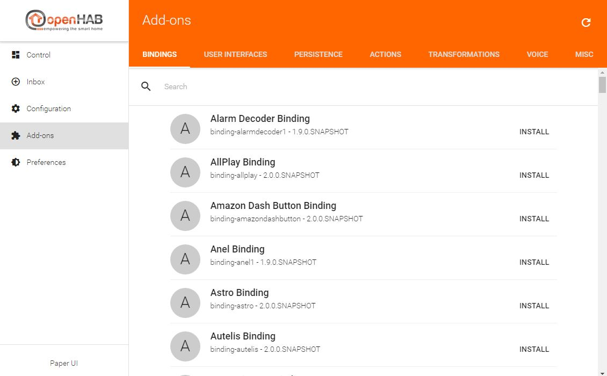

-   Thing discovery: See devices and services found on your network and add them to your setup.


-   Linking items to channels: Instead of adding a binding configuration to your item file, you can directly link Thing channels to your items.
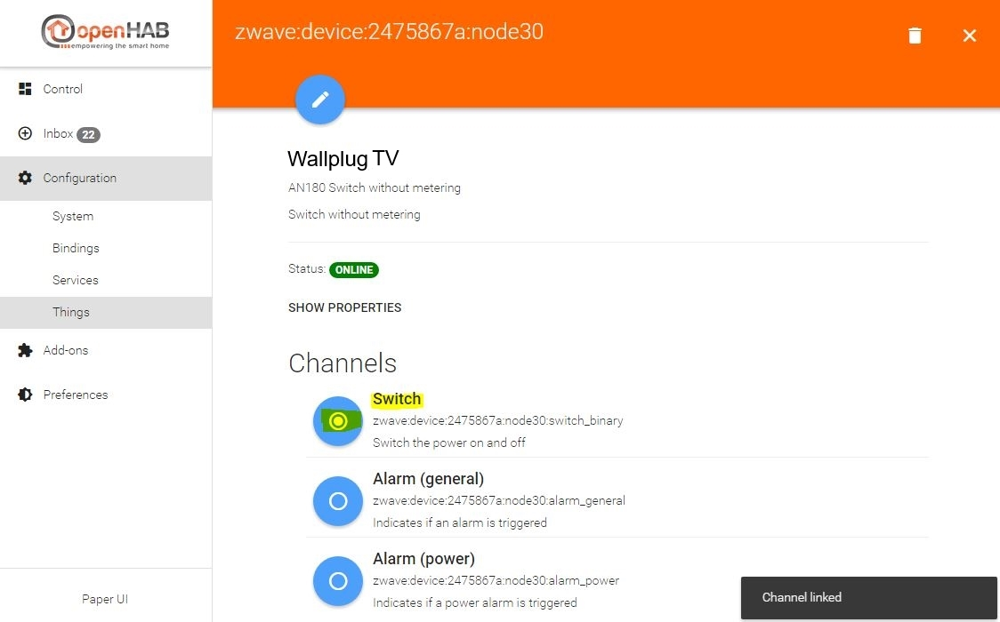

Note that you still need to define your items, sitemaps, persistence configurations and rules in the according configuration files (as done in openHAB 1).
Such functionality will be added bit by bit to the Paper UI only.

All these aspects are explained in the rest of this tutorial.

Here you can find a small screencast about the Paper UI:

[](http://www.youtube.com/watch?v=MV2a5qwtmRE)

### The Basic UI

The Basic UI is a web interface based on Material Design Lite from Google. This interface is used to present the different sitemaps.

The UIs features are:

- Responsive layout suitable for various screen sizes
- AJAX navigation
- Live update<sup>1</sup>

<sup>1</sup>: as for now, only control states and icons are updated. Visibility changes require a page reload.


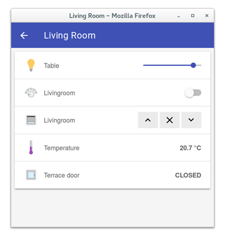

### The Classic UI

The Classic UI offers the same services that the Basic UI but with a different look and feel, close to an old iOS one.


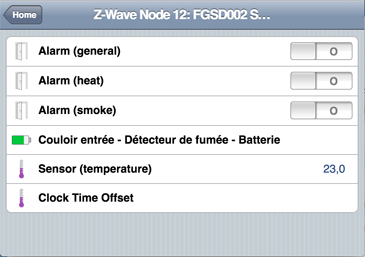


## Configuration

We left at the [start page]({{base}}/tutorials/beginner/1sttimesetup.html) before showing you the differences of the UIs.
Now click on the "PAPER UI" link and you will be taken to the "Inbox".
The inbox is the place where you can discover/add new "things" (i.e. Zwave devices, Hue lamps, network devices and so on).


In order to be able to add new things, at first you must install the corresponding binding for that type of thing.
I.e. if you want to control your Zwave devices, you have to install the Zwave binding.
If you want to control your Hue lamps, you have to install the Hue binding etc.

The installation is done on the "Add-ons" page in the left menu.


You can scroll down and have a look at lots of bindings available for openHAB!

Let's start with the "Network Binding", as this binding can be used in every setup from the start and will show you the basic configuration possibilities.
With the network binding, you can define some of your network devices as things in order to use them in a rule for example, or just to see if they are online or offline and for how long.
Scroll down or use the "Search" field to find the "Network Binding".
Click on install, the binding will be downloaded and installed automatically.

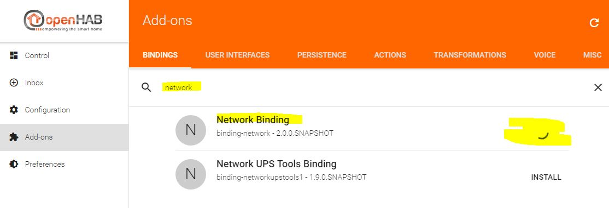

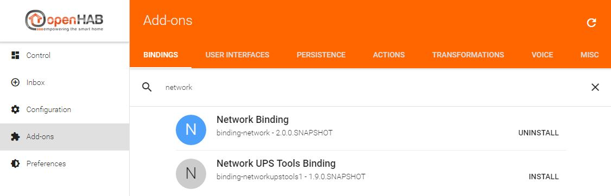

Now that the binding is installed, switch back to the "Inbox".
If you click the "+"-button, you now are able to choose the binding which you want to use for discovering new things.
Because we only installed the network binding so far, it's the only binding to choose.

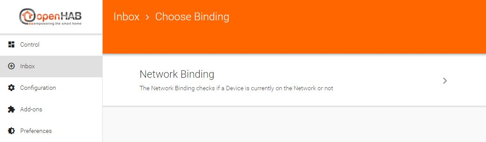

As soon as you click on "Network Binding", the binding will start an automatic discovery of all (reachable) network devices in the same subnet as your openHAB installation resides in via ICMP (ping).


The discovered "things" are now displayed in the inbox, and you can decide what to do next:

- add the device as a thing by clicking the check icon
- ignore the device by clicking the crossed-out-eye icon
- delete the device by clicking the trashcan icon

The difference between ignoring and deleting discovered things is as follows:

- if you ignore a thing, it disappears from the visible inbox. If you decide to add it at a later time, you can do so by scrolling to the bottom of the inbox and click the "SHOW IGNORED" button.
- if you delete the thing, it won't be visible in the inbox any more. But if you start a new discovery process later, the thing will reappear.

In this example, we click on the check icon of the thing with the IP address 192.168.1.103.
Let's assume this is John's mobile phone which we want to use for presence detection.
We change the (automatically added during the discovery) name of the thing on the next page to "John's Mobile" and click on the "ADD AS THING" button.
*Please note: if your network devices use a DHCP server to obtain ther IP addresses automatically, please make sure to define a DHCP reservation for a device which you want to use in openHAB.
Otherwise it's IP address may change in the future and your thing definiton won't work any more.
Information about how to define a DHCP reservation can be normally be found in the manual of your network router.*


Before we proceed, let's change one of the default system settings of openHAB to ease up the following processes.
You will see why in a moment.
Go to "Configuration -> System" via the menu on the left.
Here you can find the basic system properties of your openHAB installation.
Scroll down to "Item linking", activate the "Simple Mode" slider and click the "SAVE" button which appears afterwards.
You will notice afterwards that the "Items" menu item will be gone.

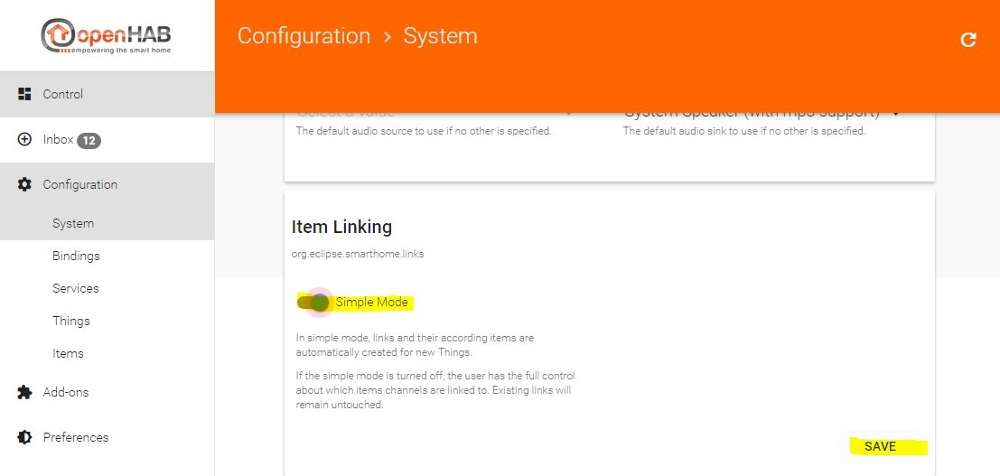

Now back to your recently added thing.
Go to the "Configuration -> Things" page, there you will find your network device thing, including the name "John's Mobile" which we defined above.

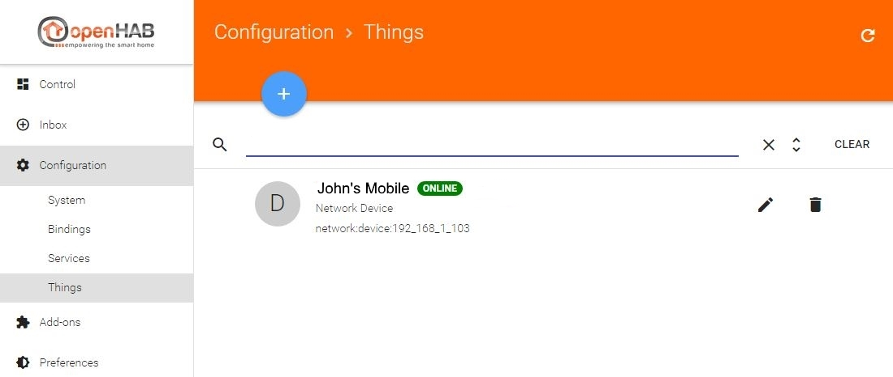

You can already see the status, "ONLINE", of the thing, so it's currently reachable by openHAB.
If you click on the name, you'll get to the next page showing the available channels of the thing.
Channels represent the different functions the items provide.
In this case you can see two channels: "Online" and "Time", the description below it says it all :)


What is very important: the channels are not "linked" after the thing discovery.
Linking means to create an openHAB "item" which represents the state of a channel of a thing.
Because we activated the "Simple Mode" before, this can be done automatically by clicking the corresponding radio button left to the channel. Otherwise you have to define the name of the item yourself.

So we'll link both channels of the "John's Mobile" thing now by clicking the radio buttons.


For most of the bindings each thing can be configured further by clicking the pen-icon.
There you can edit the name again, chose a location (this is important for the "Control" menu item later) and, of course, change binding realated options.
With the network binding for example, you can also change the IP address, the timeout, the refresh interval etc.

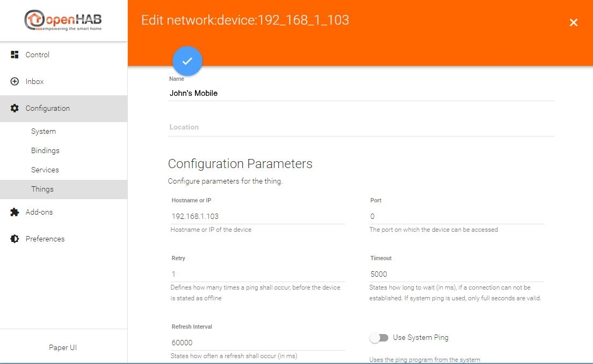

You can save changed values by clicking the check icon at the top.

Now that we linked the two channels in the previous step, we can have a look at the "Control" menu item at the top left.
On the "Control" page you can see all your linked items.
So far we added only one thing ("John's Mobile") and linked it's two channels, so that's all we see:

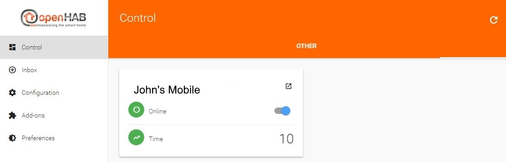

Items which are linked to channels of the same thing are displayed together, represented by the thing's name.
Here you can see the state of the "Online" and the "Time" channel.
John's mobile is online, and the ping time is 10ms.
As you can see in the screenshot with the configuration parameters of the thing above, the refresh interval is set to 60000ms by default.
This means that openHAB pings the device every 60 seconds.
If you want to set a lower value there, feel free.

**These are the basics to configure openHAB via Paper UI, meaning that the process is pretty much the same with other bindings.**

To demonstrate that, we'll proceed and install the Zwave binding in order to add Zwave things to openHAB.

**If you do not own a Zwave controller you won't be able to follow the next steps - however, this is a demonstration about how to install and configure add-ons. As mentioned before, the pure procedure to install and configure add-ons is mostly the same with other addons.**

**More information about the Zwave binding and the other available bindings can be found [on the bindings page of the user manual]({{base}}/addons/bindings.html)!**

The installation is just like the example with the network binding above.
Use the "Add-ons" menu item, search for the "Zwave" binding, click "INSTALL" and go directly to the "Inbox" afterwards.
There, we click the "+" icon again and can now choose between the "Network Binding" and the "Zwave Binding".


The difference to the network binding is, that we have to configure the Zwave controller first.
So we are taken directly to the Zwave controller config page after clicking on the"Zwave Binding" link.
Here we configure the port and basic settings and click the check icon afterwards.


openHAB immediately starts discovering Zwave things via the Zwave controller and shows them in the inbox - if they already have been included! If this is a completely new Zwave controller, you'll have to include your Zwave things first.
To set the controller into incusion mode, press the "+" icon again.
Please refer to the manual of you Zwave device in order to find out how the inclusion works there (most of the time it's pressing thetamper button thrice).

Let's assume we bought a new wallplug and included it, it's "Node 30".
For a simple sitemap and rule example on the next page, we'll configure this thing now:


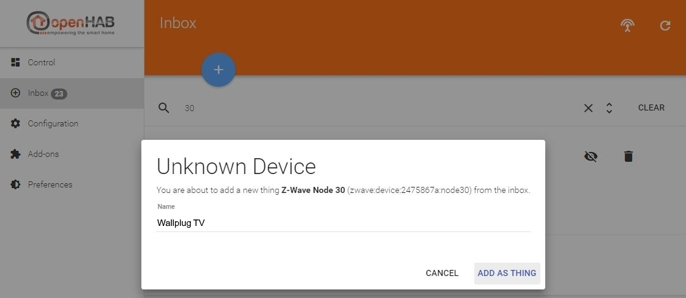


Basically we gave the thing a name ("Wallplug TV", please note the naming convention mentioned above!) and linked the "Switch" channel.
Now we can see the wallplug (and the Zwave controller) on the "Control" page, too. It's switch is currently turned off:


If you activate the slider of the wallplug, it will start routing power :)

**You first action with openHAB!**

## Creating a sitemap

Controlling your things via Paper UI is nice, but currently you can sort them only by editing the "Location" in the thing configuration.
If you want to create your own view you can use a so called "sitemap" which can be displayed in the Basic UI (you remember, it was automatically installed at the beginning).

But before that, you have to create an items file.
Both the items and the sitemap files are edited in your editor of choice.
The files' location is in the `$OPENHAB_CONF` directory, which is different on different operating systems.
See the linux installation instructions for the [file locations]({{base}}/installation/linux.html#file-locations) specific to linux, or the Windows [file locations]({{base}}/installation/windows.html#file-locations) specific to Windows.
Mac OSx files are located in the same place as Linux files.

```bash
conf/items    <-- *.items files
conf/sitemaps <-- *.sitemap files
```

After a fresh installation these directories are empty (except for the readme files), so you have to create a file there. We'll use "default.items" as the items file and "default.sitemap" as the sitemap file in this tutorial.

**In fact, you can have multiple .items files to sort your items logically, for example lamps.items, contacts.items, network.items etc.**
**As long as the file extension is .items, it's definitions will be loaded in openHAB. The same applies to .sitemap and .rules files as well**

So we create the files:

```bash
conf/items/default.items
conf/sitemaps/default.sitemap
```

Let's start small.

Open the default.items file and define your first item:

```java
Switch Presence_Mobile_John "Johns Mobile" <network> { channel="network:device:192_168_1_103:online" }
```

*Note: Item names have to be unique! You should follow a certain naming convention concerning your items.
In this example, we used the purpose of the item, "Presence", followed by the device type, "_Mobile", and finally the owner's name, "_John", to construct the final item name.

Another suggestion for different items, for example a wallplug which is plugged-in in the living room in the first floor providing power to a TV, is to use the type, the floor, the room and the usage of the item.
In this case it would be "Wallplug_FF_LR_TV".*

The syntax is as follows:

```java
ItemType ItemName "ItemDescription" <ItemIcon> { ItemToThingChannelLink }
```

You can find a detailled overview of the different item types [here]({{base}}/configuration/items.html)

In this example we use "Switch" as the item's type. This results in a slider which is either turned on or turned off.

**Important: the item's name has to be unique!**

Feel free to choose an appropriate description for your item.

**More information about available icons can be found [here]({{base}}/configuration/items.html#icons)**


Now to the item-to-thing-channel link: the channel id is always visible in Paper UI when you edit a thing.
As you can see in the screenshot from above where I linked the two channels of the network thing, I used the channel id of the "Online" channel in the definition above:

```java
network:device:192_168_1_103:online
```

*Again, for most of the bindings this is the way of adding an item in the .items file:*

*browse to your Paper UI, go to "Configuration -> Things", click on the thing you want to add, find the channel of the thing you want to add, copy the channel id and use it in your .items file*

To see the status of the wallplug, you have to add it to default.items too. First you have to look for the channel id in Paper UI:

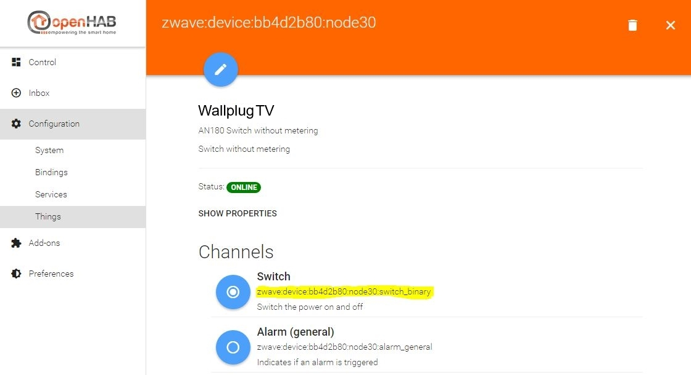

Then we add the item to default.items, this is what it looks like afterwards:

```java
Switch Presence_Mobile_John "John's Mobile" <network> { channel="network:device:192_168_1_103:online" }

Switch Wallplug_FF_LR_TV "Wallplug TV" <poweroutlet> { channel="zwave:device:bb4d2b80:node30:switch_binary" }
```

This means that you'll get a slider for the wallplug, indicating if it's turned on or off, with the poweroutlet icon.

To be able to actually see it in the "Basic UI" we have to create a sitemap. The sitemap basically defines the layout of the UI page. The syntax is quite easy, here is a simple setup of the previously created default.sitemap file:

```bash
sitemap default label="My first sitemap"
{
    Switch item=Presence_Mobile_John label="John's Mobile"
    Switch item=Wallplug_FF_LR_TV label="Wallplug TV"
}
```

A sitemap file always starts with "sitemap", followed by the sitemap's internal name (if your sitemap file is "default.sitemap", the sitemap name has to be "default"! Otherwise openHAB will complain in the log).
The "label" is the title of the sitemap, it's shown in your browser's titlebar/tab and on the sitemap page itself.
Next comes the block with the actual items you want to show on your sitemap. Here you can see the two items we added to the default.items file earlier.
The syntax is again pretty straight:

```bash
ItemType item=ItemName label="Description of the item shown on the webpage"
```

where ItemType and ItemName must be the same as defined in default.items

One last thing to do is setting the default sitemap for the "Basic UI" via "Paper UI".
Browse to "Configuration -> Services" in Paper UI and click the "Configure" button of Basic UI

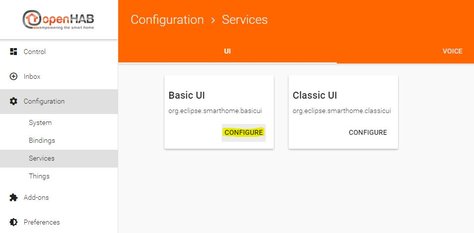

Now set the default sitemap to "default", which is the sitemap name we defined earlier in default.sitemap and click the "SAVE" button.

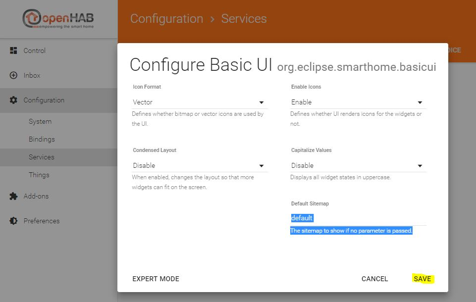

To finally see the result, browse to the initial openHAB start page <http://IP-of-your-machine:8080> and click on the "Basic UI" link.


Enjoy your first sitemap :)


## Working with rules and scripts

Now that we have the two items - "Presence_Mobile_John" aka "Johns mobile" and "Wallplug_FF_LR_TV" aka "TV wallplug LR" - we can create a simple rule.
Let's assume we want to turn on the wallplug (and give some juice to the connected TV) as soon as John's mobile comes online, turn it off again when the mobile goes offline (this would be a very basic "presence" rule).

Rules are defined in the conf/rules directory.
So we create the file default.rules there.

```bash
conf/rules/default.rules
```

You can create as many .rules files as you want - this eases the overview of different rules/situations. For example:

- presence.rules for the presence detection
- alarm.rules for your alarm actions
- tv.rules for rules specific for your SmartTV
- and so on

For now, we edit the default.rules

```bash
rule "Wallplug_FF_LR_TV ON"
when
  Item Presence_Mobile_John changed from OFF to ON
then
  Wallplug_FF_LR_TV.sendCommand(ON)
end

rule "Wallplug_FF_LR_TV OFF"
when
  Item Presence_Mobile_John changed from ON to OFF
then
  Wallplug_FF_LR_TV.sendCommand(OFF)
end
```

The rule syntax in this example is very easy:

```bash
rule "rule name (should be unique for logging purposes)"
when
  <TRIGGER CONDITION1> or
  <TRIGGER_CONDITION2> or
  <TRIGGER_CONDITION3>
  ...
then
  <EXECUTION_BLOCK>
end
```

The trigger conditions can be one of the following:

- Item triggers - just like in the example above. If the state of an item changes, do something
- Time triggers - do something at a specified time
- System triggers - do something after a system event happened, i.e. openHAB was started or is shut down

**More information on rules can be found [in the rules section of the user manual!]({{base}}/configuration/rules-dsl.html)**

The execution block in the example only consists of the "sendCommand" command, which sets the state of the named item.

```bash
ItemName.sendCommand(STATE)
```

Once the mobile comes online, the wallplug will turn on, As soon as it goes offline, it will turn off.
Just as simple as that :)

---

**This part has to be completed!**

---

*Guidelines*

*I think this will become the longest section*

*Don't forget to address JSR233 or other alternatives to the DSL that will be built into openHAB*

* *Event driven development*

* *Format and structure of rules*

* *Difference between actions and posting sending things to items*

* *Functions*

* *Group.members manipulation and how it can help simplify your rules*

* *How to figure out what to import*

* *Working with Time*

* *Working with Timers*

* *Casting to appropriate types and when that is necessary*

* *Working with Numbers*

* *Working with States*

* *Lambdas -> in advanced openHAB*

* *...*

## Looking to the logs

While using openHAB, we will need to look the the logs generated by the software.

Two log files are going to interest us.

To find them:

- open the finder,
- navigate to your home folder,
- navigate inside the openHAB folder,
- navigate inside the userdata folder,
- navigate inside the logs folder

<!--  -->

- Inside the logs folder, double-click on the `openhab.log` file. The file will be displayed inside the console application.

<!--  -->

The console will display the messages as soon as they will be logged.
Keep this window somewhere in order to take a look inside when it is needed.
We will use it to check the Z-Wave dialogs.

A "clean" startup looks this way in the log file :

```java
2016-05-09 21:29:33.195 [INFO ] [arthome.ui.paper.internal.PaperUIApp] - Started Paper UI at /ui
2016-05-09 21:29:33.252 [INFO ] [.dashboard.internal.DashboardService] - Started dashboard at /start
2016-05-09 21:29:33.567 [INFO ] [ing.zwave.handler.ZWaveSerialHandler] - Serial port is initialized
```

## Persisting historical data

This part is not yet written.
